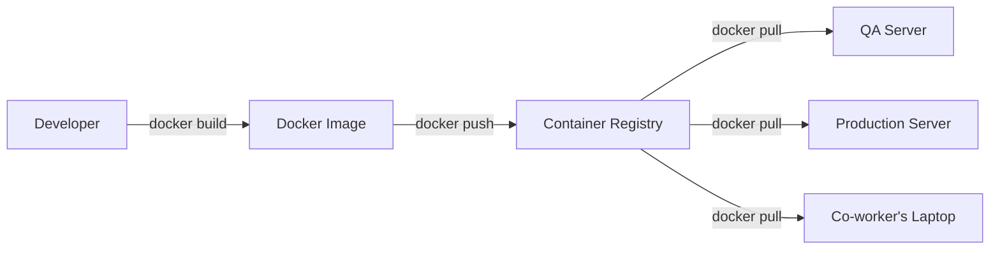
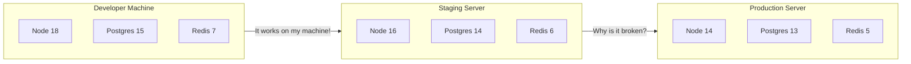
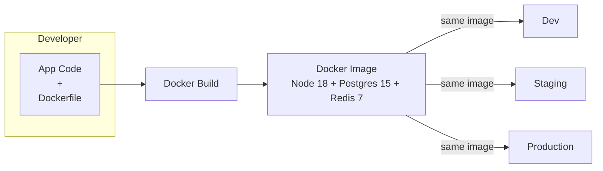
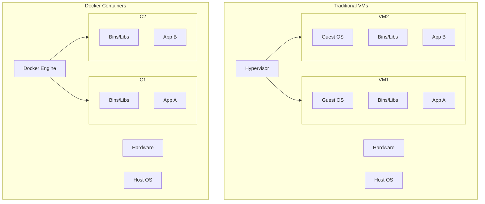
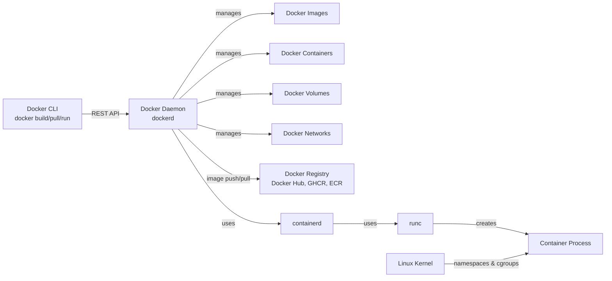
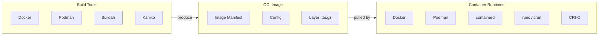
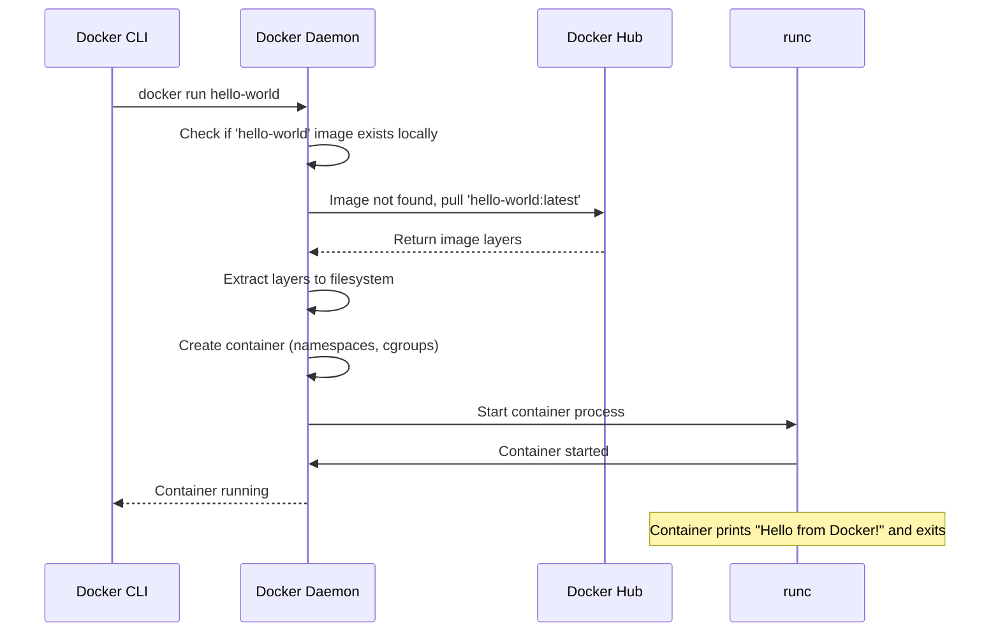
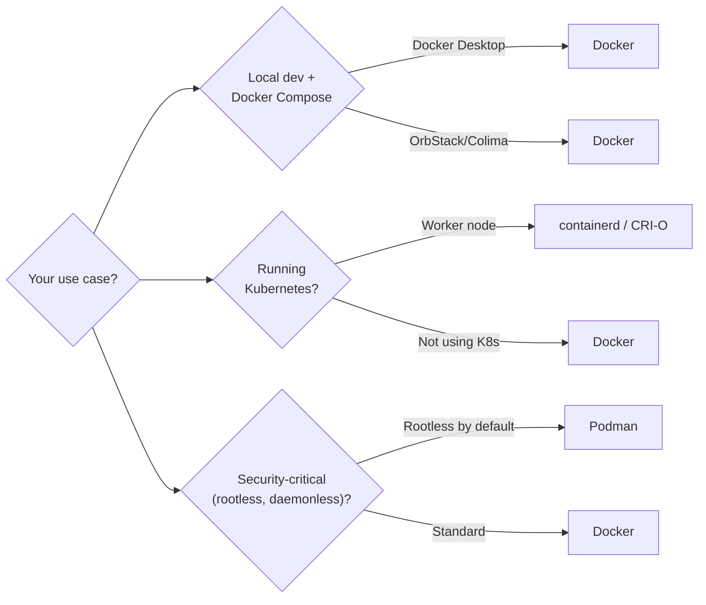

# 01 — Docker Fundamentals

> From Zero to Docker — What, Why, and How

---

## Table of Contents

1. [What is Docker?](#what-is-docker)
2. [The Problem Docker Solves](#the-problem-docker-solves)
3. [Containers vs Virtual Machines](#containers-vs-virtual-machines)
4. [Docker Architecture](#docker-architecture)
5. [Docker Components](#docker-components)
6. [OCI Standards](#oci-standards)
7. [Installing Docker](#installing-docker)
8. [Docker Hello World](#docker-hello-world)
9. [Docker vs Podman vs containerd](#docker-vs-podman-vs-containerd)

---

## What is Docker?

Docker is a platform for developing, shipping, and running applications in **containers** — lightweight, portable, isolated environments that package your application with all its dependencies.



**One build, run anywhere.** That's the Docker promise.

---

## The Problem Docker Solves

### Before Containers



### The Problems

| Problem | Description |
|---------|-------------|
| **"It works on my machine"** | Different OS, dependency versions, environment variables |
| **Dependency hell** | App A needs Node 16, App B needs Node 18 |
| **Slow onboarding** | New devs spend days setting up their environment |
| **Inconsistent environments** | Dev, staging, and prod are never identical |
| **Resource waste** | VMs are heavy — each needs a full OS |

### With Docker



**Every environment runs the EXACT same image.** The "works on my machine" problem disappears.

---

## Containers vs Virtual Machines

### Architecture Comparison



### Key Differences

| Aspect | VM | Container |
|--------|----|-----------|
| **OS** | Each VM has its own Guest OS | Shares the host OS kernel |
| **Boot time** | Minutes (full OS boot) | Milliseconds (process start) |
| **Size** | GBs (OS + app + deps) | MBs (app + deps only) |
| **Isolation** | Full hardware-level virtualization | Process-level isolation (namespaces) |
| **Resource usage** | High — each VM reserves CPU/RAM | Low — shares kernel, no overhead |
| **Portability** | Platform-dependent (VMware, Hyper-V) | Runs anywhere with Docker |
| **Startup density** | ~10 VMs per server | ~100+ containers per server |

### When to Use Which

| Use VMs When | Use Containers When |
|-------------|-------------------|
| Need to run different OS kernels (Linux + Windows) | All apps share the same OS type |
| Need full hardware isolation (PCI compliance, multi-tenant) | Process-level isolation is sufficient |
| Running Windows-only legacy apps | Microservices and cloud-native apps |
| You need a full OS environment | You want fast startup and high density |

### Analogy

- **VM** = An apartment building. Each apartment has its own foundation, plumbing, and electricity.
- **Container** = A condo building. The foundation and utilities are shared. Each unit only has its own furniture and modifications.

---

## Docker Architecture

### High-Level Architecture



### The Layer Cake

```
┌─────────────────────────────────────┐
│         Docker CLI (docker)          │  ← Your command-line tool
├─────────────────────────────────────┤
│        Docker Daemon (dockerd)       │  ← Background service
├─────────────────────────────────────┤
│           containerd                 │  ← Container runtime (manages lifecycle)
├─────────────────────────────────────┤
│              runc                     │  ← Low-level runtime (creates containers)
├─────────────────────────────────────┤
│  Linux Kernel (namespaces + cgroups) │  ← Isolation & resource limits
└─────────────────────────────────────┘
```

### Communication Flow

```
docker run nginx
     │
     ▼
Docker CLI ──REST API──► Docker Daemon
                             │
                             ▼
                      containerd (pull image, create container)
                             │
                             ▼
                         runc (create container process)
                             │
                             ▼
                      Linux Kernel (namespaces, cgroups)
                             │
                             ▼
                      nginx process running
```

---

## Docker Components

### 1. Docker Daemon (`dockerd`)

The background service that manages Docker objects (images, containers, volumes, networks). Listens on a REST API (default Unix socket: `/var/run/docker.sock`).

```bash
# Check daemon status
sudo systemctl status docker

# Daemon logs
sudo journalctl -u docker.service

# Listen on TCP (insecure — use TLS in production)
dockerd -H tcp://0.0.0.0:2375 -H unix:///var/run/docker.sock
```

### 2. Docker Client (`docker`)

The CLI tool you interact with. Sends commands to the daemon via REST API.

```bash
# Check client and server versions
docker version

# Check detailed system info
docker info
```

### 3. Docker Objects

| Object | Description |
|--------|-------------|
| **Images** | Read-only templates (like a class in OOP) |
| **Containers** | Runnable instances of images (like an object) |
| **Volumes** | Persistent data storage |
| **Networks** | Communication between containers |
| **Plugins** | Extend Docker functionality (volume drivers, network drivers) |

### 4. Docker Registry

A repository for Docker images. Default is Docker Hub. You can run private registries too.

```bash
# Pull from Docker Hub
docker pull nginx:latest

# Push to Docker Hub
docker push myusername/myapp:latest

# Push to private registry
docker push myregistry.com:5000/myapp:latest
```

---

## OCI Standards

Docker follows the **Open Container Initiative (OCI)** standards:

| Standard | What it defines | Purpose |
|----------|----------------|---------|
| **Image Spec** | How container images are built and structured | Any OCI-compliant tool can build images any OCI-compliant runtime can run |
| **Runtime Spec** | How containers are executed (filesystem, config, lifecycle) | `runc`, `crun`, `youki` all implement this |
| **Distribution Spec** | How images are pushed/pulled to registries | Any registry can serve images any client can pull |

**Why OCI matters:** You're not locked into Docker. You can:
- Build images with `podman` or `buildah`
- Run with `containerd`, `CRI-O`, or `runc`
- Store in any OCI-compatible registry (Harbor, GitLab, ECR, GHCR)



---

## Installing Docker

### Linux (Ubuntu/Debian)

```bash
# Uninstall old versions
sudo apt remove docker docker-engine docker.io containerd runc

# Install prerequisites
sudo apt update
sudo apt install ca-certificates curl gnupg lsb-release

# Add Docker's official GPG key
sudo mkdir -p /etc/apt/keyrings
curl -fsSL https://download.docker.com/linux/ubuntu/gpg | \
  sudo gpg --dearmor -o /etc/apt/keyrings/docker.gpg

# Set up repository
echo "deb [arch=$(dpkg --print-architecture) signed-by=/etc/apt/keyrings/docker.gpg] \
  https://download.docker.com/linux/ubuntu $(lsb_release -cs) stable" | \
  sudo tee /etc/apt/sources.list.d/docker.list > /dev/null

# Install Docker Engine
sudo apt update
sudo apt install docker-ce docker-ce-cli containerd.io docker-compose-plugin

# Verify
sudo docker run hello-world

# Post-install: run without sudo
sudo usermod -aG docker $USER
newgrp docker
```

### macOS

```bash
# Option 1: Docker Desktop (recommended for beginners)
brew install --cask docker

# Option 2: OrbStack (lighter, faster alternative)
brew install --cask orbstack

# Option 3: Colima (open-source, lightweight)
brew install colima
colima start
```

### Windows

```bash
# Option 1: Docker Desktop with WSL2 backend
# 1. Install WSL2: wsl --install
# 2. Install Docker Desktop from https://www.docker.com/products/docker-desktop/
# 3. Enable WSL2 backend in Docker Desktop settings

# Option 2: Using winget
winget install Docker.DockerDesktop
```

### Verify Installation

```bash
# Check version
docker --version
# Docker version 26.0.0, build 2ae903e

# Check system info
docker info

# Run hello-world
docker run hello-world

# Should see:
# Hello from Docker!
# This message shows that your installation appears to be working correctly.
```

---

## Docker Hello World

Let's break down what happens when you run `docker run hello-world`:

```bash
docker run hello-world
```

### What Happens Under the Hood



### Step-by-Step Breakdown

1. **Docker CLI** sends `docker run hello-world` to Docker Daemon
2. **Docker Daemon** checks if `hello-world:latest` exists locally
3. **Not found** — daemon pulls from Docker Hub
4. **Image downloaded** — layers are cached on disk
5. **Container created** — the daemon creates a new container from the image
6. **Container started** — `runc` creates cgroups and namespaces, starts the process
7. **Process runs** — the hello-world binary prints its message
8. **Container exits** — the process finishes, container stops

---

## Docker vs Podman vs containerd

| Feature | Docker | Podman | containerd |
|---------|--------|--------|------------|
| **Daemon** | Yes (dockerd) | No (daemonless) | Yes (as CRI runtime) |
| **Rootless** | Since v19.03 (experimental, good in v24+) | Native rootless | Via CRI |
| **Kubernetes CRI** | Via cri-dockerd | Via CRI-O or directly | Native CRI implementation |
| **Docker Compose** | Native `docker compose` | `podman-compose` | No (use nerdctl) |
| **Pod concept** | No | Yes (pods like K8s) | No |
| **Systemd integration** | Manual | Native (systemd units) | Via kubelet |
| **Image building** | Built-in | Via buildah | Via nerdctl |
| **Common use** | Dev + CI/CD + Production | Security-focused / Rootless | K8s runtime |

### When to Use Which



---

## Docker Desktop vs Docker Engine

| | Docker Desktop | Docker Engine |
|---|---|---|
| **Platforms** | macOS, Windows, Linux | Linux |
| **Includes** | Daemon, CLI, Compose, Kubernetes, Dashboard | Daemon + CLI (add-ons separate) |
| **VM** | Runs Linux VM on macOS/Windows | Native on Linux |
| **Cost** | Free for personal/edu/small business; paid for enterprise | Free (open-source) |
| **Updates** | Automatic via GUI | Manual via package manager |
| **Best for** | Dev machines, learning | Production servers, CI/CD |

---

## Key Takeaways

- Docker packages apps with their dependencies into **containers**
- Containers share the **host OS kernel** — much lighter than VMs
- Docker **Architecture**: CLI → Daemon → containerd → runc → Kernel
- **OCI standards** ensure portability across tools and runtimes
- One `docker run` pulls, creates, and starts a container
- Install Docker Desktop for dev, Docker Engine for production

---

## Next Steps

→ [02 — Docker Images & Dockerfile Deep Dive](./02-docker-images-and-dockerfile.md)
