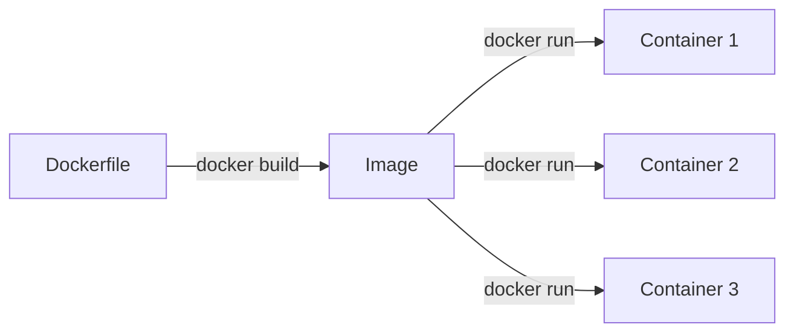
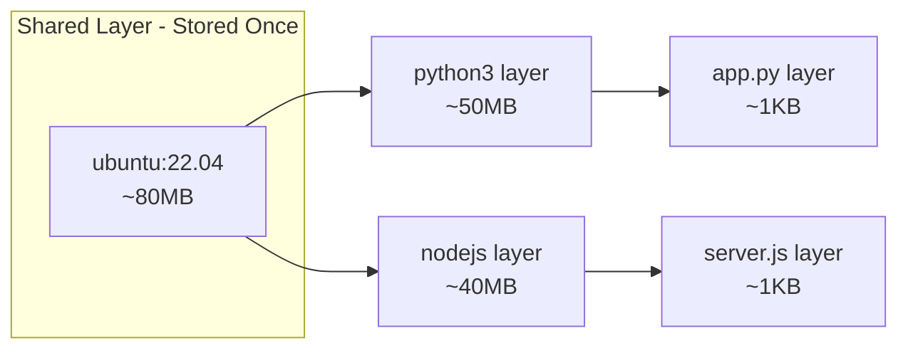
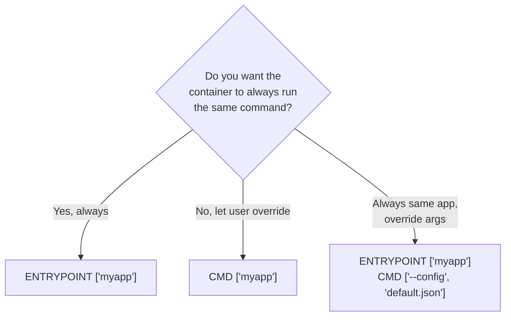
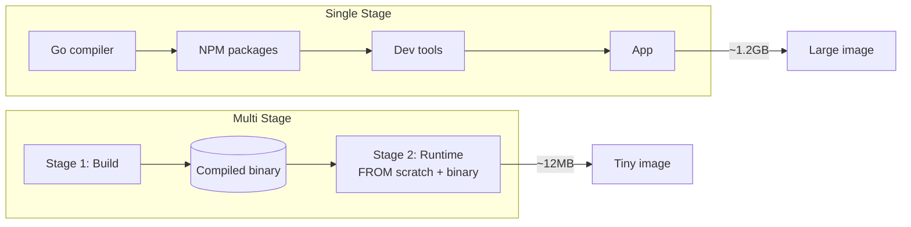
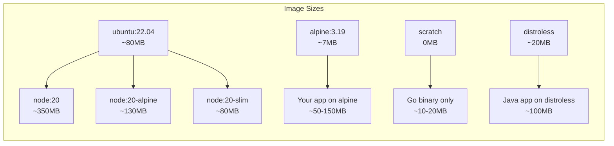
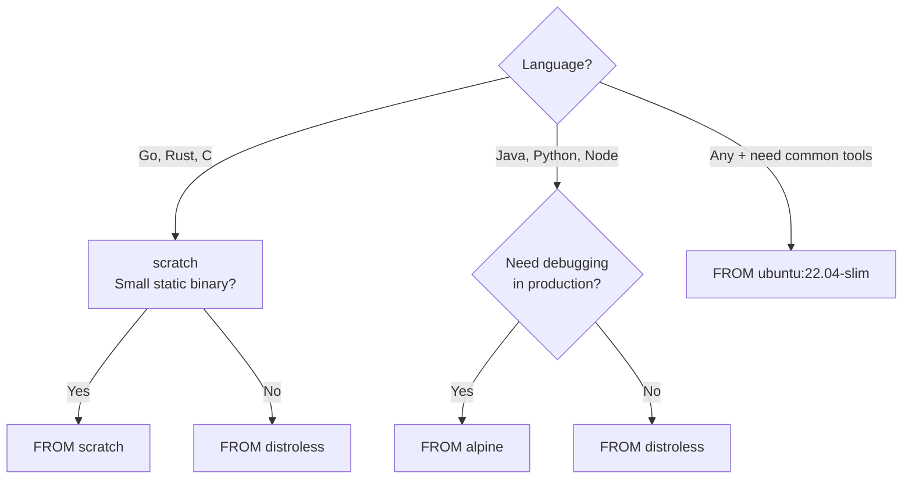

# 02 — Docker Images & Dockerfile Deep Dive

> Images are the blueprint; Dockerfile is the blueprint-maker

---

## Table of Contents

1. [What are Docker Images?](#what-are-docker-images)
2. [Image Layers](#image-layers)
3. [Union Filesystem](#union-filesystem)
4. [Dockerfile Instructions (Complete Reference)](#dockerfile-instructions-complete-reference)
5. [Building Images](#building-images)
6. [Layer Caching](#layer-caching)
7. [Multi-Stage Builds](#multi-stage-builds)
8. [Image Tagging & Versioning](#image-tagging--versioning)
9. [.dockerignore](#dockerignore)
10. [Image Optimization](#image-optimization)
11. [Distroless & Scratch](#distroless--scratch)
12. [Inspecting Images](#inspecting-images)

---

## What are Docker Images?

A **Docker image** is a read-only, immutable template that contains:
- A cut-down OS (or just the app + libraries)
- Application code
- Dependencies (Node modules, Python packages, JARs)
- Environment variables
- Default commands
- Metadata (ports, volumes, labels)

**Analogy:** An image is like a **class** in OOP. A container is an **instance** of that class.



---

## Image Layers

### What Are Layers?

Every instruction in a Dockerfile creates a **layer**. Layers are cached and reused across builds and images.

```
┌──────────────────────┐
│   Layer 5: CMD      │  ← Runtime command ("node app.js")
├──────────────────────┤
│   Layer 4: COPY .   │  ← Application code (changes most often)
├──────────────────────┤
│   Layer 3: RUN      │  ← npm ci, pip install (changes less often)
├──────────────────────┤
│   Layer 2: COPY     │  ← package.json (changes less often)
├──────────────────────┤
│   Layer 1: FROM     │  ← Base image (rarely changes)
└──────────────────────┘
         Image
```

### Layer Characteristics

| Property | Description |
|----------|-------------|
| **Immutable** | Once created, a layer never changes |
| **Cached** | If nothing changed, Docker reuses the cached layer |
| **Shared** | Same base image layer is shared across images |
| **Ordered** | Each layer is a delta on top of the previous |
| **Copy-on-write** | Container layer is writable, image layers are not |

### Storage Savings Through Layering

```
Image A: FROM ubuntu:22.04  +  RUN apt-get install python3  +  COPY app.py
Image B: FROM ubuntu:22.04  +  RUN apt-get install nodejs  +  COPY server.js

Shared layer: ubuntu:22.04 (only stored once on disk)
```



**Without layering:** 80 + 50 + 1 + 80 + 40 + 1 = 252MB  
**With layering:** 80 + 50 + 1 + 40 + 1 = 172MB (saves 80MB)

---

## Union Filesystem

Docker uses a **union filesystem** (overlay2 by default) to combine layers into a single coherent filesystem view.

```
Container Layer (R/W)        ← Changes made at runtime
    │
Overlay Filesystem
    │
Image Layer 4 (R/O)          ← COPY . 
Image Layer 3 (R/O)          ← RUN npm ci
Image Layer 2 (R/O)          ← COPY package.json
Image Layer 1 (R/O)          ← FROM node:20-alpine
    │
    ▼
Container sees: ONE unified filesystem
```

**Copy-on-Write (CoW):** When a container modifies a file from a read-only layer, the file is copied to the writable container layer first, then modified. The original stays untouched.

---

## Dockerfile Instructions (Complete Reference)

### FROM — Base Image

```dockerfile
# Syntax
FROM [--platform=<platform>] <image>[:<tag>] [AS <name>]

# Examples
FROM node:20-alpine
FROM python:3.12-slim AS builder
FROM --platform=linux/amd64 ubuntu:22.04
FROM scratch                     # Empty image — start from nothing
```

| Flag | Purpose |
|------|---------|
| `--platform` | Specify target platform (linux/amd64, linux/arm64) |
| `AS <name>` | Name the stage for multi-stage builds |

### RUN — Execute Commands

```dockerfile
# Shell form (uses /bin/sh -c)
RUN apt-get update && apt-get install -y curl

# Exec form (no shell — cleaner)
RUN ["apt-get", "install", "-y", "curl"]

# Best practice: chain commands to reduce layers
RUN apt-get update && \
    apt-get install -y \
        curl \
        git \
        build-essential && \
    apt-get clean && \
    rm -rf /var/lib/apt/lists/*
```

| Form | Shell | Variable expansion | When to use |
|------|-------|-------------------|-------------|
| Shell (`RUN cmd`) | Yes | Yes | Simple commands, pipes |
| Exec (`RUN ["cmd"]`) | No | No | No shell overhead, signals work |

### CMD — Default Command

```dockerfile
# Exec form (preferred)
CMD ["node", "app.js"]

# Shell form
CMD node app.js

# Parameter form (for ENTRYPOINT)
CMD ["--port", "3000"]
```

| Rule | Detail |
|------|--------|
| Only one CMD | If multiple, only the last is used |
| Can be overridden | `docker run myimage node other.js` overrides CMD |
| With ENTRYPOINT | CMD becomes default arguments to ENTRYPOINT |

### ENTRYPOINT — Main Process

```dockerfile
# Exec form (preferred)
ENTRYPOINT ["node", "app.js"]

# Shell form
ENTRYPOINT node app.js

# With CMD as default args
ENTRYPOINT ["node"]
CMD ["app.js"]               # Default: "node app.js"
                             # Override: docker run myimage server.js → "node server.js"
```

### CMD vs ENTRYPOINT

| Scenario | CMD | ENTRYPOINT | ENTRYPOINT + CMD |
|----------|-----|------------|------------------|
| Override at runtime | Yes — entirely replaceable | No — always runs | No — can replace args |
| Default args | Yes | — | Yes (CMD is default args) |
| Use case | `CMD ["node", "app.js"]` | `ENTRYPOINT ["docker-entrypoint.sh"]` | `ENTRYPOINT ["node"]` + `CMD ["app.js"]` |

**Visual decision tree:**



### COPY — Copy Files

```dockerfile
COPY [--chown=<user>:<group>] <src>... <dest>
COPY [--from=<stage>] <src> <dest>

# Examples
COPY package.json ./
COPY src/ ./src/
COPY --chown=node:node . .
COPY --from=builder /app/dist ./dist
```

| Flag | Purpose |
|------|---------|
| `--chown` | Set file ownership inside container |
| `--from` | Copy from a previous multi-stage build stage |
| `--link` | Copy files as independent layer (faster rebuilds, BuildKit) |

### ADD — Copy with Extras

```dockerfile
# Same as COPY but with additional features
ADD https://example.com/file.tar.gz /tmp/    # URL download (avoid — use curl instead)
ADD app.tar.gz /app/                         # Auto-extract tar archives
ADD --chown=node:node . .
```

**Rule:** Prefer `COPY` over `ADD` unless you specifically need auto-extraction. `COPY` is more explicit.

### WORKDIR — Working Directory

```dockerfile
WORKDIR /app

# All subsequent commands run from this directory
RUN npm ci                          # /app/npm ci
COPY . .                            # /app/. → /app/.
CMD ["node", "server.js"]           # /app/node server.js
```

- Creates the directory if it doesn't exist
- Each `WORKDIR` is relative to the previous one

### USER — Runtime User

```dockerfile
USER node

# Or create a custom user
RUN addgroup -S appgroup && adduser -S appuser -G appgroup
USER appuser:appgroup
```

**Security:** Always use a non-root user in production. By default, containers run as root.

### EXPOSE — Document Ports

```dockerfile
EXPOSE 3000
EXPOSE 80/tcp
EXPOSE 80/udp
```

- **Documentation only** — does NOT publish the port
- Think of it as a comment saying "this container listens on port 3000"

### ENV — Environment Variables

```dockerfile
ENV NODE_ENV=production
ENV PORT=3000
ENV PATH=/app/bin:$PATH
```

- Available at both build-time and run-time
- Can be overridden with `docker run -e NODE_ENV=development`

### ARG — Build Arguments

```dockerfile
ARG VERSION=latest
ARG NODE_ENV

RUN echo "Building version $VERSION"

# Pass at build time:
# docker build --build-arg VERSION=1.2.3 .
```

| Difference | ENV | ARG |
|-----------|-----|-----|
| Available at build time | Yes | Yes |
| Available at run time | Yes | No |
| Override | `-e` flag on run | `--build-arg` on build |
| Use case | Runtime config | Build-time version, API keys for build |

### VOLUME — Named Volumes

```dockerfile
VOLUME /data
VOLUME ["/var/lib/postgresql/data", "/logs"]
```

- Creates a mount point for persistent data
- Docker automatically creates an anonymous volume if none is mounted
- Can be overridden at runtime with `-v`

### HEALTHCHECK — Container Health

```dockerfile
HEALTHCHECK --interval=30s --timeout=3s --start-period=5s --retries=3 \
  CMD curl -f http://localhost:3000/health || exit 1

# Disable healthcheck inherited from base image
HEALTHCHECK NONE
```

| Option | Default | Description |
|--------|---------|-------------|
| `--interval` | 30s | How often to run the check |
| `--timeout` | 30s | Max time for a single check |
| `--start-period` | 0s | Grace period before health checks start |
| `--retries` | 3 | Consecutive failures before marking unhealthy |
| `--start-interval` | 5s | Interval between checks during start period |

**Exit codes:** 0 = healthy, 1 = unhealthy, 2 = reserved (don't use)

### LABEL — Metadata

```dockerfile
LABEL maintainer="team@company.com"
LABEL version="1.2.3"
LABEL org.opencontainers.image.source="https://github.com/myorg/myapp"
```

Use labels for:
- CI/CD metadata
- Image versioning
- Compliance information
- Automated cleanup policies

### SHELL — Change Default Shell

```dockerfile
SHELL ["/bin/bash", "-c"]
RUN echo "Can use bash features now"

SHELL ["/bin/sh", "-c"]
RUN echo "Back to default"
```

### STOPSIGNAL — Stop Signal

```dockerfile
STOPSIGNAL SIGQUIT
STOPSIGNAL SIGTERM          # Default is SIGTERM
```

Override the signal Docker sends to stop the container. Some apps need `SIGQUIT` or `SIGINT` for graceful shutdown.

### ONBUILD — Deferred Build

```dockerfile
ONBUILD COPY package.json .
ONBUILD RUN npm ci
```

- Instructions are NOT executed in this build
- They're triggered when this image is used as a **base image** in another `FROM`
- Used in language-specific base images (e.g., `node:onbuild`)

---

## Building Images

```bash
# Basic build
docker build -t myapp:latest .

# Build with specific Dockerfile
docker build -f Dockerfile.prod -t myapp:prod .

# Build with build args
docker build --build-arg VERSION=1.2.3 -t myapp:1.2.3 .

# Build for specific platform
docker build --platform linux/amd64,linux/arm64 -t myapp:latest .

# Build with BuildKit (enabled by default in Docker 24+)
DOCKER_BUILDKIT=1 docker build -t myapp:latest .

# Build and don't use cache
docker build --no-cache -t myapp:latest .

# Build with specific tag and push
docker build -t myrepo/myapp:latest . && docker push myrepo/myapp:latest
```

### Build Context

The **build context** is the directory sent to the Docker daemon during build.

```bash
# Context is the current directory (.)
docker build -t myapp .

# Context is a different directory
docker build -t myapp /path/to/project

# Context from stdin (useful for CI)
docker build -t myapp - < Dockerfile

# Context from URL (Dockerfile at Git URL)
docker build -t myapp https://github.com/user/repo.git#main
```

**Important:** Only files in the build context are available to `COPY` and `ADD`. Use `.dockerignore` to exclude unnecessary files from the context.

---

## Layer Caching

### How Caching Works

Docker caches each layer after building. On subsequent builds, it reuses cached layers if nothing changed.

```
Build 1:                     Build 2 (after changing app.js):

FROM node:20-alpine   →     FROM node:20-alpine  ← CACHED
WORKDIR /app          →     WORKDIR /app         ← CACHED
COPY package.json .   →     COPY package.json .  ← CACHED
RUN npm ci            →     RUN npm ci           ← CACHED  ← Same package.json
COPY . .              →     COPY . .             ← NOT CACHED ← app.js changed
CMD ["node","app.js"] →     CMD ["node","app.js"] ← NOT CACHED
```

### Cache Invalidation

A layer's cache is invalidated when:
1. The instruction itself changes (different command)
2. Files copied/added have different content
3. A parent layer's cache was invalidated
4. `--no-cache` flag is used
5. `--build-arg` values change

### Optimization: Order Matters

```dockerfile
# ❌ BAD: Source code copied before dependency install
COPY . .
RUN npm ci
# Any file change invalidates the npm ci cache

# ✅ GOOD: Dependencies installed before source code
COPY package.json package-lock.json ./
RUN npm ci
COPY . .
# npm ci is cached unless package.json changes
```

### BuildKit Cache Features

```dockerfile
# Mount cache for package managers (BuildKit only)
RUN --mount=type=cache,target=/root/.npm \
    npm ci

RUN --mount=type=cache,target=/var/cache/apt \
    apt-get update && apt-get install -y python3

# Bind mount secrets during build
RUN --mount=type=secret,id=npmrc \
    cat /run/secrets/npmrc > ~/.npmrc && npm ci
```

Enable BuildKit:
```bash
export DOCKER_BUILDKIT=1          # Linux
# or set in daemon.json: { "features": { "buildkit": true } }
```

### Cache-Busting Strategies

```dockerfile
# Strategy 1: Use --build-arg as cache buster
ARG CACHEBUST=1
RUN echo "Build date: $CACHEBUST"
# docker build --build-arg CACHEBUST=$(date +%s) .

# Strategy 2: Copy a version file
COPY VERSION .
RUN echo "Building: $(cat VERSION)"
```

---

## Multi-Stage Builds

Multi-stage builds use multiple `FROM` statements in one Dockerfile to separate the **build environment** from the **runtime environment**.

### Why Multi-Stage?



### Real Examples

#### Node.js App

```dockerfile
# === Stage 1: Build ===
FROM node:20-alpine AS builder
WORKDIR /app
COPY package*.json ./
RUN npm ci
COPY . .
RUN npm run build

# === Stage 2: Production ===
FROM node:20-alpine
WORKDIR /app
RUN addgroup -S appgroup && adduser -S appuser -G appgroup

# Copy only production dependencies
COPY package*.json ./
RUN npm ci --only=production && npm cache clean --force

# Copy built artifacts from builder
COPY --from=builder /app/dist ./dist

USER appuser
EXPOSE 3000
HEALTHCHECK --interval=30s --timeout=3s CMD wget --no-verbose --tries=1 --spider http://localhost:3000/health || exit 1
CMD ["node", "dist/main.js"]
```

#### Go App

```dockerfile
# === Stage 1: Build ===
FROM golang:1.22-alpine AS builder
WORKDIR /app
COPY go.mod go.sum ./
RUN go mod download
COPY . .
RUN CGO_ENABLED=0 GOOS=linux go build -o /app/server .

# === Stage 2: Run ===
FROM scratch
COPY --from=builder /app/server /server
COPY --from=builder /etc/ssl/certs/ca-certificates.crt /etc/ssl/certs/
EXPOSE 8080
ENTRYPOINT ["/server"]
```

#### Python App

```dockerfile
# === Stage 1: Build ===
FROM python:3.12-slim AS builder
WORKDIR /app
COPY requirements.txt .
RUN pip install --user -r requirements.txt

# === Stage 2: Run ===
FROM python:3.12-slim
WORKDIR /app
COPY --from=builder /root/.local /root/.local
COPY . .
ENV PATH=/root/.local/bin:$PATH
EXPOSE 8000
CMD ["python", "main.py"]
```

### Benefits

| Before (single-stage) | After (multi-stage) |
|----------------------|---------------------|
| Contains Go compiler, NPM, git | Only the binary + ca-certs |
| 1.2GB | 12MB |
| Build tools are security risks | Minimal attack surface |
| Longer pull/deploy times | Fast pull/deploy |

---

## Image Tagging & Versioning

### Tagging Syntax

```bash
# Basic tag
docker build -t myapp:latest .
docker tag myapp:latest myapp:1.0.0

# Tag for registry
docker tag myapp:1.0.0 registry.example.com/myapp:1.0.0

# Push specific tag
docker push myapp:1.0.0
docker push registry.example.com/myapp:1.0.0
```

### Tagging Strategies

| Strategy | Example | Pros | Cons |
|----------|---------|------|------|
| **Semver** | `1.2.3`, `1.2`, `1` | Clear versioning | Manual |
| **Git SHA** | `abc1234` | Traceable, unique | Ugly |
| **Combined** | `1.2.3-abc1234` | Best of both | Long |
| **Environment** | `prod`, `staging` | Easy to reference | Moving target |
| **Latest** | `latest` | Convenient | Never use in production |

### Recommended Production Strategy

```bash
# CI/CD pipeline tags
docker build -t myapp:${VERSION} -t myapp:${GIT_SHA} -t myapp:latest .
docker push myapp:${VERSION}
docker push myapp:${GIT_SHA}

# Deploy to staging using the git SHA
kubectl set image deployment/myapp myapp=myapp:${GIT_SHA}

# Promote to production using the semver tag
kubectl set image deployment/myapp myapp=myapp:${VERSION}
```

---

## .dockerignore

Prevents unnecessary files from being sent to the Docker daemon as part of the build context.

```
# .dockerignore

# Dependencies
node_modules/
vendor/
.venv/

# Build outputs
dist/
build/
*.tsbuildinfo

# Environment
.env
.env.local
*.env

# Version control
.git/
.gitignore
.gitattributes

# IDE
.vscode/
.idea/
*.swp

# OS files
.DS_Store
Thumbs.db

# Logs
*.log
npm-debug.log*

# Docker
Dockerfile
.dockerignore
```

Without `.dockerignore`, your build context could be hundreds of MB — slowing down every build.

---

## Image Optimization

### Size Comparison



### Optimization Checklist

| Technique | Impact | Effort |
|-----------|--------|--------|
| Use alpine/distroless base | 3-10x smaller | Low |
| Multi-stage builds | 5-20x smaller | Low |
| Combine RUN commands | Fewer layers | Low |
| Optimize layer order | Better cache hit | Low |
| Remove package manager caches | 10-30% smaller | Low |
| `.dockerignore` | Smaller context | Low |
| Use `--link` for COPY (BuildKit) | Faster rebuilds | Low |
| Use `--mount=type=cache` | Faster builds | Low |
| Pin base image versions | Reproducible builds | Low |
| Scan for unused deps | Smaller app | Medium |

### Optimization Examples

```dockerfile
# ❌ BAD: Multiple layers, no cleanup
FROM ubuntu:22.04
RUN apt-get update
RUN apt-get install -y curl python3 nodejs
RUN apt-get install -y build-essential
RUN curl -sL https://deb.nodesource.com/setup_20.x -o nodesetup.sh
RUN rm nodesetup.sh

# ✅ GOOD: Combined commands, curated installs, cleanup
FROM ubuntu:22.04
RUN apt-get update && \
    apt-get install -y --no-install-recommends \
        curl \
        python3 \
        nodejs && \
    apt-get clean && \
    rm -rf /var/lib/apt/lists/* && \
    curl -sL https://deb.nodesource.com/setup_20.x -o /tmp/nodesetup.sh && \
    /tmp/nodesetup.sh && \
    rm /tmp/nodesetup.sh
```

---

## Distroless & Scratch

### Scratch

`FROM scratch` is an **empty** image. Nothing. Zero bytes.

```dockerfile
FROM scratch
COPY mybinary /
ENTRYPOINT ["/mybinary"]
```

| Pros | Cons |
|------|------|
| Minimal possible size (~10MB for Go binary) | No shell — can't exec into container |
| Maximum security (nothing to exploit) | No package manager |
| Fastest pull/deploy | Debugging is hard (no `ps`, `curl`, `cat`) |

**Good for:** Compiled languages (Go, Rust, C) that produce static binaries.

### Distroless

Google's distroless images contain only your app and its runtime dependencies — no shell, no package manager, no utilities.

```dockerfile
FROM gcr.io/distroless/nodejs20-debian12
COPY dist/ /app/
COPY node_modules/ /app/node_modules/
WORKDIR /app
CMD ["main.js"]
```

| Pros | Cons |
|------|------|
| ~20MB base (vs ~130MB alpine) | No shell for debugging |
| Very small attack surface | Harder to debug in production |
| Includes runtime libs (glibc, SSL certs) | Not suitable for all apps |

### Alpine

```dockerfile
FROM alpine:3.19
RUN apk add --no-cache nodejs
```

| Pros | Cons |
|------|------|
| ~7MB base (vs ~80MB ubuntu) | Uses musl libc (not glibc) — some apps may not work |
| `apk` package manager | Native modules may need compilation |
| Familiar `sh` shell | DNS resolution can behave differently |

### Decision Guide



---

## Inspecting Images

```bash
# List images
docker images
docker image ls

# Show image details
docker inspect nginx:latest

# Show layers
docker history nginx:latest

# Show image size breakdown
docker system df -v

# Show image metadata
docker image inspect --format '{{.Config.Env}}' nginx

# Show platform info
docker image inspect --format '{{.Os}}/{{.Architecture}}' nginx

# Compare image sizes
docker images --format "table {{.Repository}}\t{{.Tag}}\t{{.Size}}"

# Show dangling images (untagged, unused)
docker images -f dangling=true

# Scan image for vulnerabilities (Docker Scout)
docker scout quickview nginx:latest
docker scout analysis nginx:latest
```

---

## Summary: Dockerfile Best Practices

```
┌───────────────────────────────────────────┐
│           Dockerfile Best Practices        │
├───────────────────────────────────────────┤
│ 1. Use specific tags (no :latest)         │
│ 2. Use small base images (alpine/distroless)│
│ 3. Multi-stage builds                     │
│ 4. Order layers by change frequency       │
│ 5. Combine RUN commands                   │
│ 6. Use .dockerignore                      │
│ 7. Run as non-root user                   │
│ 8. Add HEALTHCHECK                        │
│ 9. Pin versions (apt, pip, npm)           │
│ 10. Scan images for vulnerabilities       │
└───────────────────────────────────────────┘
```

---

## Next Steps

→ [03 — Docker Containers Deep Dive](./03-docker-containers.md)
