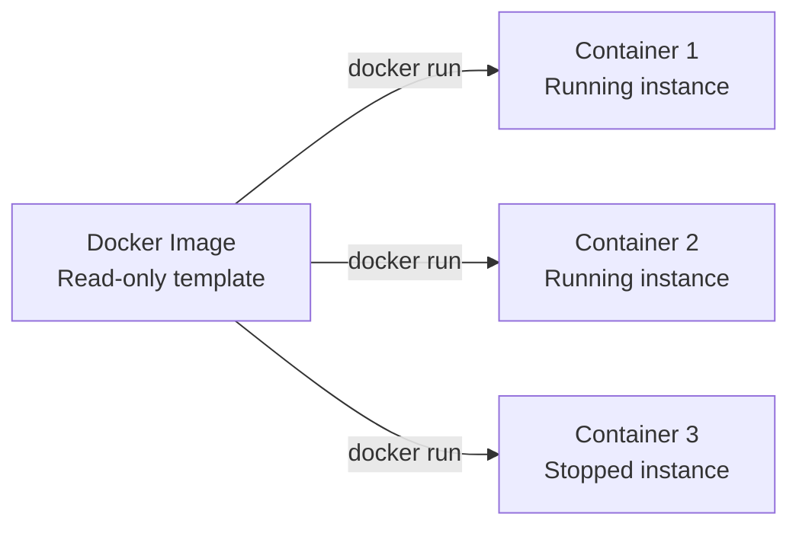

# 03 — Docker Containers Deep Dive

> Containers are where your code lives. Master their lifecycle.

---

## Table of Contents

1. [What is a Container?](#what-is-a-container)
2. [Container Lifecycle](#container-lifecycle)
3. [docker run — The Swiss Army Knife](#docker-run--the-swiss-army-knife)
4. [Container Management Commands](#container-management-commands)
5. [Resource Limits](#resource-limits)
6. [Health Checks](#health-checks)
7. [Restart Policies](#restart-policies)
8. [docker exec — Running Commands](#docker-exec--running-commands)
9. [docker logs — Viewing Output](#docker-logs--viewing-output)
10. [Container Monitoring](#container-monitoring)
11. [Cleanup & Pruning](#cleanup--pruning)

---

## What is a Container?

A **container** is a running instance of an image. It's an isolated process with:
- Its own filesystem (from the image layers + writable container layer)
- Its own network stack (IP, ports, routing)
- Its own process tree (PID namespace)
- Its own user namespace
- Resource limits (CPU, memory, disk I/O)

**Analogy:**
- **Image** = A recipe (blueprint)
- **Container** = A cooked dish (running instance)
- You can cook multiple dishes from the same recipe
- Each dish is independent — burning one doesn't affect others



---

## Container Lifecycle

### States

```
                ┌──────────┐
                │  Created │
                └────┬─────┘
                     │ docker start
                     ▼
             ┌───────────────┐
        ┌───►│   Running     │◄───┐
        │    └───────┬───────┘    │
        │            │            │
        │  docker    │ docker     │ docker
        │  pause     │ unpause    │ restart
        │            │            │
        │    ┌───────▼───────┐    │
        │    │   Paused      │────┘
        │    └───────────────┘
        │
        │ docker stop / kill / process exits
        │
        ▼
   ┌──────────┐
   │ Stopped  │
   └────┬─────┘
        │ docker rm
        ▼
   ┌──────────┐
   │  Removed │
   └──────────┘
```

### Lifecycle Commands

| Action | Command | Description |
|--------|---------|-------------|
| **Create** | `docker create` | Create a stopped container from an image |
| **Start** | `docker start` | Start a stopped container |
| **Run** | `docker run` | Create + start (most common) |
| **Pause** | `docker pause` | Freeze all processes (SIGSTOP) |
| **Unpause** | `docker unpause` | Resume paused processes (SIGCONT) |
| **Stop** | `docker stop` | Send SIGTERM, wait, then SIGKILL |
| **Kill** | `docker kill` | Send SIGKILL immediately |
| **Restart** | `docker restart` | Stop then start |
| **Wait** | `docker wait` | Block until container exits |
| **Remove** | `docker rm` | Delete container filesystem |
| **Prune** | `docker container prune` | Remove all stopped containers |

### Visual Lifecycle Walkthrough

```bash
# 1. CREATE — container exists but isn't running
docker create --name myapp nginx:alpine
docker ps -a
# CONTAINER ID   STATUS     NAMES
# abc123         Created    myapp

# 2. START — container is running
docker start myapp
docker ps
# CONTAINER ID   STATUS     NAMES
# abc123         Up 2s      myapp

# 3. PAUSE — processes frozen
docker pause myapp
docker ps
# STATUS: Up 5s (Paused)

# 4. UNPAUSE
docker unpause myapp

# 5. STOP — sends SIGTERM, then SIGKILL after grace period
docker stop myapp

# 6. START again
docker start myapp

# 7. KILL — immediate SIGKILL
docker kill myapp

# 8. REMOVE — delete the container layer
docker rm myapp
```

---

## docker run — The Swiss Army Knife

`docker run` has more flags than any other Docker command. Here's the complete reference:

### Basic Syntax

```bash
docker run [OPTIONS] IMAGE [COMMAND] [ARG...]
```

### Detached vs Foreground

```bash
# Detached mode (background — most common)
docker run -d nginx

# Foreground mode (attached to terminal)
docker run nginx

# Interactive with TTY (for shells)
docker run -it ubuntu bash

# Attach to running container
docker attach mycontainer
```

| Flag | Meaning | Use case |
|------|---------|----------|
| `-d` | Detached — run in background | Most services |
| `-it` | Interactive + TTY | Shell access |
| `--rm` | Auto-remove when exits | Ephemeral containers |
| `--name` | Assign a name | Easier management |

### Port Mapping

```bash
# Map host port 8080 to container port 80
docker run -p 8080:80 nginx

# Map random host port to container port 80
docker run -P nginx

# Map UDP port
docker run -p 5353:53/udp dns-server

# Bind to specific IP
docker run -p 127.0.0.1:8080:80 nginx

# Multiple ports
docker run -p 3000:3000 -p 9229:9229 node-app
```

```
Host:                          Container:
┌─────────────────┐            ┌──────────────────┐
│ localhost:8080──┼────────────┼─► port 80        │
│ localhost:3000──┼────────────┼─► port 3000      │
│ localhost:9229──┼────────────┼─► port 9229      │
└─────────────────┘            └──────────────────┘
```

### Volume Mounts

```bash
# Bind mount (host path)
docker run -v /host/data:/container/data nginx

# Named volume
docker run -v myvolume:/data nginx

# Anonymous volume (created automatically)
docker run -v /data nginx

# Modern syntax (preferred)
docker run --mount type=bind,source=/host/data,target=/container/data nginx
docker run --mount type=volume,source=myvolume,target=/data nginx
docker run --mount type=tmpfs,target=/tmp nginx
```

### Environment Variables

```bash
# Single variable
docker run -e NODE_ENV=production node-app

# From host environment
docker run -e HOSTNAME node-app

# From file
docker run --env-file .env node-app

# Multiple variables
docker run -e DB_HOST=localhost -e DB_PORT=5432 -e DB_USER=admin app
```

### Resource Limits

```bash
# CPU
docker run --cpus=1.5 app                   # 1.5 CPU cores
docker run --cpuset-cpus=0,2 app            # Specific cores 0 and 2
docker run --cpu-shares=512 app             # Relative weight (default 1024)

# Memory
docker run -m 512m app                       # Max 512MB memory
docker run --memory=1g --memory-reservation=512m app
docker run --memory-swap=2g app              # 2G total (RAM + swap)

# Disk I/O
docker run --device-read-bps=/dev/sda:1mb app
docker run --device-write-iops=/dev/sda:100 app

# Restart + stop
docker run --restart=always --stop-timeout=30 app

# Network
docker run --network=host app
docker run --network=mybridge --ip=172.20.0.10 app
docker run --network=container:other-container app
docker run --dns=8.8.8.8 app
docker run --add-host=db:10.0.0.5 app
```

### Complete Real-World Example

```bash
docker run -d \
  --name my-api \
  --restart unless-stopped \
  -p 3000:3000 \
  -v app-data:/app/data \
  -v /var/log/app:/app/logs \
  -e NODE_ENV=production \
  -e DB_URL=postgres://user:pass@db:5432/app \
  --env-file .env.prod \
  --cpus=2 \
  --memory=1g \
  --memory-reservation=512m \
  --network=app-network \
  --health-cmd="curl -f http://localhost:3000/health || exit 1" \
  --health-interval=30s \
  --health-timeout=5s \
  --health-retries=3 \
  --health-start-period=15s \
  --log-driver=json-file \
  --log-opt max-size=10m \
  --log-opt max-file=3 \
  --cap-drop=ALL \
  --cap-add=NET_BIND_SERVICE \
  --read-only \
  --tmpfs /tmp \
  --user 1000:1000 \
  myapp:1.2.3
```

---

## Container Management Commands

### Listing Containers

```bash
# Running containers
docker ps

# All containers (including stopped)
docker ps -a

# Last N containers
docker ps -n 5

# Quiet mode (just IDs)
docker ps -q

# Filter by status
docker ps -f status=exited
docker ps -f status=running
docker ps -f status=created

# Filter by name
docker ps -f name=myapp

# Custom format
docker ps --format "table {{.ID}}\t{{.Names}}\t{{.Status}}\t{{.Ports}}"

# Show sizes
docker ps -s
```

### Inspecting Containers

```bash
# Full JSON
docker inspect mycontainer

# Specific field
docker inspect mycontainer --format '{{.State.Status}}'
docker inspect mycontainer --format '{{.NetworkSettings.IPAddress}}'
docker inspect mycontainer --format '{{.Config.Env}}'

# Resource usage
docker stats mycontainer

# Process list inside container
docker top mycontainer

# Changes compared to image
docker diff mycontainer
```

### Stopping and Starting

```bash
# Graceful stop (SIGTERM + timeout)
docker stop mycontainer

# With custom timeout
docker stop -t 30 mycontainer

# Immediate kill
docker kill mycontainer
docker kill -s SIGQUIT mycontainer    # Custom signal

# Start a stopped container
docker start mycontainer

# Restart
docker restart mycontainer
docker restart -t 30 mycontainer

# Pause / unpause (SIGSTOP / SIGCONT)
docker pause mycontainer
docker unpause mycontainer
```

### Creating Without Running

```bash
# Create but don't start
docker create --name mydb -e POSTGRES_PASSWORD=secret postgres:16

# Later:
docker start mydb

# Create with all options, start separately
docker create \
  --name app \
  -p 3000:3000 \
  -e NODE_ENV=production \
  myapp:latest

# Useful in CI/CD to prepare resources
docker create --name test-db postgres:16-alpine
docker start test-db
# Run tests...
docker stop test-db && docker rm test-db
```

### Copying Files

```bash
# From container to host
docker cp mycontainer:/app/logs/app.log ./logs/

# From host to container
docker cp ./config.json mycontainer:/app/config.json

# Between containers
docker cp mycontainer1:/data/file.txt mycontainer2:/backup/
```

### Renaming

```bash
docker rename old-name new-name
```

---

## Resource Limits

### CPU

```bash
# Limit to 1.5 CPU cores
docker run --cpus=1.5 app

# Pin to specific cores (CPU 0 and 2)
docker run --cpuset-cpus=0,2 app

# CPU shares (relative weight, default 1024)
docker run --cpu-shares=512 app    # Gets ~1/3 of CPU when contested
docker run --cpu-shares=1024 app   # Gets ~2/3 of CPU when contested

# CPU period and quota (advanced)
docker run --cpu-period=100000 --cpu-quota=50000 app
# Container gets 50ms of CPU time per 100ms period (0.5 cores)
```

### Memory

```bash
# Hard limit
docker run -m 512m app
docker run --memory=1g app

# Soft limit (will try to keep under, but can exceed)
docker run --memory-reservation=512m app

# Total memory + swap (must be >= --memory)
docker run -m 512m --memory-swap=1g app    # 512MB RAM + 512MB swap
docker run -m 512m --memory-swap=512m app  # No swap (only 512MB RAM)
docker run -m 512m --memory-swap=-1 app    # Unlimited swap

# Kernel memory limit
docker run --kernel-memory=100m app

# OOM killer behavior
docker run --oom-kill-disable app                     # Don't kill if OOM
docker run -m 512m --oom-score-adj=500 app            # Priority for OOM kill
```

### Memory Limit Behavior

```
Container starts:
  Memory used: 200MB    ← Under reservation, no issues
  Memory used: 450MB    ← Over reservation, under limit, okay
  Memory used: 512MB    ← Hit memory limit!
  
  Swap available? → Yes → Use swap (slower but continues)
  Swap available? → No  → Docker kills the container (OOM)
```

### Disk

```bash
# Block IO weight (relative)
docker run --blkio-weight=500 app    # Default is 500

# Read/Write BPS limits
docker run --device-read-bps=/dev/sda:1mb app
docker run --device-write-bps=/dev/sda:10mb app

# Read/Write IOPS limits
docker run --device-read-iops=/dev/sda:100 app
docker run --device-write-iops=/dev/sda:200 app

# Storage limit (with overlay2)
docker run --storage-opt size=10G app
```

### Ulimits

```bash
# Set ulimits
docker run --ulimit nofile=1024:2048 app
docker run --ulimit nproc=1000 app
docker run --ulimit memlock=67108864 app

# Multiple ulimits
docker run \
  --ulimit nofile=65536:65536 \
  --ulimit nproc=4096 \
  --ulimit stack=67108864 \
  app
```

---

## Health Checks

Health checks tell Docker (and orchestrators like K8s) whether your container is **actually working** — not just running.

### In Dockerfile

```dockerfile
HEALTHCHECK --interval=30s --timeout=3s --start-period=5s --retries=3 \
  CMD curl -f http://localhost:3000/health || exit 1
```

### At Runtime

```bash
docker run \
  --health-cmd="curl -f http://localhost:3000/health || exit 1" \
  --health-interval=30s \
  --health-timeout=5s \
  --health-retries=3 \
  --health-start-period=15s \
  myapp
```

### Health States

```
starting → healthy → unhealthy → unhealthy → unhealthy → unhealthy
  (5s)    (30s)      (30s)       (30s)       (30s)      (killed/restarted)
```

### Checking Health

```bash
# Show health status
docker inspect --format='{{.State.Health.Status}}' mycontainer
# healthy / unhealthy / starting / none

# Show full health log
docker inspect --format='{{json .State.Health}}' mycontainer | jq

# Get healthcheck events
docker events --filter event=health_status
```

### Real-World Health Check Patterns

```bash
# HTTP endpoint (most apps)
--health-cmd="curl -f http://localhost:3000/health || exit 1"

# TCP check (databases, redis)
--health-cmd="nc -z localhost 6379 || exit 1"

# Custom script
--health-cmd="python /healthcheck.py || exit 1"

# Database readiness
--health-cmd="pg_isready -U postgres || exit 1"

# Using wget (if no curl)
--health-cmd="wget --no-verbose --tries=1 --spider http://localhost:3000/health || exit 1"
```

---

## Restart Policies

Controls what Docker does when a container exits.

```bash
docker run --restart=no              # Default — never restart
docker run --restart=on-failure      # Restart if exit code != 0
docker run --restart=on-failure:5    # Max 5 restart attempts
docker run --restart=always          # Always restart, even if manually stopped
docker run --restart=unless-stopped  # Always restart, unless explicitly stopped
```

### Policy Behavior

| Policy | Container exits with 0 | Container exits with non-0 | Docker daemon restarts | Manually stopped |
|--------|----------------------|--------------------------|------------------------|------------------|
| `no` | No restart | No restart | No restart | N/A |
| `on-failure` | No restart | Restart (up to max) | No restart | N/A |
| `always` | Restart | Restart | Restart | Restart after daemon restart |
| `unless-stopped` | Restart | Restart | Restart | **Won't** restart after daemon restart |

### Restart Backoff

Docker uses exponential backoff for restarts:
```
1st restart:  immediately
2nd restart:  100ms
3rd restart:  200ms
4th restart:  400ms
...
Max delay:    5 minutes
```

The backoff counter resets after 10 seconds of running.

---

## docker exec — Running Commands

Execute commands inside a running container.

```bash
# Interactive shell
docker exec -it mycontainer bash
docker exec -it mycontainer sh
docker exec -it mycontainer /bin/bash

# Run single command
docker exec mycontainer ls -la /app

# Run as different user
docker exec -u node mycontainer whoami

# Set working directory
docker exec -w /app mycontainer pwd

# Set environment variables
docker exec -e DEBUG=true mycontainer node app.js

# Detached exec
docker exec -d mycontainer touch /tmp/healthcheck
```

### Common Debugging Use Cases

```bash
# Check processes
docker exec mycontainer ps aux

# Check network
docker exec mycontainer netstat -tulpn
docker exec mycontainer curl localhost:3000/health

# Check disk
docker exec mycontainer df -h
docker exec mycontainer du -sh /app

# View config files
docker exec mycontainer cat /app/config.json

# Check logs inside container
docker exec mycontainer tail -100 /var/log/app.log

# Install debugging tools (temporarily)
docker exec -it mycontainer sh
# apk add curl net-tools procps
```

---

## docker logs — Viewing Output

### Basic Usage

```bash
# View all logs
docker logs mycontainer

# Follow (tail -f equivalent)
docker logs -f mycontainer

# Last N lines
docker logs --tail 100 mycontainer

# Since timestamp
docker logs --since 2024-01-01T00:00:00 mycontainer

# Last 5 minutes
docker logs --since 5m mycontainer

# Timestamps
docker logs -t mycontainer

# Until timestamp
docker logs --until 2024-01-02T00:00:00 mycontainer

# Combine flags
docker logs -f --tail 50 -t mycontainer
```

### Log Drivers

Docker supports multiple log drivers:

```bash
# Default: json-file (logs written to /var/lib/docker/containers/)
docker run --log-driver json-file --log-opt max-size=10m --log-opt max-file=3 app

# Journald (systemd journal)
docker run --log-driver journald app

# syslog
docker run --log-driver syslog --log-opt syslog-address=tcp://logs.example.com:514 app

# Fluentd
docker run --log-driver fluentd --log-opt fluentd-address=localhost:24224 app

# AWS CloudWatch
docker run --log-driver awslogs --log-opt awslogs-group=my-group app

# GCP Stackdriver
docker run --log-driver gcplogs app

# No logs
docker run --log-driver none app

# Local (fast, efficient, for development)
docker run --log-driver local app
```

### Log Configuration in daemon.json

```json
{
  "log-driver": "json-file",
  "log-opts": {
    "max-size": "10m",
    "max-file": "3"
  }
}
```

---

## Container Monitoring

### docker stats

Real-time resource usage for running containers.

```bash
# All containers
docker stats

# Specific containers
docker stats myapp mydb

# No-stream (single output)
docker stats --no-stream

# Custom format
docker stats --format "table {{.Name}}\t{{.CPUPerc}}\t{{.MemUsage}}\t{{.NetIO}}"

# JSON output
docker stats --no-stream --format "{{json .}}"
```

```
CONTAINER ID   NAME      CPU %     MEM USAGE / LIMIT    MEM %     NET I/O       BLOCK I/O
abc123         myapp     2.34%     125.4MiB / 1GiB      12.25%    1.2kB / 540B  8.2MB / 0B
def456         mydb      0.50%     85.2MiB / 1GiB       8.32%     560B / 230B   4.1MB / 1.2MB
```

### docker events

Real-time events from the Docker daemon.

```bash
# Stream all events
docker events

# Filter by type
docker events --filter type=container
docker events --filter type=image
docker events --filter type=network

# Filter by event
docker events --filter event=start
docker events --filter event=die
docker events --filter event=health_status

# Filter by container
docker events --filter container=myapp

# Since time
docker events --since 1h

# JSON format
docker events --format "{{json .}}"
```

### docker top

```bash
# Processes inside container
docker top myapp

# With custom format
docker top myapp -eo pid,ppid,cmd,%cpu,%mem
```

---

## Cleanup & Pruning

### Container Cleanup

```bash
# Remove stopped containers
docker container prune
docker container prune -f                    # Force, no prompt
docker container prune --filter until=24h    # Older than 24h

# Remove a single container
docker rm mycontainer
docker rm -f mycontainer        # Force remove (kills if running)
docker rm -v mycontainer        # Remove anonymous volumes too

# Remove multiple
docker rm container1 container2 container3

# Remove all stopped
docker rm $(docker ps -a -q)
docker container prune
```

### System-Wide Cleanup

```bash
# Remove ALL unused: containers, networks, images (not used by any container), build cache
docker system prune
docker system prune -a          # Also remove ALL unused images (not just dangling)
docker system prune --volumes   # Also remove unused volumes (not default)
docker system prune -af         # Force, all, no prompt
```

### Selective Cleanup

```bash
# Remove dangling images (untagged)
docker image prune

# Remove all unused images
docker image prune -a

# Remove unused volumes
docker volume prune
docker volume prune --filter label=env=production

# Remove unused networks
docker network prune

# Remove build cache
docker builder prune
docker builder prune --all
docker builder prune --filter until=24h
```

### Disk Usage

```bash
# Overall disk usage
docker system df

# Detailed breakdown
docker system df -v

# Example output:
# TYPE            TOTAL     ACTIVE    SIZE      RECLAIMABLE
# Images          5         2         1.2GB     800MB (66%)
# Containers      3         2         100MB     50MB (50%)
# Local Volumes   4         2         500MB     200MB (40%)
# Build Cache     12        -         300MB     300MB (100%)
```

---

## Summary: Container Command Cheatsheet

| Task | Command |
|------|---------|
| Run a container | `docker run -d --name app image:tag` |
| List running | `docker ps` |
| List all | `docker ps -a` |
| Stop | `docker stop app` |
| Start | `docker start app` |
| Restart | `docker restart app` |
| Remove | `docker rm app` |
| Force remove | `docker rm -f app` |
| Logs | `docker logs -f app` |
| Exec | `docker exec -it app bash` |
| Inspect | `docker inspect app` |
| Stats | `docker stats` |
| Prune all | `docker system prune -a` |

---

## Next Steps

→ [04 — Docker Volumes & Data Management](./04-docker-volumes-and-data.md)
