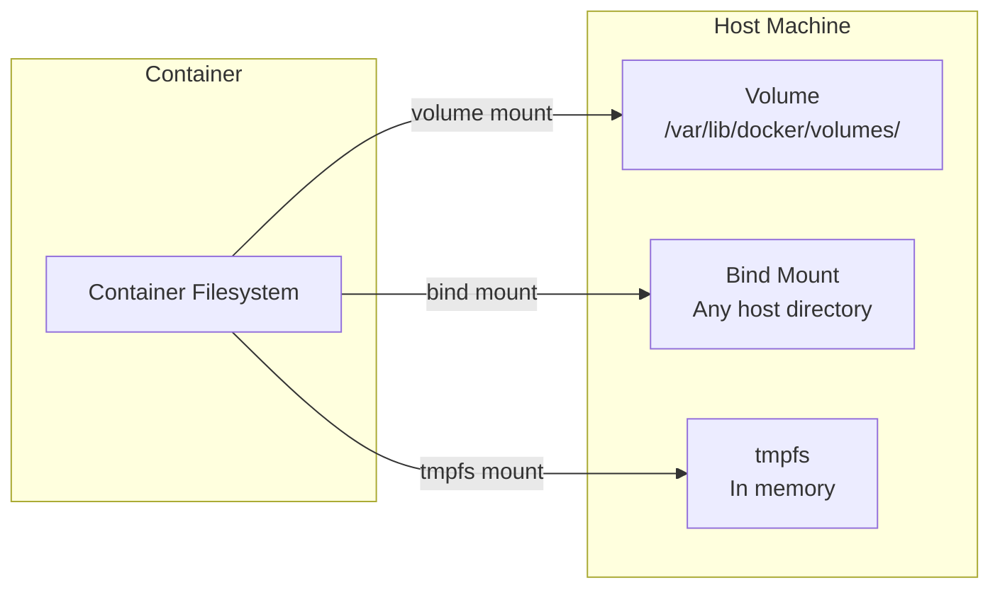
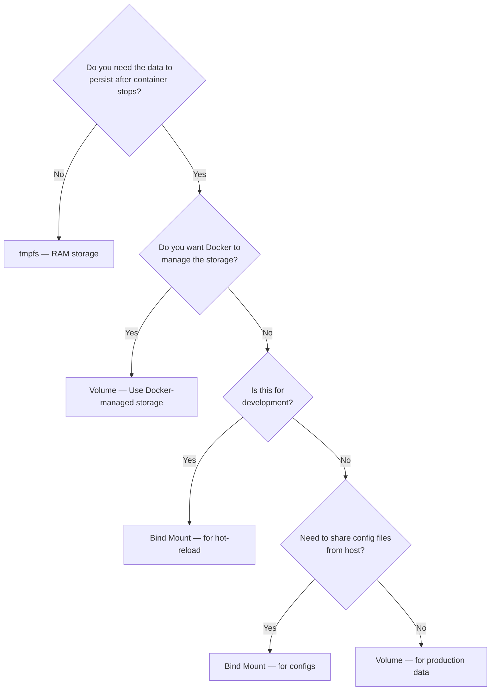
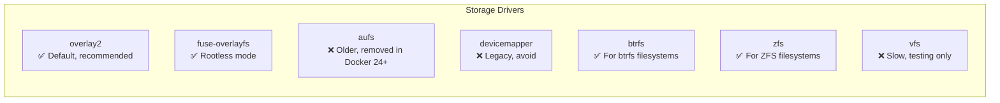

# 04 — Docker Volumes & Data Management

> Containers are ephemeral. Your data shouldn't be.

---

## Table of Contents

1. [Why Data Persistence?](#why-data-persistence)
2. [Types of Mounts](#types-of-mounts)
3. [Volumes (The Preferred Choice)](#volumes-the-preferred-choice)
4. [Bind Mounts](#bind-mounts)
5. [tmpfs Mounts](#tmpfs-mounts)
6. [Named vs Anonymous Volumes](#named-vs-anonymous-volumes)
7. [Volume Management Commands](#volume-management-commands)
8. [Volume Drivers & NFS](#volume-drivers--nfs)
9. [Backup & Restore Volumes](#backup--restore-volumes)
10. [When to Use Which Mount Type](#when-to-use-which-mount-type)
11. [Storage Drivers Overview](#storage-drivers-overview)
12. [Permissions & Ownership](#permissions--ownership)

---

## Why Data Persistence?

By default, all files created inside a container are stored on a **writable container layer**:

```
Container's writable layer  ← Changes here
    ┌──────────────────┐
    │   Layer 5: CMD   │
    ├──────────────────┤
    │   Layer 4: COPY  │
    ├──────────────────┤
    │   Layer 3: RUN   │      ← Image layers (read-only)
    ├──────────────────┤
    │   Layer 2: COPY  │
    ├──────────────────┤
    │   Layer 1: FROM  │
    └──────────────────┘
```

### The Problem

```bash
# Container 1: Add data
docker run --name postgres1 -e POSTGRES_PASSWORD=secret postgres:16
# ... database stores data in /var/lib/postgresql/data ...

# Container 2: Remove and recreate
docker rm postgres1
docker run --name postgres2 -e POSTGRES_PASSWORD=secret postgres:16
# ❌ ALL DATA IS GONE!
```

The writable layer:
- **Dies with the container** — `docker rm` destroys all data
- **Hard to move** between hosts
- **Performance issues** — the storage driver (overlay2) has overhead for write-heavy workloads

### The Solution: Mounts

Docker provides three ways to persist data **outside** the container's writable layer:



---

## Types of Mounts

| Mount Type | Stored | Persistence | Speed | Use Case |
|------------|--------|-------------|-------|----------|
| **Volume** | `/var/lib/docker/volumes/` | Persistent (managed by Docker) | Fast | Databases, production data |
| **Bind Mount** | Any host path | Persistent (you manage it) | Fastest | Development, config files |
| **tmpfs** | RAM | Non-persistent (lost on stop) | Fastest | Secrets, temp files, scratch data |

### Comparison

```
              Managed by Docker     Portable     Backup     Speed
Volume            ✅ Yes              ✅ Yes       ✅ Easy    ⭐⭐⭐
Bind Mount        ❌ No               ❌ No        Manual     ⭐⭐⭐⭐
tmpfs             ❌ No               N/A          N/A        ⭐⭐⭐⭐⭐
```

---

## Volumes (The Preferred Choice)

Volumes are the **recommended** way to persist data in Docker.

### Creating Volumes

```bash
# Create a named volume
docker volume create myvolume

# Create with labels
docker volume create \
  --label env=production \
  --label app=postgres \
  myvolume

# Create with a volume driver (e.g., NFS)
docker volume create \
  --driver local \
  --opt type=nfs \
  --opt o=addr=192.168.1.100,rw \
  --opt device=:/path/to/dir \
  nfs-volume
```

### Using Volumes

```bash
# Named volume
docker run -v myvolume:/data app

# Anonymous volume (Docker creates a random name)
docker run -v /data app

# Modern --mount syntax (preferred)
docker run --mount type=volume,source=myvolume,target=/data app
docker run --mount type=volume,source=myvolume,target=/data,readonly app

# Multiple volumes
docker run \
  --mount type=volume,source=pgdata,target=/var/lib/postgresql/data \
  --mount type=volume,source=pglogs,target=/var/log/postgresql \
  postgres:16
```

### Where Volumes Live

```bash
# Volumes are stored on the host
ls -la /var/lib/docker/volumes/
# drwx-----x 3 root root 4096 Apr 1 12:00 myvolume
# drwx-----x 3 root root 4096 Apr 1 12:00 abc123def456

# Inspect a volume
docker volume inspect myvolume
# [
#     {
#         "CreatedAt": "2024-04-01T12:00:00Z",
#         "Driver": "local",
#         "Mountpoint": "/var/lib/docker/volumes/myvolume/_data",
#         "Name": "myvolume",
#         "Options": {},
#         "Scope": "local"
#     }
# ]

# See what's in the volume
sudo ls -la /var/lib/docker/volumes/myvolume/_data/
```

---

## Bind Mounts

Bind mounts map any directory on the **host** into the container.

```bash
# Mount host directory to container
docker run -v /host/path:/container/path app

# Modern --mount syntax
docker run --mount type=bind,source=/host/path,target=/container/path app

# Read-only bind mount
docker run --mount type=bind,source=/host/path,target=/container/path,readonly app

# Relative path (from Docker context — Compose only)
docker run --mount type=bind,source=./data,target=/app/data app
```

### Development Use Case

```bash
# Mount your source code for hot-reloading
docker run \
  -p 3000:3000 \
  --mount type=bind,source=$(pwd)/src,target=/app/src \
  -e NODE_ENV=development \
  node-dev

# Now you can edit code on your host, and changes reflect in the container
```

### Common Bind Mount Patterns

```bash
# Mount Docker socket (Docker-in-Docker)
docker run -v /var/run/docker.sock:/var/run/docker.sock docker:cli

# Mount config files
docker run -v /etc/myapp/config.yaml:/app/config.yaml:ro app

# Mount logs directory
docker run -v /var/log/myapp:/app/logs app

# Mount a specific file (not directory)
docker run -v "$(pwd)/nginx.conf:/etc/nginx/nginx.conf:ro" nginx
```

### Behavior Differences

| Aspect | Volume | Bind Mount |
|--------|--------|------------|
| **Empty host dir** | Volume initialized with container content | Host dir overrides container content |
| **Non-empty host dir** | Volume initialized with container content | Host dir hides container content |
| **Permissions** | Docker manages them | Your host permissions apply |
| **Backup** | `docker run --volumes-from` | Standard file backup |

**Important:** If you bind-mount an empty host directory over a non-empty container directory, the container's files are **hidden** (not deleted). This can cause "file not found" errors.

---

## tmpfs Mounts

tmpfs mounts store data in **memory** (RAM). Data is lost when the container stops.

```bash
# Mount a tmpfs at /tmp
docker run --tmpfs /tmp app

# Modern --mount syntax
docker run --mount type=tmpfs,target=/tmp app

# tmpfs with size limit
docker run --mount type=tmpfs,target=/tmp,tmpfs-size=100m app

# tmpfs with permissions
docker run --mount type=tmpfs,target=/tmp,tmpfs-mode=1770 app
```

### Use Cases

```bash
# Scratch space for batch processing
docker run --mount type=tmpfs,target=/scratch batch-processor

# Store sensitive data (secrets loaded at runtime)
docker run \
  -e DB_PASSWORD=supersecret  # ❌ BAD — in env, visible in inspect
  app

# Better: mount as tmpfs
docker run \
  --mount type=tmpfs,target=/secrets \
  app
  # Write password to /secrets/db_password at runtime
```

### tmpfs Trade-offs

| Pros | Cons |
|------|------|
| Fastest option (RAM speed) | Consumes host memory |
| Data is never written to disk | **Not persistent** — lost on container stop |
| Automatically cleaned up | Size limited by available RAM |
| Good for sensitive data | Can cause OOM if not sized properly |

---

## Named vs Anonymous Volumes

### Anonymous Volumes

Created automatically when you use `-v /container/path` without a name.

```bash
docker run -v /data app
# Docker creates: /var/lib/docker/volumes/RANDOM_HASH/_data

docker run -v /data app
# Docker creates: /var/lib/docker/volumes/ANOTHER_RANDOM_HASH/_data
```

**Problem:** Anonymous volumes are hard to manage. You don't know which volume belongs to which container.

### Named Volumes

```bash
docker volume create app-data
docker run -v app-data:/data app

# Later:
docker volume rm app-data     # Clean, intentional
docker volume ls              # You see "app-data", not "abc123"
```

**Always prefer named volumes** for anything that matters.

---

## Volume Management Commands

### Create / List / Inspect / Remove

```bash
# Create
docker volume create app-data
docker volume create --label env=prod app-data

# List
docker volume ls
docker volume ls -f name=app
docker volume ls -f dangling=true
docker volume ls --format "table {{.Name}}\t{{.Driver}}\t{{.Size}}"

# Inspect
docker volume inspect app-data

# Remove
docker volume rm app-data

# Remove all unused
docker volume prune
docker volume prune -a      # Remove ALL volumes not in use
docker volume prune -f      # Force

# Force remove a volume in use
docker volume rm -f app-data
```

### Backup

```bash
# Create a backup of a volume
docker run --rm \
  --mount type=volume,source=pgdata,target=/data \
  -v $(pwd):/backup \
  alpine \
  tar czf /backup/pgdata-backup.tar.gz -C /data .

# Backup while the source container is running
docker run --rm \
  --volumes-from postgres \
  -v $(pwd):/backup \
  alpine \
  tar czf /backup/pgdata-backup.tar.gz -C /var/lib/postgresql/data .
```

### Restore

```bash
# Restore a backup to a volume
docker volume create pgdata-restored

docker run --rm \
  --mount type=volume,source=pgdata-restored,target=/data \
  -v $(pwd):/backup \
  alpine \
  tar xzf /backup/pgdata-backup.tar.gz -C /data

# Verify
docker run --rm \
  --mount type=volume,source=pgdata-restored,target=/data \
  alpine \
  ls -la /data
```

### Migrate Between Hosts

```bash
# On source host:
docker run --rm \
  --mount type=volume,source=app-data,target=/data \
  -v $(pwd):/backup \
  alpine tar czf /backup/app-data.tar.gz -C /data .

# Copy backup to destination host
scp app-data.tar.gz user@destination:/tmp/

# On destination host:
docker volume create app-data
docker run --rm \
  --mount type=volume,source=app-data,target=/data \
  -v /tmp:/backup \
  alpine tar xzf /backup/app-data.tar.gz -C /data
```

---

## Volume Drivers & NFS

### Local Driver (Default)

```bash
# Default — stores on the host filesystem
docker volume create --driver local myvolume
```

### NFS Volume

Useful when you need to share data across multiple Docker hosts.

```bash
# Create NFS volume
docker volume create \
  --driver local \
  --opt type=nfs \
  --opt o=addr=192.168.1.100,rw,nfsvers=4 \
  --opt device=:/exported/path \
  nfs-volume

# Use it
docker run --mount type=volume,source=nfs-volume,target=/data app
```

### Third-Party Volume Drivers

```bash
# REX-Ray (cloud storage)
docker volume create --driver rexray --opt size=10 --opt volumetype=gp2 myvolume

# Portworx
docker volume create --driver pxd --opt size=10 --opt repl=3 myvolume

# Ceph
docker volume create --driver ceph --opt pool=rbd myvolume

# SSHFS (mount remote directory via SSH)
docker plugin install --grant-all-permissions vieux/sshfs
docker volume create --driver vieux/sshfs \
  --opt sshcmd=user@host:/remote/path \
  --opt password=secret \
  ssh-volume
```

---

## Backup & Restore Volumes

### Full Backup Script

```bash
#!/bin/bash
# backup-volume.sh

VOLUME_NAME=$1
BACKUP_DIR=${2:-./backups}
TIMESTAMP=$(date +%Y%m%d_%H%M%S)
BACKUP_FILE="${BACKUP_DIR}/${VOLUME_NAME}_${TIMESTAMP}.tar.gz"

mkdir -p "$BACKUP_DIR"

docker run --rm \
  --mount type=volume,source="$VOLUME_NAME",target=/data \
  -v "$(pwd)/$BACKUP_DIR":/backup \
  alpine \
  tar czf "/backup/$(basename $BACKUP_FILE)" -C /data .

echo "✅ Backup saved to: $BACKUP_FILE"
echo "   Size: $(du -h $BACKUP_FILE | cut -f1)"
```

### Full Restore Script

```bash
#!/bin/bash
# restore-volume.sh

VOLUME_NAME=$1
BACKUP_FILE=$2

if [ ! -f "$BACKUP_FILE" ]; then
  echo "❌ Backup file not found: $BACKUP_FILE"
  exit 1
fi

# Create volume if it doesn't exist
docker volume create "$VOLUME_NAME" 2>/dev/null

docker run --rm \
  --mount type=volume,source="$VOLUME_NAME",target=/data \
  -v "$(pwd)/$BACKUP_FILE":/backup/file.tar.gz \
  alpine \
  tar xzf /backup/file.tar.gz -C /data

echo "✅ Restored $BACKUP_FILE to volume $VOLUME_NAME"
```

### Docker Compose Backup

```yaml
# docker-compose.backup.yml
services:
  backup:
    image: alpine
    command: tar czf /backup/data-backup.tar.gz -C /data .
    volumes:
      - app-data:/data
      - ./backups:/backup
    profiles:
      - backup

volumes:
  app-data:
    external: true
```

```bash
docker compose -f docker-compose.backup.yml run --rm backup
```

---

## When to Use Which Mount Type

### Decision Tree



### Quick Reference

| Use Case | Mount Type | Example |
|----------|------------|---------|
| Database data | **Volume** | `-v pgdata:/var/lib/postgresql/data` |
| Development hot-reload | **Bind mount** | `-v $(pwd)/src:/app/src` |
| Configuration files | **Bind mount** (read-only) | `-v ./config.yaml:/app/config.yaml:ro` |
| Temporary scratch space | **tmpfs** | `--tmpfs /tmp` |
| Secrets (short-lived) | **tmpfs** | `--mount type=tmpfs,target=/secrets` |
| Sharing between containers | **Volume** | Named volume mounted in multiple containers |
| Logs | **Bind mount** | `-v /var/log/app:/app/logs` |
| Docker socket access | **Bind mount** | `-v /var/run/docker.sock:/var/run/docker.sock` |
| Cloud storage (EBS, EFS) | **Volume with cloud driver** | REX-Ray, Portworx |
| NFS shares | **Volume with NFS driver** | NFS volume |
| Cache directories | **Volume** (or tmpfs) | `-v npm-cache:/root/.npm` |

---

## Storage Drivers Overview

Docker uses **storage drivers** to manage the layers and the writable container layer.



### Default: overlay2

```bash
# Check which storage driver is in use
docker info | grep "Storage Driver"
# Storage Driver: overlay2

# overlay2 is:
# - Fast (native filesystem operations)
# - Stable (default since Docker 18.09)
# - Works on xfs, ext4, and most Linux filesystems
```

### How overlay2 Works

```
Container Layer (R/W)     ← Changes at runtime
    │
    │  Copy-on-Write: when a file is modified,
    │  it's copied from lower to upper layer
    │
lowerdir (R/O layers):    ← Image layers
    Layer N
    Layer N-1
    ...
    Layer 1 (FROM)
```

**Performance tip:** For write-heavy workloads (like databases), use volumes or bind mounts — they bypass the storage driver entirely and write directly to the host filesystem.

---

## Permissions & Ownership

### The Permission Problem

When using bind mounts, files are owned by the **host user's UID/GID**. Inside the container, the same UID/GID applies.

```bash
# Host: user has UID=1000
# Container node user: UID=1000
# ✅ Works perfectly

# Host: user has UID=1000
# Container postgres user: UID=999
# ❌ Permission denied on mounted data directory
```

### Solutions

```bash
# 1. Use --user flag to run as host UID
docker run --user "$(id -u):$(id -g)" -v "$(pwd)/data:/data" app

# 2. chown inside container (at startup)
docker run app bash -c "chown -R appuser:appgroup /data && exec node app.js"

# 3. Use an entrypoint script that handles permissions
# entrypoint.sh:
#   chown -R appuser:appgroup /data
#   exec gosu appuser "$@"

# 4. Match container user UID to host UID in Dockerfile
RUN addgroup -g 1000 appgroup && adduser -u 1000 -G appgroup -D appuser
```

### With Volumes

```bash
# Volumes are created with root:root by default
# On first use, container can set the ownership

# PostgreSQL example:
# The postgres image's entrypoint sets ownership:
# chown -R postgres:postgres /var/lib/postgresql/data
# This runs ONCE when the volume is first created
```

---

## Summary

| Concept | Key Takeaway |
|---------|-------------|
| **Volumes** | ✅ Preferred — Docker-managed, portable, easy to backup |
| **Bind mounts** | ⚡ Great for dev — hot-reload, but host-dependent |
| **tmpfs** | 🚀 RAM-speed — for temporary, sensitive data |
| **Named volumes** | Always use named volumes, never anonymous |
| **Backup** | Use Alpine container with tar for backup/restore |
| **Permissions** | Match UID/GID between host and container |

---

## Next Steps

→ [05 — Docker Networking](./05-docker-networking.md)
