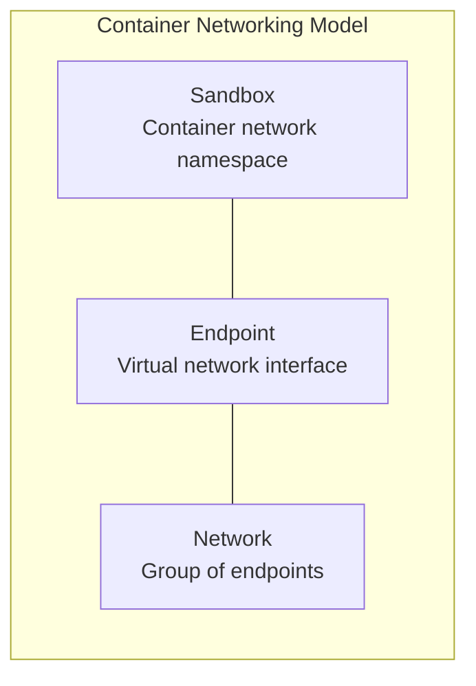
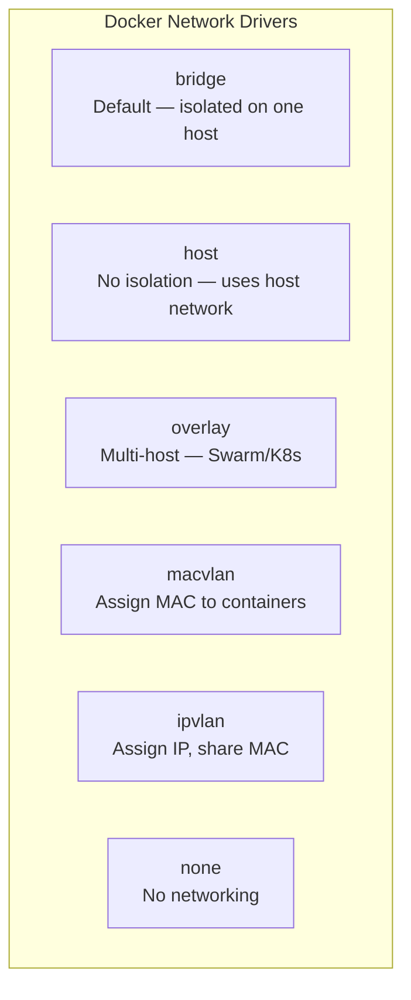
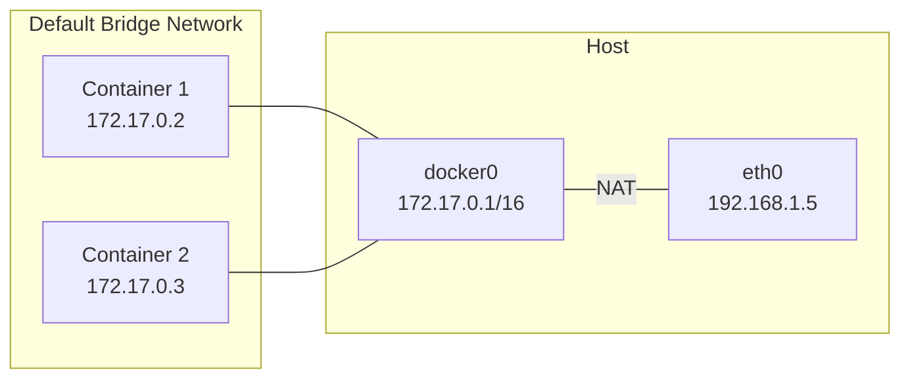
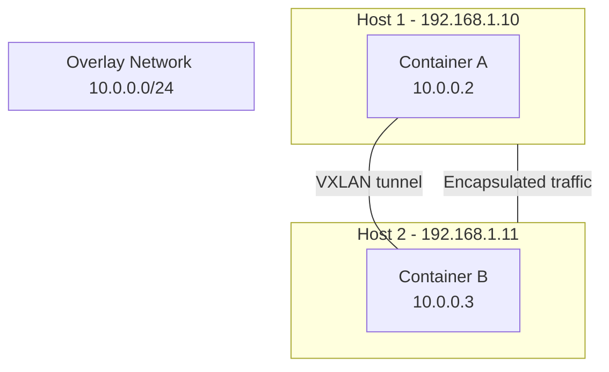
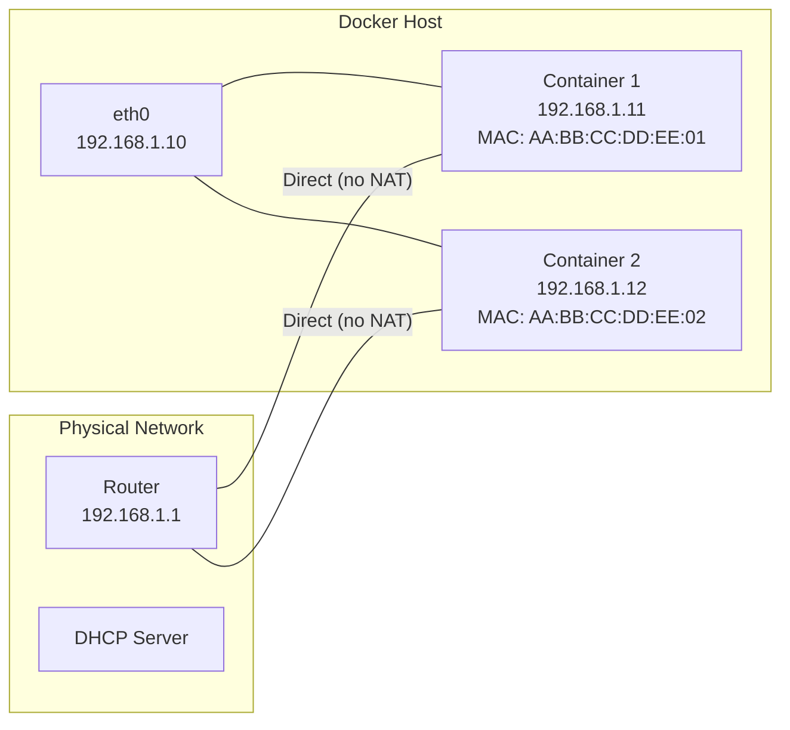
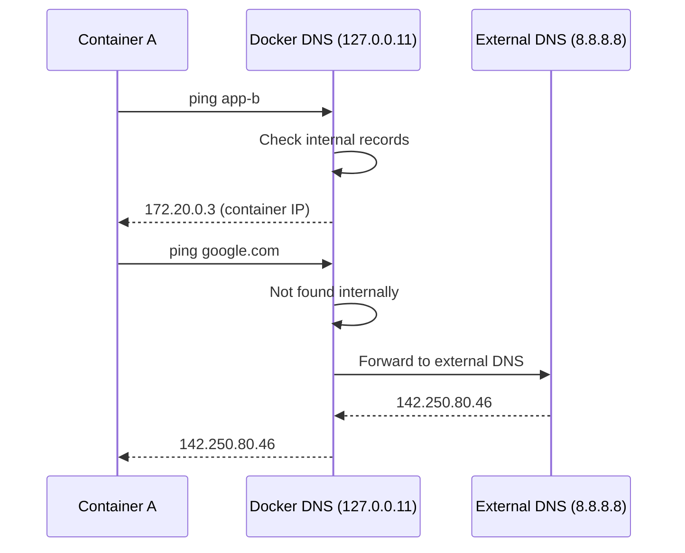
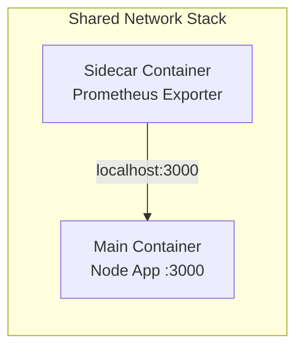

# 05 — Docker Networking

> How containers talk to each other and the outside world.

---

## Table of Contents

1. [Container Networking Model (CNM)](#container-networking-model-cnm)
2. [Network Drivers Overview](#network-drivers-overview)
3. [Bridge Network](#bridge-network)
4. [Host Network](#host-network)
5. [Overlay Network](#overlay-network)
6. [Macvlan & IPvlan](#macvlan--ipvlan)
7. [None Network](#none-network)
8. [Port Publishing](#port-publishing)
9. [Container DNS](#container-dns)
10. [Inter-Container Communication](#inter-container-communication)
11. [Network Troubleshooting](#network-troubleshooting)

---

## Container Networking Model (CNM)

Docker's networking is built on the **Container Networking Model (CNM)**, which defines three core components:



| Component | Description | Linux Implementation |
|-----------|-------------|---------------------|
| **Sandbox** | Isolated network stack for a container | Network namespace (`netns`) |
| **Endpoint** | Virtual network interface connecting sandbox to network | `veth` pair (one end in sandbox, one on bridge) |
| **Network** | Collection of endpoints that can communicate | Linux bridge, overlay, etc. |

### Visual: Container Network Stack

```
Container 1                         Container 2
┌─────────────────────┐            ┌─────────────────────┐
│  eth0: 172.17.0.2   │            │  eth0: 172.17.0.3   │
│  lo: 127.0.0.1      │            │  lo: 127.0.0.1      │
│  /etc/resolv.conf   │            │  /etc/resolv.conf    │
│  /etc/hosts         │            │  /etc/hosts          │
│  iptables rules     │            │  iptables rules      │
└─────────┬───────────┘            └─────────┬────────────┘
          │ veth pair                        │ veth pair
          │                                  │
          └───────────┬──────────────────────┘
                      │
              ┌───────▼────────┐
              │  docker0       │
              │  (Linux Bridge) │
              │  172.17.0.0/16 │
              └───────┬────────┘
                      │
              ┌───────▼────────┐
              │   Host eth0    │
              │   192.168.1.5  │
              └────────────────┘
```

---

## Network Drivers Overview

Docker provides six built-in network drivers:



| Driver | Scope | Use Case |
|--------|-------|----------|
| **bridge** | Local | Default — single-host container communication |
| **host** | Local | Performance-critical apps (no NAT overhead) |
| **overlay** | Swarm | Multi-host communication across nodes |
| **macvlan** | Local | Containers need their own MAC/IP on physical network |
| **ipvlan** | Local | High-performance, large-scale deployments |
| **none** | Local | Completely isolated containers |

---

## Bridge Network

### Default Bridge (docker0)

When Docker is installed, it creates a default bridge network called `docker0`.

```bash
# Check the default bridge
ip addr show docker0
# 3: docker0: <BROADCAST,MULTICAST,UP,LOWER_UP> ...
#     inet 172.17.0.1/16 brd 172.17.255.255 scope global docker0
```



### Default Bridge Limitations

```bash
# Containers on default bridge can communicate by IP
docker run -d --name app1 nginx
docker run -d --name app2 alpine ping 172.17.0.2   # ✅ Works by IP

# But NOT by container name
docker run -d --name app2 alpine ping app1          # ❌ DNS resolution not available
```

### User-Defined Bridge (Recommended)

```bash
# Create custom bridge network
docker network create --driver bridge my-network

# Custom subnet and gateway
docker network create \
  --driver bridge \
  --subnet=172.20.0.0/16 \
  --gateway=172.20.0.1 \
  --ip-range=172.20.10.0/24 \
  my-network

# Enable ICC (inter-container communication, default: true)
docker network create \
  --driver bridge \
  -o com.docker.network.bridge.enable_icc=false \
  isolated-network

# Run containers on custom network
docker run -d --name app1 --network my-network nginx
docker run -d --name app2 --network my-network alpine

# DNS resolution works!
docker exec app2 ping app1    # ✅ Works by container name
```

### Benefits of User-Defined Bridge

| Feature | Default Bridge | User-Defined Bridge |
|---------|---------------|-------------------|
| **DNS resolution** | ❌ By IP only | ✅ By container name |
| **Isolation** | All containers on `docker0` can communicate | Containers on different bridges are isolated |
| **Attach/detach** | Must create with `--link` (legacy) | Can attach/detach at any time |
| **Custom options** | Limited | Full control (subnet, gateway, MTU, ICC) |

### Network Isolation Example

```mermaid
flowchart LR
    subgraph Frontend[frontend-network]
        Nginx[nginx:80<br/>172.20.0.2]
    end
    subgraph Backend[backend-network]
        API[node-app:3000<br/>172.21.0.2]
        DB[postgres:5432<br/>172.21.0.3]
    end
    Nginx ---|port 3000| API
    API ---|port 5432| DB
    Nginx -.-x-.- DB  # ❌ Cannot reach DB directly
```

```bash
# Create networks
docker network create frontend-network
docker network create backend-network

# Nginx only on frontend
docker run -d --name nginx --network frontend-network nginx

# API on both (can talk to frontend AND backend)
docker run -d --name api --network backend-network node-api
docker network connect frontend-network api

# DB only on backend (isolated from frontend)
docker run -d --name db --network backend-network -e POSTGRES_PASSWORD=secret postgres

# DB can't be accessed from nginx directly
docker exec nginx ping db   # ❌ DNS resolution fails
```

### Bridge Network Options

```bash
# MTU setting (useful for overlay networks)
docker network create -o com.docker.network.driver.mtu=1450 my-network

# Enable IP masquerading (NAT for outbound traffic)
docker network create -o com.docker.network.bridge.enable_ip_masquerade=true my-network

# Set bridge name
docker network create -o com.docker.network.bridge.name=br-myapp my-network
```

---

## Host Network

With `--network=host`, the container shares the **host's network stack** — no isolation.

```bash
docker run --network=host nginx
# Now nginx listens directly on the host's IP, no port mapping needed
```

### How It Works

```
Normal bridge mode:                  Host network mode:

Container: 127.0.0.1                Container: shares host's 127.0.0.1
  - port 80 mapped to host:8080       - port 80 is host's port 80
  - has its own IP (172.17.0.2)       - no separate IP
  - traffic goes through NAT          - no NAT — direct access
```

### When to Use Host Network

```bash
# Performance-sensitive apps (minimal latency)
docker run --network=host --name nginx nginx

# Network monitoring tools (need host interfaces)
docker run --network=host --privileged ntop

# Apps that need to bind to many ports
docker run --network=host myapp
# No need for -p flags — all ports exposed directly
```

### Trade-offs

| Pros | Cons |
|------|------|
| Zero network overhead | No port isolation (port conflicts) |
| No NAT — real client IP | Can't run multiple containers on same port |
| Maximum performance | Reduced security (container in host network space) |
| Simple (no port mapping to manage) | Only works on Linux (not macOS/Windows Docker Desktop) |

---

## Overlay Network

Overlay networks connect containers across **multiple Docker hosts** (used with Docker Swarm).



```bash
# Create overlay network (requires Swarm mode)
docker swarm init
docker network create --driver overlay --attachable my-overlay
# --attachable allows standalone containers to use the network

# Run containers on different hosts
docker -H host1 run -d --name app1 --network my-overlay nginx
docker -H host2 run -d --name app2 --network my-overlay alpine

# They can communicate by container name
docker -H host2 exec app2 ping app1    # ✅ Cross-host DNS resolution
```

### Overlay Encryption

```bash
# Encrypted overlay (IPSec)
docker network create \
  --driver overlay \
  --opt encrypted \
  secure-overlay
```

---

## Macvlan & IPvlan

### Macvlan

Assigns a **real MAC address** to each container, making them appear as physical devices on the network.



```bash
# Create macvlan network
docker network create \
  --driver macvlan \
  --subnet=192.168.1.0/24 \
  --gateway=192.168.1.1 \
  -o parent=eth0 \
  macvlan-network

# Run container with IP from the physical network
docker run -d --name app --network macvlan-network --ip=192.168.1.50 nginx

# The container is directly accessible at 192.168.1.50 (no port mapping!)
```

### IPvlan

Similar to macvlan but shares the host's MAC address. Each container gets its own IP.

```bash
docker network create \
  --driver ipvlan \
  --subnet=192.168.1.0/24 \
  --gateway=192.168.1.1 \
  -o parent=eth0 \
  ipvlan-network

# L2 mode (default) — same as macvlan but same MAC
# L3 mode — routing between subnets without bridging
docker network create \
  --driver ipvlan \
  --subnet=10.0.0.0/24 \
  --gateway=10.0.0.1 \
  -o parent=eth0 \
  -o ipvlan_mode=l3 \
  ipvlan-l3
```

### Macvlan vs IPvlan

| Feature | Macvlan | IPvlan |
|---------|---------|--------|
| **MAC address** | Each container gets unique MAC | All containers share host MAC |
| **Scalability** | Limited by MAC table in switch (usually 1024) | No MAC limit |
| **Promiscuous mode** | Parent interface must be in promiscuous mode | Not required |
| **Use case** | Legacy apps needing direct network access | Large-scale IP-per-container |

---

## None Network

Complete network isolation — the container has no network interfaces except `lo`.

```bash
docker run --network=none --name isolated alpine
docker exec isolated ip addr
# 1: lo: <LOOPBACK,UP,LOWER_UP> ... 127.0.0.1/8
# No eth0 — completely offline
```

**Use cases:**
- Security-sensitive batch processing
- Containers that only read from stdin/write to stdout
- Testing in complete isolation

---

## Port Publishing

### How Port Publishing Works

```bash
docker run -p 8080:80 nginx
```

```
User Request                    Docker Host
┌──────────┐    ┌─────────────────────────────────────────┐
│ Browser  │───►│  eth0: 192.168.1.10                     │
│ :8080    │    │  ┌──────────────────────────────────┐   │
└──────────┘    │  │  iptables NAT rule:               │   │
                │  │  PREROUTING: REDIRECT 8080 → 80   │   │
                │  │  DOCKER chain in iptables         │   │
                │  └──────────┬───────────────────────┘   │
                │             ▼                           │
                │  docker0 bridge: 172.17.0.1             │
                │    ┌──────────────────────┐             │
                │    │ Container: 172.17.0.2 │             │
                │    │ Port 80               │             │
                │    └──────────────────────┘             │
                └─────────────────────────────────────────┘
```

### Port Publishing Options

```bash
# Map host port 8080 to container port 80
docker run -p 8080:80 nginx

# Map random host port to container port 80
docker run -P nginx                    # Capital P — publish ALL exposed ports
docker run -p 80 nginx                 # Same, random host port

# Specify protocol
docker run -p 53:53/udp dns-server
docker run -p 53:53/tcp dns-server
docker run -p 53:53/udp -p 53:53/tcp dns-server

# Bind to specific host IP
docker run -p 127.0.0.1:8080:80 nginx       # localhost only
docker run -p 10.0.0.5:8080:80 nginx        # Specific interface

# Multiple port ranges
docker run -p 3000-3005:3000-3005 app

# Check port mappings
docker port mycontainer
# 80/tcp -> 0.0.0.0:8080
```

### Published vs Exposed Ports

| Concept | Description | 
|---------|-------------|
| **EXPOSE** (Dockerfile) | Documentation — says "this container listens on port X" |
| **-p / --publish** | Actually maps host port to container port (creates iptables rule) |
| **-P / --publish-all** | Publishes all EXPOSEd ports to random host ports |

```bash
# Dockerfile EXPOSE is documentation only
docker run nginx              # ❌ Not accessible from host
docker run -P nginx           # ✅ Published to random port
docker run -p 8080:80 nginx   # ✅ Published to port 8080
```

---

## Container DNS

### DNS Resolution in Containers

Docker provides built-in DNS resolution for containers on **user-defined networks**.

```bash
# Each container gets:
# - /etc/resolv.conf (usually host's DNS)
# - DNS resolution for other containers by name
# - Internal DNS at 127.0.0.11 (Docker's embedded DNS)
```

### How Docker DNS Works



### Custom DNS Configuration

```bash
# Custom DNS servers
docker run --dns 8.8.8.8 --dns 8.8.4.4 app

# Custom hostname
docker run --hostname myapp app

# Custom /etc/hosts entries
docker run --add-host db:10.0.0.5 --add-host cache:10.0.0.6 app

# DNS search domains
docker run --dns-search example.com --dns-search prod.example.com app

# DNS options
docker run --dns-opt ndots:2 --dns-opt timeout:2 app
```

### DNS in User-Defined Networks

```bash
# Containers can resolve each other by name
docker network create mynet
docker run -d --name web --network mynet nginx
docker run -d --name app --network mynet alpine

docker exec app ping web       # ✅ Works
docker exec app getent hosts web  # 172.18.0.2  web  mynet

# Container name + network alias
docker run -d --name api --network mynet --network-alias backend api-image
# Other containers can reach it as "backend"
```

---

## Inter-Container Communication

### Methods

| Method | Description | Example |
|--------|-------------|---------|
| **Same network** | Containers on same user-defined bridge can communicate by name | `ping app1` |
| **Network connect** | Attach container to multiple networks | `docker network connect` |
| **Container network** | Share one container's network stack with another | `--network=container:other` |
| **Legacy --link** | Deprecated, avoid | `--link db:db` |

### Container Network Mode

```bash
# Share another container's network stack
docker run -d --name nginx nginx
docker run -it --network=container:nginx alpine

# The alpine container sees the same network as nginx
# They share the same IP and port space
# Useful for: network debugging, sidecar containers
```

### Sidecar Pattern



```bash
# Main app
docker run -d --name myapp myapp-image

# Sidecar (shares network with main app)
docker run -d --network=container:myapp \
  --name metrics-collector \
  prom/node-exporter
# The sidecar can access myapp at localhost:3000
```

---

## Network Troubleshooting

### Common Commands

```bash
# List networks
docker network ls

# Inspect network (see connected containers)
docker network inspect my-network

# Show container network settings
docker inspect mycontainer --format '{{json .NetworkSettings}}' | jq

# Show container IP
docker inspect -f '{{range .NetworkSettings.Networks}}{{.IPAddress}}{{end}}' mycontainer

# Connect container to network
docker network connect my-network mycontainer

# Disconnect container from network
docker network disconnect my-network mycontainer

# Remove all unused networks
docker network prune
```

### Debugging Connectivity

```bash
# 1. Check if container is running
docker ps | grep mycontainer

# 2. Check container logs
docker logs mycontainer

# 3. Check network settings
docker inspect mycontainer | grep -A 10 "Networks"

# 4. Check DNS resolution (from inside container)
docker exec mycontainer getent hosts other-container
docker exec mycontainer nslookup other-container
docker exec mycontainer cat /etc/resolv.conf

# 5. Check connectivity
docker exec mycontainer ping -c 3 other-container
docker exec mycontainer curl -v http://other-container:3000/health

# 6. Check iptables rules (on host)
iptables -L -n -t nat | grep DOCKER

# 7. Check port bindings
docker port mycontainer

# 8. Check network namespace
docker inspect mycontainer --format '{{.NetworkSettings.SandboxKey}}'
```

### Common Issues & Fixes

| Problem | Cause | Fix |
|---------|-------|-----|
| `ping: bad address` | DNS not resolving | Use user-defined bridge network |
| `Connection refused` | App not listening on right interface | Bind to `0.0.0.0`, not `127.0.0.1` |
| `Cannot find network` | Network was pruned | Recreate network and reattach containers |
| Port conflict | Another container/host using the port | Change host port or stop the other process |
| Cross-host resolution fails | Not using overlay network | Use Docker Swarm overlay or external service discovery |
| Container can't reach internet | No NAT/masquerade on bridge | Enable IP masquerade or check host firewall |
| DNS resolution slow | DNS server unreachable | Set explicit DNS: `--dns 8.8.8.8` |

### Network Debug Container

```bash
# Spawn a network debugging container
docker run --rm -it --network container:target-container nicolaka/netshoot

# Or use the official Docker debug image
docker run --rm -it --network container:target-container docker:latest sh

# netshoot has: curl, wget, dig, nslookup, tcpdump, netstat, iftop, iperf, nmap
```

---

## Summary

| Network Driver | Isolation | Cross-Host | When to Use |
|---------------|-----------|------------|-------------|
| **bridge** (default) | ✅ Containers on same bridge can talk | ❌ | Most apps, single host |
| **bridge** (custom) | ✅ ✅ Full isolation per network | ❌ | Production apps, microservices |
| **host** | ❌ No isolation | ❌ | Performance-critical, monitoring |
| **overlay** | ✅ Per-network | ✅ | Multi-host, Swarm services |
| **macvlan** | ❌ Containers on physical network | ❌ | Legacy apps, direct network access |
| **ipvlan** | ❌ Containers on physical network | ❌ | Large-scale IP-per-container |
| **none** | ✅ Complete isolation | ❌ | Offline processing, security |

---

## Next Steps

→ [06 — Docker Compose](./06-docker-compose.md)
