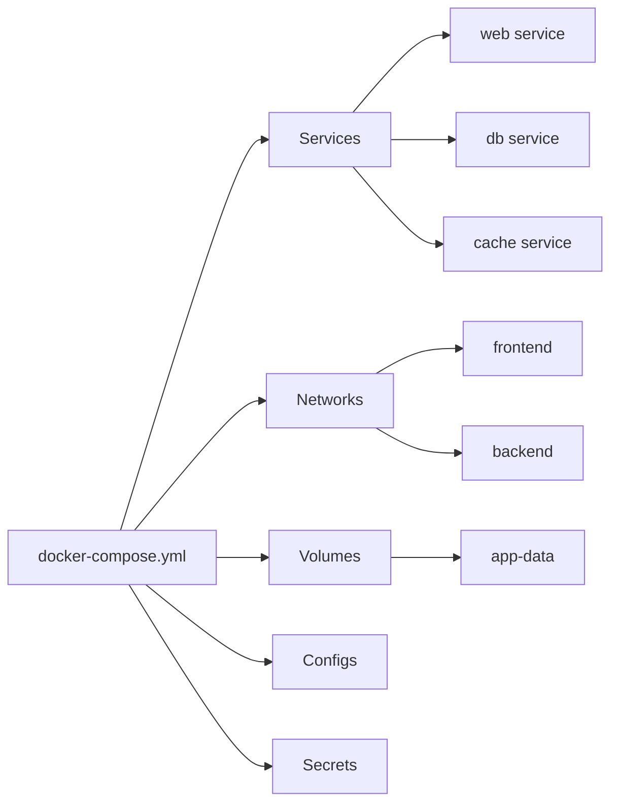

# 06 — Docker Compose

> Define and run multi-container Docker applications

---

## Table of Contents

1. [What is Docker Compose?](#what-is-docker-compose)
2. [Compose V1 vs V2](#compose-v1-vs-v2)
3. [Compose File Structure](#compose-file-structure)
4. [Service Configuration Reference](#service-configuration-reference)
5. [Networking in Compose](#networking-in-compose)
6. [Volumes in Compose](#volumes-in-compose)
7. [Profiles](#profiles)
8. [Environment Variables & .env](#environment-variables--env)
9. [Multi-File Compose](#multi-file-compose)
10. [Compose Commands Reference](#compose-commands-reference)
11. [Production Compose Patterns](#production-compose-patterns)

---

## What is Docker Compose?

Docker Compose lets you define and run **multi-container** Docker applications using a YAML file.

```yaml
services:
  web:
    build: .
    ports:
      - "3000:3000"
  db:
    image: postgres:16
    environment:
      POSTGRES_PASSWORD: secret
```

**Without Compose:** Run 5+ `docker run` commands with multiple flags  
**With Compose:** One `docker compose up -d` starts everything

### Before Compose

```bash
# Every developer needs to remember this:
docker network create myapp
docker volume create pgdata
docker run -d --name db --network myapp -v pgdata:/var/lib/postgresql/data -e POSTGRES_PASSWORD=secret postgres:16
docker run -d --name redis --network myapp redis:7-alpine
docker run -d --name api --network myapp -p 3000:3000 -e DB_URL=postgres://... myapp/api
docker run -d --name web --network myapp -p 8080:80 -e API_URL=http://api:3000 nginx
```

### After Compose

```bash
docker compose up -d
# Done. Everything starts, connects, and is ready.
```

---

## Compose V1 vs V2

| Aspect | V1 (docker-compose) | V2 (docker compose) |
|--------|---------------------|---------------------|
| **Command** | `docker-compose` (with hyphen) | `docker compose` (space) |
| **Status** | Deprecated | Current |
| **Installation** | Separate Python package | Built into Docker CLI (v20.10+) |
| **Performance** | Slower | Faster (Go-native) |
| **Output** | Standard | Colored, organized by service |

```bash
# V1 (old — deprecated)
docker-compose up -d

# V2 (new — use this)
docker compose up -d
```

---

## Compose File Structure



```yaml
# docker-compose.yml — Complete structure
name: myapp                         # Project name (v2.1+)

services:
  web:
    build: ./web
    ports:
      - "8080:80"
    networks:
      - frontend

  api:
    build:
      context: ./api
      dockerfile: Dockerfile.prod
    environment:
      - DB_URL=postgres://user:pass@db:5432/myapp
    depends_on:
      - db
    networks:
      - frontend
      - backend
    volumes:
      - app-data:/app/data

  db:
    image: postgres:16-alpine
    environment:
      POSTGRES_USER: user
      POSTGRES_PASSWORD: ${DB_PASSWORD}     # From .env
      POSTGRES_DB: myapp
    volumes:
      - pgdata:/var/lib/postgresql/data
    networks:
      - backend
    healthcheck:
      test: ["CMD-SHELL", "pg_isready -U user"]
      interval: 10s
      timeout: 5s
      retries: 5

networks:
  frontend:
    driver: bridge
  backend:
    driver: bridge
    internal: true                     # No external access

volumes:
  pgdata:                              # Named volume
  app-data:                            # Named volume
```

### Compose File Versions

```yaml
# Modern Compose (v2.x / v3.x) — everything above version line is deprecated
# Just use the latest format without specifying version:

services:
  ...

# OLD format (do NOT use):
version: '3.8'       # ❌ No longer needed
services:
  ...
```

Docker Compose now auto-detects the format. Omitting `version:` is the modern approach.

---

## Service Configuration Reference

### Build

```yaml
services:
  app:
    # Simple build
    build: .

    # Detailed build
    build:
      context: ./app
      dockerfile: Dockerfile.prod
      args:
        NODE_ENV: production
        VERSION: "1.2.3"
      labels:
        - "app.version=1.2.3"
      target: production                # Multi-stage build target
      network: host                     # Build-time network
      cache_from:
        - myapp:latest
        - type=registry,ref=myapp:cache
      extra_hosts:
        - "host.docker.internal:host-gateway"
      tags:
        - "myapp:latest"
        - "myapp:1.2.3"

    # Platform-specific builds
    platform: linux/amd64
```

### Image

```yaml
services:
  app:
    # From a registry
    image: postgres:16-alpine

    # Build and tag
    build: .
    image: myapp:latest

    # Pull policy
    pull_policy: always          # always, never, missing, build
```

### Ports

```yaml
services:
  web:
    ports:
      - "8080:80"                        # HOST:CONTAINER
      - "443:8443"
      - "127.0.0.1:3000:3000"            # Bind to specific IP
      - "3000-3005:3000-3005"            # Range
      - "53:53/udp"                      # UDP
      - target: 80
        published: 8080
        protocol: tcp
        mode: host                       # host (default) or ingress (Swarm)
```

### Environment

```yaml
services:
  app:
    # List format
    environment:
      - NODE_ENV=production
      - DB_HOST=db
      - DB_PORT=5432

    # Map format
    environment:
      NODE_ENV: production
      DB_HOST: db

    # From file
    env_file:
      - .env.production
      - ./config/common.env

    # Filter specific env file vars
    env_file:
      - path: .env.production
        required: true                   # Fail if missing (default: true)
```

### Volumes

```yaml
services:
  app:
    volumes:
      # Named volume
      - app-data:/app/data

      # Anonymous volume
      - /app/node_modules

      # Bind mount
      - ./src:/app/src

      # Long syntax (preferred for production)
      - type: volume
        source: app-data
        target: /app/data
        read_only: false
        volume:
          nocopy: true                   # Don't copy from container on first mount

      - type: bind
        source: ./src
        target: /app/src

      - type: tmpfs
        target: /tmp
        tmpfs:
          size: 1000000000               # 1GB

      - type: nfs
        target: /shared
        source: nfs-volume
```

### depends_on

```yaml
services:
  app:
    # Simple — just start order
    depends_on:
      - db
      - redis

    # Extended — with health check condition
    depends_on:
      db:
        condition: service_healthy      # Wait until healthcheck passes
      redis:
        condition: service_started      # Default — just started
      migrations:
        condition: service_completed_successfully  # Wait for job to finish
```

### Healthcheck

```yaml
services:
  db:
    image: postgres:16
    healthcheck:
      test: ["CMD-SHELL", "pg_isready -U postgres"]
      interval: 10s
      timeout: 5s
      retries: 5
      start_period: 30s                 # Grace period for startup
      start_interval: 5s                # Check frequency during start period
```

### Restart Policy

```yaml
services:
  app:
    restart: always                     # no, always, on-failure, unless-stopped

    # With on-failure limit
    restart: on-failure:5               # Max 5 retries

    # Deploy-level restart (Swarm)
    deploy:
      restart_policy:
        condition: any
        delay: 5s
        max_attempts: 3
        window: 120s
```

### Resource Limits

```yaml
services:
  app:
    deploy:
      resources:
        limits:
          cpus: "2.0"
          memory: 512M
          pids: 100
        reservations:
          cpus: "1.0"
          memory: 256M

    # For `docker compose` (not swarm), use these:
    cpus: "2.0"
    mem_limit: 512m
    mem_reservation: 256m
```

### Networks

```yaml
services:
  app:
    networks:
      - frontend
      - backend

    # With custom IP
    networks:
      frontend:
        ipv4_address: 172.20.0.10
      backend:
        ipv4_address: 172.21.0.10

    # Network aliases
    networks:
      frontend:
        aliases:
          - api
          - api-gateway
```

### Configs (Read-Only Files)

```yaml
services:
  app:
    configs:
      - app_config
      - source: nginx_config
        target: /etc/nginx/nginx.conf
        uid: "103"
        gid: "103"
        mode: 0440

configs:
  app_config:
    file: ./config/app.yaml
  nginx_config:
    file: ./config/nginx.conf
  # Or external (for Swarm)
  external_config:
    external: true
```

### Secrets

```yaml
services:
  app:
    secrets:
      - db_password
      - source: api_key
        target: /etc/app/api_key
        uid: "1000"
        mode: 0400

secrets:
  db_password:
    file: ./secrets/db_password.txt
  api_key:
    environment: API_KEY                # From environment variable
  # External (for Swarm)
  tls_cert:
    external: true
```

### Other Options

```yaml
services:
  app:
    container_name: myapp               # Fixed container name (not compose-generated)
    hostname: myapp                     # Container hostname
    user: "1000:1000"                   # Run as specific user
    working_dir: /app
    entrypoint: ["/entrypoint.sh"]
    command: ["--port", "3000"]         # Override CMD
    stop_signal: SIGTERM
    stop_grace_period: 30s
    dns:
      - 8.8.8.8
      - 8.8.4.4
    dns_search:
      - example.com
    extra_hosts:
      - "host.docker.internal:host-gateway"
    cap_add:
      - NET_BIND_SERVICE
    cap_drop:
      - ALL
    privileged: false
    read_only: true
    tmpfs:
      - /tmp
      - /var/run
    stdin_open: true                     # -i (interactive)
    tty: true                           # -t (TTY)
    logging:
      driver: json-file
      options:
        max-size: "10m"
        max-file: "3"
    labels:
      - "env=production"
      - "app.team=backend"
    sysctls:
      - net.core.somaxconn=1024
    ulimits:
      nofile:
        soft: 65536
        hard: 65536
    security_opt:
      - no-new-privileges:true
    profiles: ["production", "staging"] # Conditional startup
```

---

## Networking in Compose

### Default Network

Compose automatically creates a default network for your project:

```yaml
# This compose file:
services:
  app:
    build: .
  db:
    image: postgres

# Automatically creates:
# - Network: myapp_default
# - Containers can reach each other as "app" and "db"
# - Network driver: bridge
```

### Custom Networks

```yaml
services:
  frontend:
    build: ./frontend
    networks:
      - public

  api:
    build: ./api
    networks:
      - public
      - private

  db:
    image: postgres
    networks:
      - private

networks:
  public:
    driver: bridge
  private:
    driver: bridge
    internal: true               # No external access
    ipam:
      config:
        - subnet: 172.28.0.0/16
          gateway: 172.28.0.1
```

### External Networks

```yaml
services:
  app:
    networks:
      - shared-network

networks:
  shared-network:
    external: true               # Must already exist
    name: my-pre-existing-network
```

```bash
docker network create shared-network
docker compose up -d
```

---

## Volumes in Compose

```yaml
services:
  db:
    image: postgres
    volumes:
      - pgdata:/var/lib/postgresql/data
      - ./init.sql:/docker-entrypoint-initdb.d/init.sql:ro

volumes:
  pgdata:                          # Named volume
    driver: local
    driver_opts:
      type: nfs
      o: addr=10.0.0.5,rw
      device: ":/path/to/dir"

  # Volume with labels
  app-data:
    labels:
      env: production

  # External volume
  existing-volume:
    external: true
    name: my-existing-volume
```

---

## Profiles

Profiles let you selectively start services:

```yaml
services:
  app:
    image: myapp

  db:
    image: postgres

  redis:
    image: redis

  # Development-only services
  adminer:
    image: adminer
    profiles: ["dev", "staging"]

  mailhog:
    image: mailhog/mailhog
    profiles: ["dev"]

  # Monitoring stack
  prometheus:
    image: prom/prometheus
    profiles: ["monitoring", "production"]

  grafana:
    image: grafana/grafana
    profiles: ["monitoring", "production"]

  # One-off tasks
  migrations:
    build: .
    command: npm run migrate
    profiles: ["tools"]
    depends_on:
      - db
```

### Using Profiles

```bash
# Start only default services (app + db + redis)
docker compose up -d

# Start with dev profile
docker compose --profile dev up -d
# Starts: app, db, redis, adminer, mailhog

# Start with multiple profiles
docker compose --profile dev --profile monitoring up -d

# Start specific service regardless of profile
docker compose up -d migrations

# List services with their profiles
docker compose config --services
```

---

## Environment Variables & .env

### .env File

```bash
# .env file (in same directory as compose file)
DB_PASSWORD=secret123
NODE_ENV=production
API_PORT=3000
LOG_LEVEL=info
IMAGE_TAG=latest
```

```yaml
# docker-compose.yml
services:
  api:
    image: myapp:${IMAGE_TAG}
    ports:
      - "${API_PORT}:3000"
    environment:
      NODE_ENV: ${NODE_ENV}
      DB_PASSWORD: ${DB_PASSWORD}
      LOG_LEVEL: ${LOG_LEVEL}
```

### Variable Substitution

```yaml
services:
  app:
    image: ${REGISTRY:-docker.io}/myapp:${TAG:-latest}
    ports:
      - "${PORT:-8080}:80"
    environment:
      - DEBUG=${DEBUG:-false}
      - DATABASE_URL=postgres://user:${DB_PASSWORD}@db:5432/app
```

### .env File Precedence

1. Compose file directory `.env` file
2. Shell environment variables
3. `--env-file` flag
4. `env_file` directive in service

```bash
# Override .env with shell variables
DB_PASSWORD=override docker compose up -d

# Use a different env file
docker compose --env-file .env.production up -d

# Use environment variables only (no .env file)
docker compose --env-file /dev/null up -d
```

---

## Multi-File Compose

Split your Compose configuration across multiple files for different environments.

### Common Pattern

```yaml
# docker-compose.yml (base — shared config)
services:
  app:
    build: .
    ports:
      - "3000:3000"
    environment:
      - NODE_ENV=development

  db:
    image: postgres:16-alpine
    environment:
      POSTGRES_PASSWORD: secret
```

```yaml
# docker-compose.override.yml (default override — dev)
services:
  app:
    volumes:
      - ./src:/app/src           # Hot-reload
    environment:
      - DEBUG=true

  db:
    ports:
      - "5432:5432"              # Expose DB for local tools

  adminer:
    image: adminer               # Dev-only UI
    ports:
      - "8080:8080"
```

```yaml
# docker-compose.prod.yml (production)
services:
  app:
    build:
      dockerfile: Dockerfile.prod
    restart: always
    deploy:
      resources:
        limits:
          memory: 512M

  db:
    volumes:
      - pgdata:/var/lib/postgresql/data

volumes:
  pgdata:
```

```yaml
# docker-compose.test.yml (testing)
services:
  app:
    build:
      dockerfile: Dockerfile.test
    environment:
      - NODE_ENV=test

  db:
    image: postgres:16-alpine
    tmpfs:
      - /var/lib/postgresql/data    # In-memory for tests
```

### Using Multiple Files

```bash
# Development (override is auto-merged)
docker compose up -d

# Production
docker compose -f docker-compose.yml -f docker-compose.prod.yml up -d

# Testing
docker compose -f docker-compose.yml -f docker-compose.test.yml run --rm app

# Custom combination
docker compose \
  -f docker-compose.yml \
  -f docker-compose.prod.yml \
  -f docker-compose.monitoring.yml \
  up -d
```

### Merge Rules

```yaml
# docker-compose.yml
services:
  app:
    ports:
      - "3000:3000"
    environment:
      - NODE_ENV=development

# docker-compose.prod.yml
services:
  app:
    ports:                               # Overrides entire list
      - "80:3000"
    environment:
      - NODE_ENV=production              # Overrides entire list
```

- **Lists** (ports, environment, volumes): Completely replaced
- **Maps** (labels, build.args): Merged
- **Scalars** (restart, image): Replaced

---

## Compose Commands Reference

### Basic Lifecycle

```bash
# Start services
docker compose up                    # Foreground
docker compose up -d                 # Detached
docker compose up -d --build         # Rebuild before starting
docker compose up -d service1 service2  # Specific services

# Stop services
docker compose down                  # Stop and remove containers
docker compose down -v               # Also remove volumes
docker compose down --rmi all        # Also remove images
docker compose down --remove-orphans # Remove containers not in compose file

# Restart
docker compose restart
docker compose restart service1

# Stop without removing
docker compose stop
docker compose start
```

### Build

```bash
# Build images
docker compose build
docker compose build --no-cache
docker compose build --parallel
docker compose build service1

# Build and push
docker compose build --push
```

### Logs

```bash
# View logs
docker compose logs -f
docker compose logs -f service1
docker compose logs --tail=100
docker compose logs --since=5m
docker compose logs -t                     # With timestamps
```

### Exec

```bash
# Run commands in running service
docker compose exec app bash
docker compose exec -T app ci-check       # Non-TTY (for CI)
docker compose exec -u root app apt-get update
```

### Run (One-off Commands)

```bash
# Run a one-off command (creates new container)
docker compose run --rm app npm test
docker compose run --rm -p 3000:3000 app bash
docker compose run --rm -e NODE_ENV=test app npm run migrate
```

### Management

```bash
# List services and their status
docker compose ps
docker compose ps -a

# List images used by services
docker compose images

# Show top processes
docker compose top

# Show resource usage
docker compose stats

# Check configuration
docker compose config
docker compose config --services
docker compose config --volumes
docker compose config --format json

# Validate compose file
docker compose config --quiet && echo "Valid"

# Events
docker compose events
docker compose events --json
```

### Scale (without Swarm)

```bash
# Run multiple instances
docker compose up -d --scale worker=5
docker compose up -d --scale api=3 --scale worker=2
```

### Copy Files

```bash
docker compose cp app:/app/logs/app.log ./logs/
docker compose cp ./config.json app:/app/config.json
```

---

## Production Compose Patterns

### Full Production Compose

```yaml
# docker-compose.prod.yml
name: myapp-production

services:
  app:
    build:
      context: .
      dockerfile: Dockerfile.prod
      args:
        NODE_ENV: production
    image: registry.example.com/myapp:${VERSION:-latest}
    restart: always
    ports:
      - "127.0.0.1:3000:3000"         # Only localhost (reverse proxy handles external)
    environment:
      - NODE_ENV=production
      - DB_URL=postgres://user:${DB_PASSWORD}@db:5432/myapp
      - REDIS_URL=redis://redis:6379
    env_file:
      - .env.production
    depends_on:
      db:
        condition: service_healthy
      redis:
        condition: service_healthy
    healthcheck:
      test: ["CMD", "curl", "-f", "http://localhost:3000/health"]
      interval: 30s
      timeout: 5s
      retries: 3
      start_period: 15s
    logging:
      driver: "json-file"
      options:
        max-size: "10m"
        max-file: "3"
    deploy:
      resources:
        limits:
          cpus: "2"
          memory: 512M
        reservations:
          cpus: "0.5"
          memory: 256M
    security_opt:
      - no-new-privileges:true
    cap_drop:
      - ALL
    cap_add:
      - NET_BIND_SERVICE
    read_only: true
    tmpfs:
      - /tmp
    user: "1000:1000"

  db:
    image: postgres:16-alpine
    restart: always
    environment:
      POSTGRES_USER: user
      POSTGRES_PASSWORD: ${DB_PASSWORD}
      POSTGRES_DB: myapp
    volumes:
      - pgdata:/var/lib/postgresql/data
      - ./backup:/backup
    healthcheck:
      test: ["CMD-SHELL", "pg_isready -U user"]
      interval: 10s
      timeout: 5s
      retries: 5
      start_period: 30s
    logging:
      driver: "json-file"
      options:
        max-size: "10m"
        max-file: "3"
    deploy:
      resources:
        limits:
          memory: 1G

  redis:
    image: redis:7-alpine
    restart: always
    command: redis-server --appendonly yes
    volumes:
      - redis-data:/data
    healthcheck:
      test: ["CMD", "redis-cli", "ping"]
      interval: 10s
      timeout: 3s
      retries: 5
    deploy:
      resources:
        limits:
          memory: 256M

  nginx:
    image: nginx:alpine
    restart: always
    ports:
      - "80:80"
      - "443:443"
    volumes:
      - ./nginx/nginx.conf:/etc/nginx/nginx.conf:ro
      - ./nginx/ssl:/etc/nginx/ssl:ro
      - ./certbot/data:/var/www/certbot:ro
    depends_on:
      - app
    deploy:
      resources:
        limits:
          memory: 128M

volumes:
  pgdata:
    driver: local
  redis-data:
    driver: local

networks:
  default:
    name: myapp_production
    driver: bridge
```

### Run Commands

```bash
# Production deployment
docker compose -f docker-compose.yml -f docker-compose.prod.yml up -d

# Zero-downtime update
docker compose -f docker-compose.yml -f docker-compose.prod.yml up -d --no-deps --build app

# Rollback
docker compose -f docker-compose.yml -f docker-compose.prod.yml up -d app:<previous-tag>

# Check logs
docker compose -f docker-compose.yml -f docker-compose.prod.yml logs -f --tail=100

# Backup database
docker compose -f docker-compose.prod.yml exec db pg_dump -U user myapp > backup.sql
```

---

## Summary

| Concept | Key Takeaway |
|---------|-------------|
| **Compose** | Define multi-container apps in YAML |
| **Services** | Each service is a container (or set of containers with scale) |
| **Networks** | Automatically created — containers resolve each other by service name |
| **Volumes** | Named volumes defined at the top level |
| **Profiles** | Conditionally include services |
| **Multi-file** | Split config by environment (base, override, prod, test) |
| **.env** | Variables for substitution in compose file |
| **depends_on** | Control startup order (with healthcheck conditions) |

---

## Next Steps

→ [07 — Docker Security](./07-docker-security.md)
