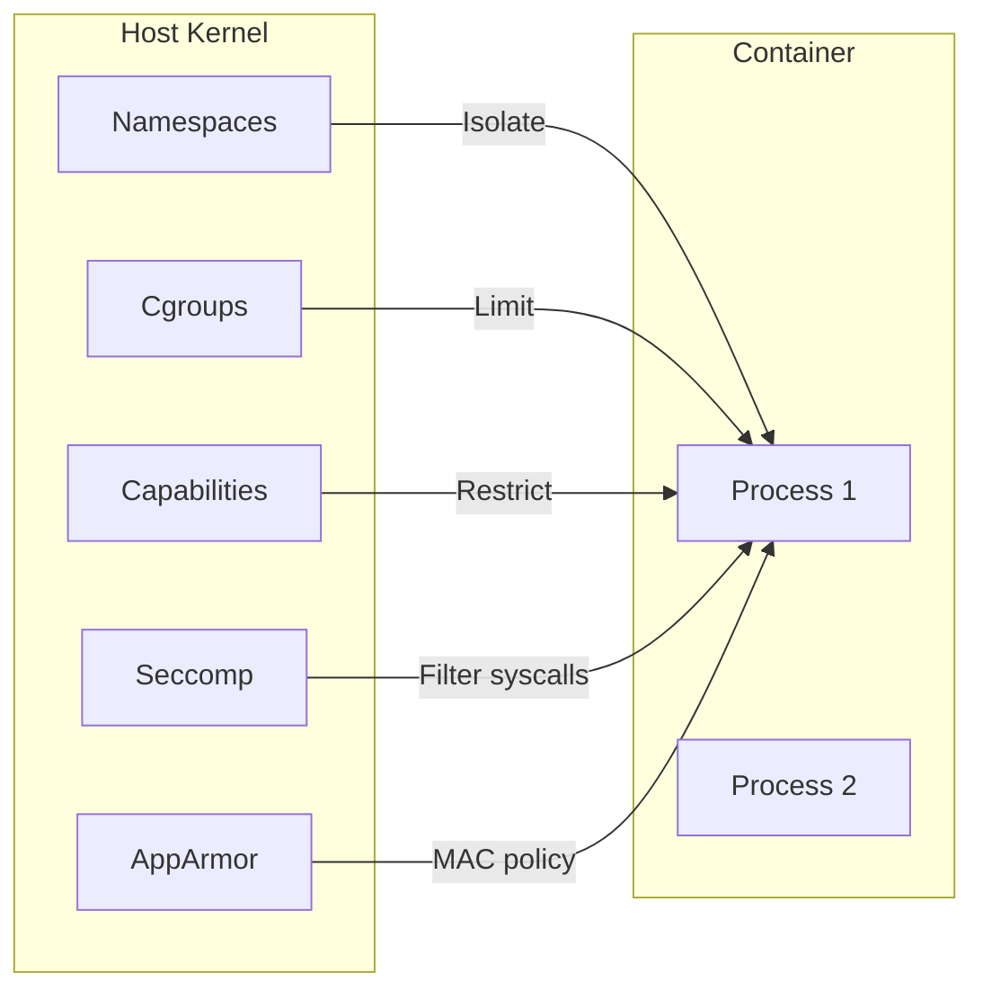
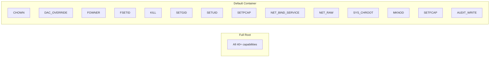
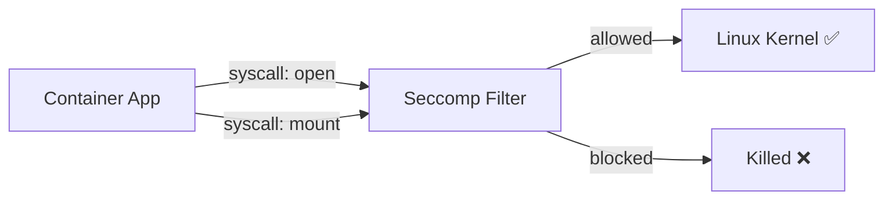

# 07 — Docker Security

> Secure your containers from development to production

---

## Table of Contents

1. [Docker Security Model](#docker-security-model)
2. [Linux Kernel Isolation](#linux-kernel-isolation)
3. [Running as Non-Root](#running-as-non-root)
4. [Capabilities](#capabilities)
5. [Seccomp Profiles](#seccomp-profiles)
6. [AppArmor & SELinux](#apparmor--selinux)
7. [Read-Only Root Filesystem](#read-only-root-filesystem)
8. [Rootless Docker](#rootless-docker)
9. [Image Scanning](#image-scanning)
10. [Supply Chain Security](#supply-chain-security)
11. [Secrets Management](#secrets-management)
12. [Security Checklist](#security-checklist)

---

## Docker Security Model

### The Security Layers

```
┌──────────────────────────────────────────────┐
│         Container Security Layers             │
├──────────────────────────────────────────────┤
│  1. Linux Namespaces (isolation)              │
│  2. Cgroups (resource limits)                 │
│  3. Capabilities (fine-grained privileges)    │
│  4. Seccomp (system call filtering)           │
│  5. AppArmor / SELinux (MAC policies)         │
│  6. User namespaces (root mapping)            │
│  7. Read-only filesystem                      │
│  8. Image signing & scanning                  │
└──────────────────────────────────────────────┘
```

### Defense in Depth

Docker uses **defense in depth** — multiple independent security mechanisms that reinforce each other:



---

## Linux Kernel Isolation

### Namespaces

Docker uses Linux namespaces to provide **isolation**. Each container gets its own view of the system:

| Namespace | What it Isolates | Impact |
|-----------|-----------------|--------|
| **PID** | Process IDs | Container only sees its own processes |
| **Network** | Network stack | Own IP, ports, routing table |
| **Mount** | Filesystem mounts | Own filesystem tree |
| **UTS** | Hostname & domain | Can have its own hostname |
| **IPC** | Inter-process communication | Isolated semaphores, message queues |
| **User** | User & group IDs | Container root ≠ host root (if configured) |
| **Cgroup** | Resource limits | View of its own cgroup |
| **Time** | System time (Linux 5.6+) | Can have different time offset |

```bash
# Container sees its own PID namespace
docker run alpine ps aux
# PID   USER     TIME  COMMAND
#     1 root      0:00 ps aux
# Only sees ONE process — itself!

# Host sees everything
ps aux | grep docker
# Root     12345  ...  containerd-shim
# Root     12346  ...  nginx: worker process
```

### Cgroups (Control Groups)

Cgroups limit **how much** a container can use (not what it can see):

```bash
# Limit CPU and memory
docker run --cpus=2 --memory=512m app

# Container is restricted even if host has resources
```

---

## Running as Non-Root

### Why It Matters

By default, containers run as **root** (UID 0). If an attacker escapes the container, they have root on the host.

```bash
# Default: root inside container
docker run alpine whoami     # root

# If container is compromised and user is root:
# - Can potentially escape to host
# - Can modify container files
# - Can install new packages
```

### The Fix: Use Non-Root User

```dockerfile
# Dockerfile
FROM node:20-alpine

# Create a non-root user
RUN addgroup -S appgroup && adduser -S appuser -G appgroup

WORKDIR /app
COPY . .

# Switch to non-root user
USER appuser

CMD ["node", "app.js"]
```

```bash
docker run myapp
whoami     # appuser
```

### Run as Non-Root at Runtime

```bash
# Override with --user flag
docker run --user 1000:1000 app
docker run --user node app
docker run --user "$(id -u):$(id -g)" app  # Match host user

# Run as non-root with specific UID/GID
docker run --user 10001:10001 app
```

### The Problem with Bind Mounts

```bash
# Container user (UID 1000) needs to write to bind mount
docker run -v "$(pwd)/data:/data" --user 1000:1000 app

# If /data on host is owned by root, it fails!
# Solution: Ensure host directory has correct permissions
chown -R 1000:1000 ./data
```

---

## Capabilities

### What are Capabilities?

Traditionally, Linux processes are either **root** (can do everything) or **non-root** (can do almost nothing). Capabilities break root's power into small, distinct units.

```bash
# Default capabilities for a container
docker run alpine getcap /bin/busybox
# /bin/busybox = cap_chown,cap_dac_override,cap_fowner,... +ep

# Full root: All ~40 capabilities
# Container root: ~14 capabilities (highly restricted)
```

### Default Capabilities Granted



### Dropping All Capabilities (Least Privilege)

```dockerfile
# Dockerfile
FROM nginx:alpine

# Drop all capabilities at build time (only affects runtime)
# Actual dropping happens at run command
```

```bash
# Drop ALL capabilities, then add only what's needed
docker run \
  --cap-drop=ALL \
  --cap-add=NET_BIND_SERVICE \
  nginx

# Drop specific capabilities
docker run \
  --cap-drop=NET_RAW \
  --cap-drop=SYS_CHROOT \
  app
```

### Capability Reference

| Capability | What it Allows | Security Risk |
|------------|---------------|---------------|
| `CHOWN` | Change file ownership | Low — needed for basic ops |
| `DAC_OVERRIDE` | Bypass file permission checks | **Medium** — read/write any file |
| `FOWNER` | Bypass permission checks on owned files | Low |
| `KILL` | Send signals to processes | Low |
| `NET_BIND_SERVICE` | Bind to ports < 1024 | Low — need for web servers |
| `NET_RAW` | Use raw sockets (ICMP, ARP) | **Medium** — ping, but also packet crafting |
| `NET_ADMIN` | Modify network config | **High** — change routing, firewall |
| `SYS_ADMIN` | Mount, namespace ops, etc. | **CRITICAL** — nearly as powerful as root |
| `SYS_PTRACE` | Debug processes, read memory | **High** — ptrace any process |
| `SYS_MODULE` | Load kernel modules | **CRITICAL** — kernel compromise |
| `SETUID` / `SETGID` | Set UID/GID on executables | **High** — privilege escalation |
| `MKNOD` | Create device nodes | **High** — access hardware |
| `IPC_LOCK` | Lock memory (mlock) | Low — needed for some databases |
| `SYS_TIME` | Change system clock | **High** — NTP poisoning |
| `SYS_BOOT` | Reboot | **Medium** |
| `AUDIT_CONTROL` | Manage audit system | **High** — disable auditing |

### Capability Best Practices

```bash
# Web app (Node/Python/Ruby/Go) — very restrictive
docker run \
  --cap-drop=ALL \
  --cap-add=NET_BIND_SERVICE \
  --cap-add=NET_RAW \
  app

# Nginx reverse proxy
docker run \
  --cap-drop=ALL \
  --cap-add=NET_BIND_SERVICE \
  nginx

# Database (PostgreSQL)
docker run \
  --cap-drop=ALL \
  --cap-add=IPC_LOCK \
  --cap-add=SETUID \
  --cap-add=SETGID \
  postgres

# Redis
docker run \
  --cap-drop=ALL \
  --cap-add=SETUID \
  --cap-add=SETGID \
  redis
```

---

## Seccomp Profiles

### What is Seccomp?

**Seccomp** (Secure Computing Mode) filters which **system calls** a process can make. If a container tries to call a blocked syscall, it's killed.



### Default Seccomp Profile

Docker uses a default seccomp profile that blocks ~50 dangerous syscalls:

```json
{
  "defaultAction": "SCMP_ACT_ERRNO",
  "architectures": ["SCMP_ARCH_X86_64"],
  "syscalls": [
    {
      "names": ["acct", "add_key", "bpf", "clock_adjtime",
                "delete_module", "init_module", "finit_module",
                "kexec_file_load", "kexec_load", "keyctl",
                "lookup_dcookie", "mbind", "mount", "move_mount",
                "open_by_handle_at", "perf_event_open",
                "personality", "pivot_root", "process_vm_readv",
                "process_vm_writev", "ptrace", "reboot",
                "request_key", "setdomainname", "sethostname",
                "setns", "stty", "syslog", "umount", "umount2",
                "unshare", "uselib", "userfaultfd", "ustat",
                "vm86", "vm86old"],
      "action": "SCMP_ACT_ERRNO"
    }
  ]
}
```

### Custom Seccomp Profile

```json
// my-seccomp.json — Allow only what your app needs
{
  "defaultAction": "SCMP_ACT_ERRNO",
  "architectures": ["SCMP_ARCH_X86_64"],
  "syscalls": [
    {
      "names": [
        "accept", "access", "arch_prctl", "bind", "brk",
        "capget", "capset", "chdir", "chmod", "chown",
        "clock_getres", "clock_gettime", "clone",
        "close", "connect", "copy_file_range", "creat",
        "dup", "dup2", "epoll_create", "epoll_ctl",
        "epoll_wait", "eventfd2", "execve", "exit_group",
        "fchdir", "fchmod", "fchmodat", "fchown", "fchownat",
        "fcntl", "fdatasync", "flock", "fstat", "fstatfs",
        "fsync", "ftruncate", "futex", "getcwd", "getdents64",
        "getegid", "geteuid", "getgid", "getpeername",
        "getpgid", "getpid", "getppid", "getrandom",
        "getsockname", "getsockopt", "gettid", "getuid",
        "ioctl", "listen", "lseek", "lstat", "madvise",
        "memfd_create", "mincore", "mkdirat", "mlock",
        "mmap", "mprotect", "mremap", "msync", "munlock",
        "munmap", "nanosleep", "newfstatat", "openat",
        "pause", "pipe2", "poll", "ppoll", "pread64",
        "prlimit64", "pwrite64", "read", "readlink",
        "readlinkat", "recvfrom", "recvmsg", "rename",
        "renameat", "rmdir", "rseq", "rt_sigaction",
        "rt_sigprocmask", "rt_sigreturn", "rt_sigsuspend",
        "sched_getaffinity", "sched_yield", "sendfile",
        "sendmsg", "sendto", "set_robust_list",
        "set_tid_address", "setgid", "setgroups", "sethostname",
        "setpgid", "setresgid", "setresuid", "setsid",
        "setsockopt", "setuid", "shutdown", "sigaltstack",
        "socket", "socketpair", "statfs", "statx",
        "symlinkat", "sync", "sync_file_range", "sysinfo",
        "tee", "tgkill", "time", "times", "truncate",
        "umask", "uname", "unlink", "unlinkat", "utimensat",
        "wait4", "write", "writev"
      ],
      "action": "SCMP_ACT_ALLOW"
    }
  ]
}
```

```bash
docker run --security-opt seccomp=my-seccomp.json app
```

### When to Customize Seccomp

| Situation | Action |
|-----------|--------|
| Default is fine | Don't change — default is secure |
| App crashes with "operation not permitted" | Check which syscall failed with `strace` |
| High-security app | Create a minimal allowed-syscalls list |
| Using `--privileged` | Seccomp is disabled — use with extreme caution |

---

## AppArmor & SELinux

### AppArmor (Ubuntu/Debian)

AppArmor uses **profiles** to restrict what a program can do.

```bash
# Check if AppArmor is running
sudo aa-status

# Default Docker AppArmor profile (loaded automatically)
docker run nginx
# Uses: docker-default profile

# Custom AppArmor profile
docker run --security-opt apparmor=my-custom-profile app

# Disable AppArmor for container
docker run --security-opt apparmor=unconfined app
```

### AppArmor Profile Example

```
# /etc/apparmor.d/docker-myapp
#include <tunables/global>

profile docker-myapp flags=(attach_disconnected,mediate_deleted) {
  #include <abstractions/base>

  network inet tcp,
  network inet udp,

  /app/** rw,
  /app/server ix,            # Execute server

  /etc/ld.so.cache r,
  /etc/ld.so.preload r,

  /lib/x86_64-linux-gnu/** mr,
  /usr/lib/** mr,

  deny /etc/shadow rw,       # Explicitly deny sensitive files
  deny /proc/** w,
  deny /sys/** w,
}
```

### SELinux (RHEL/CentOS/Fedora)

```bash
# Check if SELinux is enforcing
getenforce
# Enforcing

# Set SELinux labels on container
docker run --security-opt label=level:s0:c100,c200 app

# Disable label confinement
docker run --security-opt label=disable app

# Type enforcement
docker run --security-opt label=type:myapp_t app
```

---

## Read-Only Root Filesystem

Makes the entire container filesystem **read-only**. Only explicitly mounted volumes or tmpfs can be written to.

```bash
docker run --read-only app

# Provide tmpfs for writable directories
docker run --read-only --tmpfs /tmp --tmpfs /var/run app
```

### With Docker Compose

```yaml
services:
  app:
    image: myapp
    read_only: true
    tmpfs:
      - /tmp
      - /var/run
    volumes:
      - app-data:/app/data       # Writable only here
```

### What Gets Blocked

```bash
# ❌ These operations fail:
docker exec app touch /test.txt
docker exec app apt-get install curl
docker exec app rm /etc/config.json

# ✅ These still work (mounted writable):
docker exec app touch /tmp/test.txt
docker exec app touch /app/data/output.csv
```

---

## Rootless Docker

Rootless Docker lets you run the Docker daemon and containers **without root privileges**.

### Installation

```bash
# Install rootless Docker
dockerd-rootless-setuptool.sh install

# Start rootless daemon
systemctl --user start docker

# Set environment
export DOCKER_HOST=unix:///run/user/$UID/docker.sock

# Run without root
docker run hello-world
```

### Limitations

| Feature | Rootful Docker | Rootless Docker |
|---------|---------------|-----------------|
| **Port < 1024** | Yes | Via `net.ipv4.ip_unprivileged_port_start=0` |
| **Overlay network** | Yes | Limited |
| **cgroups v2** | Yes | Yes (requires cgroups v2) |
| **--privileged** | Yes | No |
| **AppArmor** | Yes | Limited |
| **FUSE-based storage** | No | Yes (fuse-overlayfs) |

### When to Use Rootless

- Multi-tenant environments
- CI/CD where you don't trust the pipeline
- Secure-by-default setups
- Anyone without sudo access

---

## Image Scanning

### Why Scan Images

```
Your image might contain:
- Known vulnerabilities (CVEs) in base OS packages
- Vulnerable dependencies (npm, pip, gem packages)
- Malware or backdoors
- Secrets accidentally baked in
```

### Docker Scout (Built-in)

```bash
# Scan with Docker Scout
docker scout quickview nginx:latest
docker scout analysis nginx:latest
docker scout recommendations nginx:latest

# Compare images
docker scout compare nginx:1.25 nginx:1.26

# View CVEs
docker scout cves nginx:latest

# Watch for vulnerabilities (continuous)
docker scout watch myimage:latest
```

### Trivy (Open-source)

```bash
# Install
brew install aquasecurity/trivy/trivy

# Scan image
trivy image nginx:latest

# Scan filesystem
trivy fs .

# Scan repository
trivy repo https://github.com/org/repo

# Scan with severity filter
trivy image --severity CRITICAL,HIGH nginx:latest

# Output JSON
trivy image --format json --output results.json nginx:latest

# Scan only specific target
trivy image --vuln-type os nginx:latest
trivy image --vuln-type library nginx:latest
```

### CI/CD Integration

```yaml
# .github/workflows/scan.yml
name: Docker Security Scan
on: [push]

jobs:
  scan:
    runs-on: ubuntu-latest
    steps:
      - uses: actions/checkout@v4
      - name: Build image
        run: docker build -t myapp:${{ github.sha }} .
      - name: Scan with Trivy
        uses: aquasecurity/trivy-action@master
        with:
          image-ref: myapp:${{ github.sha }}
          format: sarif
          output: trivy-results.sarif
          severity: CRITICAL,HIGH
      - name: Upload results
        uses: github/codeql-action/upload-sarif@v3
        with:
          sarif_file: trivy-results.sarif
```

---

## Supply Chain Security

### Docker Content Trust (DCT)

DCT uses **digital signatures** to verify image integrity and publisher identity.

```bash
# Enable content trust
export DOCKER_CONTENT_TRUST=1

# Now push signs the image
docker push myuser/myapp:latest
# Created signature: myuser/myapp:latest

# Pull verifies the signature
docker pull myuser/myapp:latest
# ✅ Signed by myuser

# Images without signatures are rejected
docker pull myuser/unsigned:latest
# Error: No trust data for unsigned
```

### Cosign (Sigstore)

More modern image signing from the **Sigstore** project.

```bash
# Install Cosign
brew install cosign

# Generate a key pair
cosign generate-key-pair

# Sign an image
cosign sign --key cosign.key myuser/myapp:latest

# Verify
cosign verify --key cosign.pub myuser/myapp:latest

# Keyless signing (uses OIDC)
cosign sign myuser/myapp:latest
# Uses: GitHub identity, Google, Microsoft, etc.
```

### SBOM (Software Bill of Materials)

```bash
# Generate SBOM with Syft
syft nginx:latest -o spdx-json=sbom.json

# Generate SBOM with Docker Scout
docker scout sbom nginx:latest

# Generate SBOM with Trivy
trivy image --format spdx-json --output sbom.json nginx:latest
```

---

## Secrets Management

### Never Bake Secrets Into Images

```dockerfile
# ❌ BAD: Secret is baked into the image
FROM node:20-alpine
ENV API_KEY=supersecret
COPY . .
# Anyone who pulls this image can extract the key:
# docker history myimage

# ✅ GOOD: Use build args with --secret (BuildKit)
FROM node:20-alpine
RUN --mount=type=secret,id=api_key \
    export API_KEY=$(cat /run/secrets/api_key) && \
    npm install
```

### Docker Secrets (Swarm)

```bash
# Create a secret
echo "supersecret" | docker secret create db_password -

# Or from file
docker secret create db_password ./secrets/db_password.txt

# List secrets
docker secret ls

# Use in service
docker service create \
  --name app \
  --secret db_password \
  --secret source=api_key,target=/etc/app/key \
  myapp
```

### Compose Secrets

```yaml
services:
  app:
    image: myapp
    secrets:
      - db_password
      - source: api_key
        target: /etc/app/key
        uid: "1000"
        mode: 0400

secrets:
  db_password:
    file: ./secrets/db_password.txt
  api_key:
    environment: API_KEY
```

### Runtime Secrets (Without Swarm)

```bash
# Option 1: Mount from host (read-only)
docker run -v "$(pwd)/secrets:/secrets:ro" app

# Option 2: Use tmpfs
docker run \
  --mount type=tmpfs,target=/secrets \
  -e DB_PASSWORD_FILE=/secrets/db_password \
  app
  # App reads password from file, not env var

# Option 3: HashiCorp Vault sidecar
docker compose up -d vault-agent app
# Vault agent writes secrets to tmpfs volume shared with app
```

---

## Security Checklist

### Build Time

```markdown
- [ ] Use specific image tags (no :latest)
- [ ] Use minimal base images (alpine, distroless, scratch)
- [ ] Use multi-stage builds
- [ ] Run as non-root user
- [ ] Never bake secrets into images
- [ ] Pin versions in package managers (npm ci, pip freeze)
- [ ] Scan images for vulnerabilities
- [ ] Sign images (Cosign / DCT)
- [ ] Generate SBOM
- [ ] Use .dockerignore to exclude secrets
```

### Run Time

```markdown
- [ ] Drop ALL capabilities, add only needed
- [ ] Use read-only root filesystem
- [ ] Add tmpfs for /tmp and /var/run
- [ ] Set resource limits (CPU, memory, PIDs)
- [ ] Set ulimits (nofile, nproc)
- [ ] Use no-new-privileges
- [ ] Use custom seccomp profile
- [ ] Use AppArmor/SELinux profile
- [ ] Don't mount Docker socket (unless absolutely necessary)
- [ ] Don't use --privileged
- [ ] Run rootless Docker if possible
- [ ] Use secrets management, not env vars for sensitive data
```

### Network

```markdown
- [ ] Use user-defined bridge networks
- [ ] Isolate services on separate networks
- [ ] Use internal networks for backend services
- [ ] Only publish necessary ports
- [ ] Don't use --network=host unless necessary
- [ ] Use TLS for registry communication
```

### Monitoring

```markdown
- [ ] Use Docker Scout or similar for continuous scanning
- [ ] Monitor container events (docker events)
- [ ] Watch for unexpected privilege escalation
- [ ] Audit container access
- [ ] Check logs for suspicious activity
- [ ] Rebase images regularly (security patches)
```

### One-Liner Security

```bash
# Most secure run command for a web app
docker run -d \
  --name app \
  --restart unless-stopped \
  --cap-drop=ALL \
  --cap-add=NET_BIND_SERVICE \
  --cap-add=NET_RAW \
  --security-opt=no-new-privileges:true \
  --read-only \
  --tmpfs /tmp \
  --tmpfs /var/run \
  --user 1000:1000 \
  -p 3000:3000 \
  myapp:latest
```

---

## Summary

| Security Layer | What It Does | How to Implement |
|---------------|-------------|-----------------|
| **Namespaces** | Isolate container view of system | Built-in, automatic |
| **Cgroups** | Limit resource usage | `--cpus`, `--memory` |
| **Non-root user** | No root inside container | `USER appuser` in Dockerfile |
| **Capabilities** | Fine-grained privileges | `--cap-drop=ALL --cap-add=...` |
| **Read-only FS** | Prevent writes to container | `--read-only` + `--tmpfs` |
| **Seccomp** | Filter system calls | `--security-opt seccomp=...` |
| **AppArmor** | MAC policy for executables | `--security-opt apparmor=...` |
| **Rootless** | No daemon root privileges | Rootless Docker mode |
| **Image scanning** | Find CVEs | Trivy, Docker Scout |
| **Image signing** | Verify image integrity | Cosign, DCT |
| **Secrets mgmt** | Don't leak secrets | `--secret`, tmpfs, vault |

---

## Next Steps

→ [08 — Dockerfile Recipes & Patterns](./08-dockerfile-recipes-and-patterns.md)
