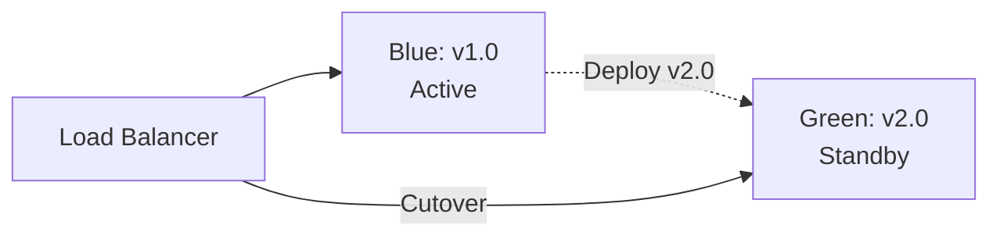
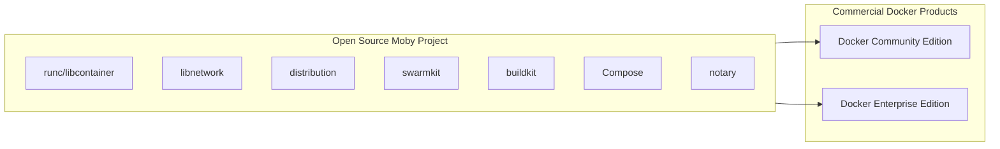

# 10 — Docker Interview Questions

> From junior to staff engineer — with detailed, real-world answers

---

## Table of Contents

1. [Basic Questions](#basic-questions)
2. [Intermediate Questions](#intermediate-questions)
3. [Advanced Questions](#advanced-questions)
4. [Scenario-Based Questions](#scenario-based-questions)
5. [Real-World Incident Questions](#real-world-incident-questions)

---

## Basic Questions

### Q1: What is Docker and why would you use it?

<details>
<summary>Answer</summary>

**Docker** is a platform for developing, shipping, and running applications in **containers** — lightweight, isolated environments that package code with all its dependencies.

**Why use it:**

1. **Consistency** — "It works on my machine" disappears
2. **Portability** — Runs on any OS, cloud, or bare metal
3. **Isolation** — Each container has its own filesystem, network, and processes
4. **Efficiency** — Lighter than VMs (MB vs GB, ms vs min startup)
5. **CI/CD** — Same image from dev to production
6. **Microservices** — Easy to break monolith into services
</details>

### Q2: What's the difference between a Docker image and a container?

<details>
<summary>Answer</summary>

| Aspect | Image | Container |
|--------|-------|-----------|
| **Nature** | Read-only template | Runnable instance |
| **Analogy** | Class (OOP) | Object (OOP) |
| **Mutability** | Immutable | Mutable (writable layer) |
| **Persistence** | Stays on disk | Temporary (ephemeral) |
| **Creation** | `docker build` | `docker run` or `docker create` + `start` |
| **Size** | MBs to GBs | Initially the same as image + changes |

```bash
# Build an image
docker build -t myapp:latest .

# Create multiple containers from the same image
docker run -d --name app1 myapp:latest
docker run -d --name app2 myapp:latest
```
</details>

### Q3: What is Docker Hub?

<details>
<summary>Answer</summary>

Docker Hub is a **public container registry** where you can:
- **Pull** official images (nginx, postgres, node, python)
- **Push** your own images
- **Automate** builds from GitHub/Bitbucket
- **Scan** images for vulnerabilities

Alternatives: GitHub Container Registry (GHCR), Amazon ECR, Google Artifact Registry, Azure Container Registry, Harbor.

```bash
# Pull from Docker Hub
docker pull nginx:latest

# Push to Docker Hub
docker push myusername/myapp:latest
```
</details>

### Q4: What does `docker run -d -p 8080:80 nginx` do?

<details>
<summary>Answer</summary>

This command:
1. **Pulls** the `nginx` image (if not already local)
2. **Creates** a container from the nginx image
3. **Runs** it in detached mode (`-d` = background)
4. **Publishes** host port 8080 → container port 80

```bash
# You can now access nginx at http://localhost:8080
curl http://localhost:8080
# Welcome to nginx!
```

Breakdown:
- `-d` = detached (background)
- `-p 8080:80` = host port 8080 maps to container port 80
- `nginx` = the image name
</details>

### Q5: How do Docker layers work?

<details>
<summary>Answer</summary>

Each instruction in a Dockerfile creates a **layer**. Layers are:

- **Read-only** (except the top container layer)
- **Cached** — if nothing changed, Docker reuses the cached layer
- **Shared** — same base image layers are shared across images

```
Layer 5: CMD ["node", "app.js"]           ← Small layer
Layer 4: COPY . .                         ← Changes most often
Layer 3: RUN npm ci                       ← Changes when deps change
Layer 2: COPY package.json .              ← Changes when deps change
Layer 1: FROM node:20-alpine              ← Rarely changes (large)
```

**Cache rule:** If a layer changes, ALL subsequent layers are rebuilt. This is why we copy `package.json` BEFORE source code — dependency install is cached unless deps change.
</details>

### Q6: What is the difference between CMD and ENTRYPOINT?

<details>
<summary>Answer</summary>

| | CMD | ENTRYPOINT | ENTRYPOINT + CMD |
|---|---|---|---|
| **Purpose** | Default command/args | Main executable | Executable + default args |
| **Overridable** | Completely | Partially | Args only |
| **Usage** | `docker run image` uses CMD | Always runs ENTRYPOINT | `ENTRYPOINT ["node"]` + `CMD ["app.js"]` |

```dockerfile
# CMD — can be entirely overridden
CMD ["node", "app.js"]
# docker run myimage → runs "node app.js"
# docker run myimage python other.py → runs "python other.py"

# ENTRYPOINT — always runs
ENTRYPOINT ["node"]
CMD ["app.js"]
# docker run myimage → runs "node app.js"
# docker run myimage server.js → runs "node server.js"
```
</details>

### Q7: How do you persist data in Docker?

<details>
<summary>Answer</summary>

Three ways:

1. **Volumes** (recommended) — Docker-managed, stored in `/var/lib/docker/volumes/`
2. **Bind mounts** — Any host directory
3. **tmpfs** — In-memory (non-persistent)

```bash
# Volume (preferred)
docker run -v mydata:/var/lib/postgresql/data postgres

# Bind mount (for dev)
docker run -v $(pwd)/src:/app/src app

# tmpfs (temporary)
docker run --tmpfs /tmp app
```

**Best practice:** Use volumes for production data, bind mounts for development.
</details>

### Q8: What is a multi-stage build?

<details>
<summary>Answer</summary>

A multi-stage build uses multiple `FROM` statements in one Dockerfile to separate the **build environment** from the **runtime environment**. This dramatically reduces image size.

```dockerfile
# Stage 1: Build (has Go compiler, 900MB)
FROM golang:1.22 AS builder
WORKDIR /app
COPY . .
RUN go build -o server .

# Stage 2: Runtime (just the binary, 12MB)
FROM scratch
COPY --from=builder /app/server /server
ENTRYPOINT ["/server"]
```

**Result:** 12MB instead of 900MB. No Go compiler or build tools in the final image.
</details>

---

## Intermediate Questions

### Q9: How does Docker networking work? Explain bridge, host, and overlay networks.

<details>
<summary>Answer</summary>

**Bridge** (default) — containers get their own IP on a private network (`172.17.0.0/16`). Traffic goes through NAT to reach the outside world. User-defined bridges also provide DNS resolution by container name.

**Host** — container shares the host's network stack (no isolation, no NAT). Performance is better but you lose port isolation.

**Overlay** — connects containers across multiple hosts (used in Docker Swarm). Encapsulates traffic in VXLAN tunnels.

```bash
# Bridge
docker network create my-bridge
docker run --network my-bridge --name app1 nginx
docker run --network my-bridge --name app2 alpine ping app1  # ✅ DNS works

# Host
docker run --network host nginx  # No port mapping needed

# Overlay
docker network create --driver overlay --attachable my-overlay
docker run --network my-overlay app1
```
</details>

### Q10: Explain Docker volume drivers and when you'd use different ones.

<details>
<summary>Answer</summary>

Docker uses a **pluggable volume driver architecture**:

| Driver | Use Case |
|--------|----------|
| `local` | Default — local storage on host |
| `nfs` | NFS shares across hosts |
| `rexray` | Cloud block storage (EBS, EFS) |
| `portworx` | Enterprise storage orchestration |
| `ceph` | Ceph/RBD storage |
| `vieux/sshfs` | Mount remote via SSH |

```bash
# NFS volume
docker volume create --driver local \
  --opt type=nfs \
  --opt o=addr=192.168.1.100,rw \
  --opt device=:/exports/data \
  nfs-volume
```

**When NFS:** Multiple Docker hosts need to share the same data (file uploads, shared configs).

**When cloud driver:** Running Docker on AWS/GCP/Azure and want EBS/PD volumes for your containers.
</details>

### Q11: How do you secure a Docker container?

<details>
<summary>Answer</summary>

A senior engineer's security checklist:

1. **Non-root user** — `USER appuser` in Dockerfile
2. **Drop capabilities** — `--cap-drop=ALL --cap-add=NEEDED`
3. **Read-only filesystem** — `--read-only --tmpfs /tmp`
4. **No new privileges** — `--security-opt=no-new-privileges:true`
5. **Minimal base image** — alpine, distroless, scratch
6. **Image scanning** — Trivy, Docker Scout
7. **Image signing** — Cosign, Docker Content Trust
8. **Scan dependencies** — Regular CVE scanning
9. **Resource limits** — `--cpus --memory`
10. **Don't mount docker socket** unless absolutely necessary

```bash
# Most secure run command
docker run -d \
  --cap-drop=ALL \
  --cap-add=NET_BIND_SERVICE \
  --security-opt=no-new-privileges:true \
  --read-only \
  --tmpfs /tmp \
  --user 1000:1000 \
  --cpus=2 --memory=512m \
  myapp:latest
```
</details>

### Q12: What's the difference between COPY and ADD in a Dockerfile?

<details>
<summary>Answer</summary>

| | COPY | ADD |
|---|---|---|
| **Files** | Yes | Yes |
| **URLs** | No | Yes |
| **Auto-extract** | No | Yes (tar.gz → directory) |
| **Best practice** | Use for everything | Avoid unless you need auto-extraction |

```dockerfile
# COPY — preferred for most cases
COPY package.json ./
COPY src/ ./src/

# ADD — only use for auto-extraction
ADD app.tar.gz /app/
# Extracts tar.gz automatically

# Avoid ADD for URLs (no caching, no cleanup)
# ❌ Bad: ADD https://example.com/file.tar.gz /tmp/
# ✅ Good: RUN curl ... && tar ... && rm ...
```

**Rule:** Use `COPY` unless you specifically need tar auto-extraction.
</details>

### Q13: How do you handle environment variables in Docker?

<details>
<summary>Answer</summary>

Multiple levels:

```bash
# 1. Dockerfile ENV (build-time defaults)
ENV NODE_ENV=production
ENV PORT=3000

# 2. docker run -e (runtime override)
docker run -e NODE_ENV=development -e PORT=4000 myapp

# 3. docker run --env-file
docker run --env-file .env.production myapp

# 4. Compose env_file
services:
  app:
    env_file: .env.production
```

**Security note:** Environment variables are visible via `docker inspect`. For secrets, use `docker secret` or tmpfs-mounted files.
</details>

### Q14: What is the difference between docker-compose and docker stack?

<details>
<summary>Answer</summary>

| | docker compose | docker stack |
|---|---|---|
| **Purpose** | Single-host development | Multi-host production |
| **Deploy** | `docker compose up` | `docker stack deploy` |
| **Scale** | `--scale` flag | `deploy.replicas` |
| **Networking** | Bridge networks | Overlay networks |
| **Configs/Secrets** | File-based | Docker secrets/configs |
| **Rolling updates** | Manual | Built-in (update_config) |
| **Use case** | Dev, small prod | Swarm clusters |

```yaml
# docker-compose.yml — both can use the same file
services:
  app:
    image: myapp
    deploy:                    # docker stack uses this
      replicas: 3
      update_config:
        parallelism: 1
        delay: 10s
    ports:
      - "3000:3000"            # docker compose uses this
```

**Rule of thumb:** Use `docker compose` for dev and single-host. Use `docker stack` for multi-host Swarm clusters.
</details>

### Q15: How do you debug a container that starts and immediately exits?

<details>
<summary>Answer</summary>

```bash
# 1. Check logs
docker logs mycontainer

# 2. Run interactively to see what happens
docker run -it --rm myimage sh

# 3. Override entrypoint to debug
docker run -it --rm --entrypoint sh myimage
# Then manually start the app to see the error

# 4. Check exit code
docker inspect --format '{{.State.ExitCode}}' mycontainer
# Exit code 0 = success
# Exit code 1 = general error
# Exit code 137 = SIGKILL (OOM?)
# Exit code 139 = SIGSEGV (segfault)
# Exit code 143 = SIGTERM (graceful shutdown)

# 5. Check resource limits
docker inspect mycontainer | grep -A 5 "HostConfig"
docker logs mycontainer | grep -i "kill\|oom\|error\|fatal"

# 6. Check if a dependency is missing
docker logs mycontainer | grep -i "no such file\|not found\|connection refused"

# 7. Run with --rm to auto-clean during debugging
docker run --rm -it myimage sh
```

**Common causes and fixes:**

| Exit Code | Cause | Fix |
|-----------|-------|-----|
| 0 | Normal exit (background task done) | Use `-d` or run in foreground |
| 1 | Application error | Check app logs |
| 137 | OOM kill | Increase `--memory` |
| 139 | Segfault | Check app compatibility (e.g., musl vs glibc) |
| 143 | SIGTERM | Graceful shutdown (this is normal) |
</details>

### Q16: What is the Docker build cache and how do you optimize it?

<details>
<summary>Answer</summary>

Each Dockerfile instruction creates a layer. Docker caches each layer. On rebuild, if the instruction and its input haven't changed, Docker reuses the cached layer.

**Optimization strategies:**

```dockerfile
# ❌ BAD: Copy everything first
FROM node:20-alpine
COPY . .           # Any file change → invalidates ALL layers
RUN npm ci         # ❌ Runs every time
RUN npm run build  # ❌ Runs every time

# ✅ GOOD: Dependencies first
FROM node:20-alpine
COPY package.json package-lock.json ./   # Rarely changes
RUN npm ci                                # Cached if deps unchanged
COPY . .                                  # Changes often
RUN npm run build                         # Only this rebuilds on code changes

# ✅ BEST: Multi-stage with dependency caching
FROM node:20-alpine AS deps
COPY package.json package-lock.json ./
RUN npm ci

FROM node:20-alpine AS build
COPY --from=deps /app/node_modules ./node_modules
COPY . .
RUN npm run build

FROM node:20-alpine
COPY --from=build /app/dist ./dist
COPY --from=deps /app/node_modules ./node_modules
```

**BuildKit cache mounts** (for package manager caches):
```dockerfile
RUN --mount=type=cache,target=/root/.npm \
    npm ci
```
</details>

### Q17: How do you handle database migrations in Docker?

<details>
<summary>Answer</summary>

**Approach 1: Init container pattern**

```yaml
services:
  app:
    image: myapp
    depends_on:
      migrations:
        condition: service_completed_successfully

  migrations:
    build: .
    command: npm run migrate
    depends_on:
      db:
        condition: service_healthy

  db:
    image: postgres:16
    healthcheck:
      test: ["CMD-SHELL", "pg_isready -U postgres"]
```

**Approach 2: Entrypoint script**

```dockerfile
COPY entrypoint.sh /entrypoint.sh
ENTRYPOINT ["/entrypoint.sh"]
```

```bash
#!/bin/sh
# entrypoint.sh
npm run migrate
exec node app.js
```

**Approach 3: Separate compose file for migrations**

```bash
# Run migrations (blocking)
docker compose run --rm app npm run migrate

# Then start the app
docker compose up -d app
```

**Important:** Always have a rollback script. Test migrations on staging before production.
</details>

### Q18: What is the difference between `docker run --rm` and just `docker rm`?

<details>
<summary>Answer</summary>

- `docker run --rm` — Automatically removes the container when it exits
- `docker rm` — Manually removes an existing container

```bash
# --rm: container disappears after exit
docker run --rm alpine echo "hello"
# Container runs, prints "hello", exits, and is DELETED

# Without --rm: container stays stopped
docker run alpine echo "hello"
docker ps -a  # Container is still there (status: Exited)
docker rm <container>  # Must manually remove
```

**When to use --rm:** One-off commands, test runs, CI/CD jobs, batch processing.

**When not to use --rm:** Containers with logging that you want to examine after exit, containers you might restart.
</details>

---

## Advanced Questions

### Q19: Explain Docker's container runtime interface (CRI) and how it relates to Kubernetes.

<details>
<summary>Answer</summary>

**CRI (Container Runtime Interface)** is a Kubernetes API that allows any container runtime to work with Kubernetes. It's a **plugin interface** — the kubelet talks to any CRI-compliant runtime.

```
Kubelet
  │
  ▼
CRI API (gRPC)
  │
  ▼
┌──────────────────────┐
│    CRI Runtime        │
├──────────────────────┤
│ containerd (most common) │
│ CRI-O                 │
│ Docker (via cri-dockerd)│
│ rktlet (deprecated)   │
└──────────────────────┘
```

**How Docker fits in:**
- Docker implements the CRI specification
- containerd (OCI-compliant) is the default CRI runtime for K8s 1.24+
- Docker Engine v1.11+ uses containerd internally

**The shift:**
- K8s 1.20+ deprecated Docker as a runtime
- K8s 1.24+ removed dockershim
- But Docker-built images still work — it's the runtime that changed, not the image format (OCI)

```bash
# Check node's container runtime
kubectl get nodes -o wide
# CONTAINER-RUNTIME
# containerd://1.7.0
```
</details>

### Q20: How do you implement a blue/green deployment with Docker?

<details>
<summary>Answer</summary>

**Blue/green deployment** runs two identical environments. Only one serves traffic at a time. Switch traffic for instant deployment and rollback.



**Implementation with Docker Compose:**

```yaml
# docker-compose.blue.yml
services:
  app-blue:
    image: myapp:${BLUE_TAG:-1.0}
    container_name: app-blue
    ports:
      - "8081:3000"
    networks:
      - app-net

# docker-compose.green.yml
services:
  app-green:
    image: myapp:${GREEN_TAG:-2.0}
    container_name: app-green
    ports:
      - "8082:3000"
    networks:
      - app-net
```

**Deployment script:**

```bash
#!/bin/bash
# Deploy to green, test, then switch

# Determine which is active
if curl -sf http://localhost:8081/health > /dev/null; then
  ACTIVE="blue"
  STANDBY="green"
  ACTIVE_PORT=8081
  STANDBY_PORT=8082
else
  ACTIVE="green"
  STANDBY="blue"
  ACTIVE_PORT=8082
  STANDBY_PORT=8081
fi

echo "Active: $ACTIVE, Deploying to: $STANDBY"

# Deploy new version to standby
docker compose -f docker-compose.$STANDBY.yml up -d

# Wait for health
for i in $(seq 1 30); do
  if curl -sf http://localhost:$STANDBY_PORT/health > /dev/null; then
    echo "Standby is healthy!"
    break
  fi
  sleep 2
done

# Switch traffic (update reverse proxy or load balancer)
# ... update nginx config, HAproxy, or AWS ALB target group ...

echo "Switched traffic to $STANDBY"

# Remove old active
docker compose -f docker-compose.$ACTIVE.yml down
```
</details>

### Q21: What happens when you run `docker run --privileged`?

<details>
<summary>Answer</summary>

`--privileged` gives the container **almost all** capabilities that the host root has. It bypasses nearly all security mechanisms:

```
Without --privileged:        With --privileged:
┌──────────────────────┐    ┌──────────────────────┐
│  ✓ Namespaces         │    │  ✓ Namespaces        │
│  ✓ Cgroups            │    │  ✓ Cgroups           │
│  ✓ Capabilities (14)  │    │  ✗ ALL capabilities  │
│  ✓ Seccomp (default)  │    │  ✗ No seccomp        │
│  ✓ AppArmor           │    │  ✗ No AppArmor       │
│  ✓ Read-only FS       │    │  ✓ Read-only FS      │
└──────────────────────┘    └──────────────────────┘
```

**What a privileged container CAN do:**
- Access all host devices
- Load kernel modules
- Mount/unmount filesystems
- Modify network stack (routing, iptables)
- Access host /sys and /proc
- Run Docker-in-Docker

```bash
docker run --privileged alpine
# Inside: can do nearly everything root can do on host
```

**When to use (extremely rare):**
- Docker-in-Docker (CI/CD runners)
- Network monitoring/tool containers
- Container that needs to configure host networking

**When NOT to use:** Everything else. There's almost always a more specific capability or security option.
</details>

### Q22: Explain Docker's Copy-on-Write (CoW) mechanism.

<details>
<summary>Answer</summary>

**Copy-on-Write** is Docker's strategy for efficient filesystem management:

- Image layers are **read-only**
- Container has a thin **writable layer** on top
- When a container modifies a file from a read-only layer:
  1. File is **copied** from the image layer to the container layer
  2. The modification is applied to the **copy**

```
Before modification:
Container Layer (empty)
Layer 4: /app/config.json ← "host: localhost"
Layer 3: /app/package.json

Container modifies config.json:
Container Layer: /app/config.json ← "host: db-prod"  (COPIED)
Layer 4: /app/config.json ← "host: localhost"        (HIDDEN)
Layer 3: /app/package.json                           (unchanged)
```

**Why CoW matters:**
1. **Fast startup** — containers don't copy the entire image
2. **Low memory** — multiple containers share the same read-only layers
3. **Efficient builds** — only changed layers are rebuilt
4. **Saves disk** — 10 containers from the same image share base layers

**Performance impact:** CoW has overhead. For write-heavy apps (databases), mount a volume to bypass CoW and write directly to the host filesystem.
</details>

### Q23: How do you handle log rotation in Docker?

<details>
<summary>Answer</summary>

Docker's default log driver (`json-file`) can fill up disk space quickly. Configure log rotation:

```bash
# Per container
docker run \
  --log-driver json-file \
  --log-opt max-size=10m \
  --log-opt max-file=3 \
  myapp

# Global (daemon.json)
{
  "log-driver": "json-file",
  "log-opts": {
    "max-size": "10m",
    "max-file": "3"
  }
}
```

**Alternative log drivers:**

```bash
# local — Docker-managed, automatic rotation
docker run --log-driver local myapp

# journald — systemd journal, rotation handled by journalctl
docker run --log-driver journald myapp

# syslog — send to external log server
docker run --log-driver syslog --log-opt syslog-address=tcp://logs.example.com:514 myapp

# fluentd — structured logging
docker run --log-driver fluentd --log-opt fluentd-address=localhost:24224 myapp

# Splunk
docker run --log-driver splunk --log-opt splunk-token=... --log-opt splunk-url=... myapp

# CloudWatch / GCP / Azure
docker run --log-driver awslogs --log-opt awslogs-group=myapp myapp
```

**Danger of not rotating:**
```bash
# A chatty container can fill up your disk:
docker run --log-driver json-file --log-opt max-size=-1 chatty-app
# /var/lib/docker/containers/CONTAINER_ID/CONTAINER_ID-json.log
# → Grows unbounded → Disk full → Everything stops

# Check log sizes
du -sh /var/lib/docker/containers/*/*.log
```
</details>

### Q24: What is BuildKit and what advantages does it provide?

<details>
<summary>Answer</summary>

**BuildKit** is Docker's next-generation build engine (enabled by default in Docker 24+). It replaces the legacy build system.

**Key advantages:**

| Feature | Legacy Builder | BuildKit |
|---------|---------------|----------|
| **Concurrent builds** | Sequential | Parallel (independent stages) |
| **Cache mounts** | No | `--mount=type=cache` |
| **Secret mounts** | Build args only | `--mount=type=secret` |
| **SSH mounts** | No | `--mount=type=ssh` |
| **Heredoc** | No | Yes |
| **Skip unused stages** | No | Yes (converge only needed stages) |
| **Frontend formats** | Dockerfile only | Dockerfile, mdx, LLB |

**Example: Cache mounts**

```dockerfile
# BEFORE: npm install runs every time cache is invalidated
RUN npm ci

# AFTER with BuildKit: cached across builds
RUN --mount=type=cache,target=/root/.npm \
    npm ci
```

**Example: Secret mounts (no more --build-arg for secrets)**

```dockerfile
# BEFORE (security risk — secret visible in image history)
ARG NPM_TOKEN
RUN echo //registry.npmjs.org/:_authToken=${NPM_TOKEN} > ~/.npmrc && npm ci

# AFTER with BuildKit (secret never stored in image)
RUN --mount=type=secret,id=npm_token \
    export NPM_TOKEN=$(cat /run/secrets/npm_token) && \
    echo //registry.npmjs.org/:_authToken=${NPM_TOKEN} > ~/.npmrc && \
    npm ci
```

```bash
docker build --secret id=npm_token,src=./.npm_token -t myapp .
```

**Enable BuildKit:**
```bash
export DOCKER_BUILDKIT=1
```
</details>

### Q25: How do you monitor Docker containers in production?

<details>
<summary>Answer</summary>

**Built-in tools:**

```bash
# Real-time metrics
docker stats
docker stats --no-stream

# Events
docker events --filter type=container

# Logs
docker logs --tail=100 -f myapp
```

**Production monitoring stack:**

```yaml
services:
  cadvisor:
    image: gcr.io/cadvisor/cadvisor:latest
    ports:
      - "8080:8080"
    volumes:
      - /:/rootfs:ro
      - /var/run:/var/run:ro
      - /sys:/sys:ro
      - /var/lib/docker/:/var/lib/docker:ro
    devices:
      - /dev/kmsg
    privileged: true

  prometheus:
    image: prom/prometheus
    volumes:
      - ./prometheus.yml:/etc/prometheus/prometheus.yml
      - prometheus-data:/prometheus
    ports:
      - "9090:9090"

  grafana:
    image: grafana/grafana
    volumes:
      - grafana-data:/var/lib/grafana
    ports:
      - "3000:3000"
```

**Key metrics to monitor:**
- CPU usage (docker stats)
- Memory usage (docker stats)
- Disk I/O
- Network I/O
- Restart count
- Health check status
- Container state changes

**Third-party tools:**
- **cAdvisor** — Container resource usage
- **Prometheus** — Metrics collection
- **Grafana** — Visualization
- **Datadog** — SaaS monitoring
- **New Relic** — APM + infrastructure
- **Docker Scout** — Vulnerability monitoring

**Alerting rules:**
```yaml
# prometheus rules
groups:
  - name: docker
    rules:
      - alert: ContainerDown
        expr: time() - container_last_seen{container_label_restart="always"} > 60
        for: 1m
      - alert: ContainerHighMemory
        expr: container_memory_usage_bytes / container_spec_memory_limit_bytes > 0.9
        for: 5m
```
</details>

---

## Scenario-Based Questions

### Q26: A developer says "it works on my machine" but the Docker container fails. How do you debug?

<details>
<summary>Answer</summary>

**Step 1: Check if the Dockerfile is correct**
```bash
# Build with --no-cache to avoid stale layers
docker build --no-cache -t myapp:debug .

# Run with interactive shell
docker run -it --rm myapp:debug sh
# Then manually run commands to reproduce
```

**Step 2: Common environment differences**

| Issue | Fix |
|-------|-----|
| Missing `.env` file | Mount the file or use `--env-file` |
| Wrong working directory | Add `WORKDIR` to Dockerfile |
| File permissions | Use `--user` or `chown` in Dockerfile |
| Port binding | Bind to `0.0.0.0`, not `localhost` |
| Database connection | Use service name (not localhost) in Docker |
| Missing dependencies | Check package.json/requirements.txt |
| OS-specific features | Check libc (musl vs glibc), symlinks |

**Step 3: Environment parity checklist**
```bash
# Check Node version
node --version        # Dev machine
docker run myimage node --version

# Check environment variables
printenv              # Dev machine
docker inspect mycontainer --format '{{.Config.Env}}'

# Check file permissions
ls -la /app           # Dev machine
docker run myimage ls -la /app
```

**The real fix:** Use Docker for local development. If the dev runs the same Docker image, "it works on my machine" disappears.
</details>

### Q27: A CI pipeline build is taking 15 minutes because Docker build is slow. How do you optimize it?

<details>
<summary>Answer</summary>

**1. Layer caching optimization**

```dockerfile
# Order layers by change frequency
FROM node:20-alpine
WORKDIR /app
COPY package.json package-lock.json ./   # Rarely changes
RUN npm ci                               # Cached!
COPY . .                                 # Changes every build
RUN npm run build                        # Only rebuilds source
```

**2. Docker layer caching in CI**

```yaml
# GitHub Actions with cache
- name: Set up Docker Buildx
  uses: docker/setup-buildx-action@v3

- name: Build and cache
  uses: docker/build-push-action@v5
  with:
    context: .
    push: true
    tags: myapp:latest
    cache-from: type=gha
    cache-to: type=gha,mode=max
```

**3. BuildKit cache mounts**

```dockerfile
RUN --mount=type=cache,target=/root/.npm \
    npm ci
```

**4. Use a slim base image**

```dockerfile
# BEFORE: 800MB base
FROM node:20

# AFTER: 130MB base
FROM node:20-alpine
```

**5. Reduce build context**

```dockerignore
node_modules/
.git/
.env
*.log
dist/
```

**Before/after:**
```
15 minutes → 3 minutes (80% reduction)
• Layer caching: -5 min
• Cache mounts: -3 min
• Smaller base: -2 min
• Build context: -2 min
```
</details>

### Q28: A container in production keeps restarting in a crash loop. How do you debug it?

<details>
<summary>Answer</summary>

**Step 1: Check the exit code and reason**

```bash
# Exit code tells you a lot
docker inspect --format='{{.State.ExitCode}}' mycontainer

# Check if it's an OOM kill
docker inspect --format='{{.State.OOMKilled}}' mycontainer

# Full state info
docker inspect --format='{{json .State}}' mycontainer | jq
```

**Step 2: Check logs**

```bash
docker logs --tail=100 mycontainer
docker logs --since=5m mycontainer

# If container restarts fast, use --timestamps
docker logs -t mycontainer
```

**Step 3: Common crash loop patterns**

| Symptom | Likely Cause | Fix |
|---------|-------------|-----|
| Exit 137, OOMKilled=true | Out of memory | Increase `--memory` |
| Exit code 139 | Segfault | Check binary compatibility |
| "Connection refused" | DB/redis not ready | Add healthcheck + depends_on |
| "Permission denied" | File permissions | Check `--user` and volume permissions |
| "Port already in use" | Port conflict | Change host port or stop other container |
| "Module not found" | Missing dependency | Check Dockerfile COPY paths |
| "Killed" (no OOM) | Process killed by cgroup | Check `--pids-limit` |

**Step 4: Run locally with --rm for debugging**

```bash
# Override entrypoint to inspect
docker run -it --rm --entrypoint sh myimage

# Then try running the app manually
/app # node app.js
# Error: ...

# Fix the Dockerfile issue, rebuild, retry
```

**Step 5: Add better health checks**

```dockerfile
HEALTHCHECK --interval=10s --timeout=3s --start-period=30s --retries=3 \
  CMD curl -f http://localhost:3000/health || exit 1
```

**Step 6: Use restart properly**

```bash
# on-failure:5 — stop crashing after 5 attempts
docker run -d --restart=on-failure:5 mycontainer
```

**Production playbook:**
1. **Stop the bleeding** — remove the container, redeploy previous version
2. **Collect all data** — logs, inspect, exit code, resource usage
3. **Reproduce locally** — run the same image with same config
4. **Fix** — code fix, config change, or infrastructure change
5. **Prevent** — add healthchecks, alerting, better error handling
</details>

### Q29: Your Docker image is 1.5GB. How do you reduce it?

<details>
<summary>Answer</summary>

**Immediate wins (highest impact):**

```dockerfile
# 1. Use smaller base image
# BEFORE: FROM ubuntu:22.04 (80MB → 1.2GB with build tools)
# AFTER:  FROM node:20-alpine (130MB total)
FROM node:20-alpine

# 2. Multi-stage build
FROM node:20-alpine AS builder
RUN npm ci && npm run build

FROM node:20-alpine
COPY --from=builder /app/dist ./dist
# 1.5GB → 150MB

# 3. Use --only=production
RUN npm ci --only=production  # NOT npm install

# 4. Clean package manager caches
RUN apt-get update && \
    apt-get install -y curl && \
    apt-get clean && \
    rm -rf /var/lib/apt/lists/*
```

**Diagnose image size:**

```bash
# See layer sizes
docker history myimage

# See what's taking space
docker run myimage du -sh /app/* | sort -rh | head -10

# Compare
docker images --format "table {{.Repository}}\t{{.Tag}}\t{{.Size}}"
```

**Optimization checklist:**

| Technique | Reduction | Effort |
|-----------|-----------|--------|
| Switch to alpine | 3-5x | Low |
| Multi-stage build | 5-20x | Low |
| --only=production | 2-3x (Node) | Low |
| .dockerignore | 10-50% | Low |
| apt-get clean | 10-20% | Low |
| Remove unnecessary files | Variable | Medium |
| Use distroless/scratch | 10-100x | Medium (for compiled langs) |
| Use --install-recommends | 20-30% | Low |

**Before/After example (Node app):**
```
Before: node:20 → npm install → copy all → 1.5GB
After:  node:20-alpine → multi-stage → --only=prod → .dockerignore → 150MB

That's 90% reduction.
```
</details>

### Q30: How do you design a Docker-based microservices architecture?

<details>
<summary>Answer</summary>

**Key design decisions:**

```yaml
# 1. One service per container (not one container for everything)
services:
  api-gateway:
    image: nginx:alpine        # Entry point for all requests
    ports:
      - "443:443"

  auth-service:
    image: auth-service        # Handles authentication

  user-service:
    image: user-service        # CRUD for users

  payment-service:
    image: payment-service     # Payment processing

  notification-service:
    image: notification-service # Email, SMS, push
```

**2. Network topology:**
```yaml
networks:
  public:                      # Externally accessible
    driver: bridge
  private:                     # Internal only
    driver: bridge
    internal: true

services:
  api-gateway:
    networks:
      - public
      - private

  auth-service:
    networks:
      - private                # Not accessible from outside

  db:
    networks:
      - private                # Only internal services can reach DB
```

**3. Service discovery**
```yaml
# Docker DNS provides built-in service discovery
# auth-service connects to: "postgres://user-service-db:5432/users"
# No need for external service discovery on single host
```

**4. Configuration management:**
```yaml
services:
  auth-service:
    environment:
      - DB_URL=postgres://user:@auth-db:5432/auth
      - JWT_SECRET=${JWT_SECRET}
    env_file:
      - ./secrets/auth.env
```

**5. Shared volumes:**
```yaml
services:
  upload-service:
    volumes:
      - uploads:/uploads

  cdn-service:
    volumes:
      - uploads:/cdn/uploads
```

**6. Logging:**
```yaml
services:
  auth-service:
    logging:
      driver: "fluentd"
      options:
        fluentd-address: "localhost:24224"
        tag: "auth-service"
```

**7. Health checks:**
```yaml
services:
  auth-service:
    healthcheck:
      test: ["CMD", "curl", "-f", "http://localhost:3000/health"]
      interval: 30s
      retries: 3
```

**Rules:**
1. **One concern per container** — auth, user, payment are separate
2. **Stateless containers** — any container can be replaced without data loss
3. **Configuration via environment** — not baked into images
4. **Health checks** — every service should report its health
5. **Graceful shutdown** — handle SIGTERM properly
6. **Structured logging** — JSON logs with service name, request ID, timestamp
7. **Defined interfaces** — API contracts between services
8. **Circuit breakers** — handle service failures gracefully
</details>

### Q31: You need to move a Docker volume from one host to another. How?

<details>
<summary>Answer</summary>

**Method 1: tar backup and restore (recommended)**

```bash
# On source host:
docker run --rm \
  --mount type=volume,source=pgdata,target=/data \
  -v $(pwd):/backup \
  alpine tar czf /backup/pgdata-backup.tar.gz -C /data .

# Copy to destination
scp pgdata-backup.tar.gz user@destination:/tmp/

# On destination host:
docker volume create pgdata
docker run --rm \
  --mount type=volume,source=pgdata,target=/data \
  -v /tmp:/backup \
  alpine tar xzf /backup/pgdata-backup.tar.gz -C /data
```

**Method 2: SSH pipe (no intermediate file)**

```bash
# Source → Destination (one-liner)
docker run --rm \
  --mount type=volume,source=pgdata,target=/data \
  alpine tar czf - -C /data . | \
  ssh user@destination \
  "docker run --rm \
    --mount type=volume,source=pgdata,target=/data \
    -i alpine tar xzf - -C /data"
```

**Method 3: Use a volume driver (NFS)**

```bash
# Both hosts mount the same NFS volume
docker volume create --driver local \
  --opt type=nfs \
  --opt o=addr=192.168.1.100,rw \
  --opt device=:/exports/pgdata \
  pgdata
```

**Method 4: Docker volume plugin (cloud)**

```bash
# REX-Ray (AWS EBS)
docker volume create --driver rexray --opt size=10 --opt volumetype=gp2 pgdata
# Volume is available on any host with the same driver
```

**Important:** Stop the container that's using the volume before backing up to ensure data consistency.
</details>

### Q32: Explain the Docker Moby project and its significance.

<details>
<summary>Answer</summary>

**Moby** is Docker's open-source framework for assembling container systems. Think of it as the **lego set** that Docker is built from.



**Significance:**
1. **Modularity** — You can swap components (e.g., use containerd directly)
2. **Community-driven** — All components are open source
3. **Innovation** — New features like BuildKit started in Moby
4. **OCI compliance** — Moby components implement OCI specs

**Moby components used in Docker:**
- **LinuxKit** — Toolkit for building Linux subsystems for containers
- **Libnetwork** — Container network stack
- **Distribution** — Registry push/pull
- **Notary** — Content trust
- **SwarmKit** — Swarm orchestration
- **BuildKit** — Next-gen builder

**Why you should know this:** Docker is not monolithic. Understanding Moby helps you work with Docker internals and understand where container technology is heading.
</details>

---

## Real-World Incident Questions

### Q33: A `docker run` command produces "port is already allocated". How do you fix it?

<details>
<summary>Answer</summary>

**Problem:** Another container or process is already using the port.

**Step 1: Find what's using the port**
```bash
# Check if another Docker container has the port
docker ps --format "table {{.Names}}\t{{.Ports}}" | grep 8080

# Check system-wide
netstat -tlnp | grep 8080
# or
lsof -i :8080
```

**Step 2: Solutions**

```bash
# Option A: Stop the container using the port
docker stop other-container
docker rm other-container

# Option B: Use a different host port
docker run -p 8081:80 nginx

# Option C: Kill the process using the port
kill $(lsof -t -i :8080)

# Option D: Container is already running (this port on 0.0.0.0)
# Maybe you already ran the container — check first
docker ps | grep myapp
```

**Prevention:** Use port ranges or let Docker pick:
```bash
# Docker will pick a random host port
docker run -p 80 nginx
docker port <container>
# 80/tcp -> 0.0.0.0:32768
```
</details>

### Q34: Docker says "no space left on device" but your disk has space. What's happening?

<details>
<summary>Answer</summary>

**Common causes:**

1. **Inode exhaustion** — small files using all inodes
2. **Overlay2 limits** — overlay/mnt partition full
3. **Docker's disk usage**

```bash
# Check inodes
df -i /var/lib/docker

# Check Docker disk usage
docker system df

# Check overlay filesystem
df -h /var/lib/docker/overlay2/

# Check container log sizes
du -sh /var/lib/docker/containers/*/*.log
```

**Fix:**
```bash
# Clean up
docker system prune -af
docker builder prune

# Remove huge logs
truncate -s 0 /var/lib/docker/containers/*/*.log

# Or better: configure log rotation
# /etc/docker/daemon.json
{
  "log-driver": "json-file",
  "log-opts": {
    "max-size": "10m",
    "max-file": "3"
  }
}
```

**Prevention:** Set up log rotation, monitoring, and automated cleanup.
</details>

### Q35: Container can't connect to the internet even though it's running. How do you debug?

<details>
<summary>Answer</summary>

**Step 1: Basic connectivity test**
```bash
docker run alpine ping -c 3 8.8.8.8
docker run alpine ping -c 3 google.com
```

**Step 2: Check DNS**
```bash
docker run alpine cat /etc/resolv.conf
docker run alpine nslookup google.com
```

**Step 3: Check network config**
```bash
docker inspect mycontainer --format '{{json .NetworkSettings}}' | jq
# Check: IPAddress, Gateway, DNS, Networks
```

**Step 4: Check iptables on host**
```bash
iptables -L -n -t nat | grep DOCKER
iptables -L -n -t filter | grep DOCKER
```

**Common issues and fixes:**

| Issue | Fix |
|-------|-----|
| DNS not resolving | `--dns 8.8.8.8` |
| No outbound NAT | Check `ip_masquerade` setting on bridge |
| Firewall blocking | Check host firewall rules |
| Wrong network | `--network host` for debugging |
| Internal network | `--network bridge` instead of internal |

```bash
# Quick diagnostic
docker run --rm --network host alpine sh -c "
  echo '=== IP ===' && ip addr && \
  echo '=== DNS ===' && cat /etc/resolv.conf && \
  echo '=== Ping ===' && ping -c 2 8.8.8.8 && \
  echo '=== HTTP ===' && wget -q -O- http://example.com"
```
</details>

---

## Summary: Answering Strategies

| Level | Focus | What Interviewers Look For |
|-------|-------|---------------------------|
| **Junior** | Concepts + commands | Do you know the basics? Can you use Docker? |
| **Mid-level** | Architecture + patterns | Can you design with Docker? Debug issues? |
| **Senior** | Trade-offs + production | Can you build production systems? Security? |
| **Staff** | Strategy + internals | Can you design org-wide patterns? Optimize? |

**The best answers:**
1. Start with a clear one-sentence definition
2. Show the trade-offs (no silver bullets)
3. Give a real-world example
4. End with best practices

---

## Next Steps

→ [11 — Docker Practical Problems](./11-docker-practical-problems.md)
