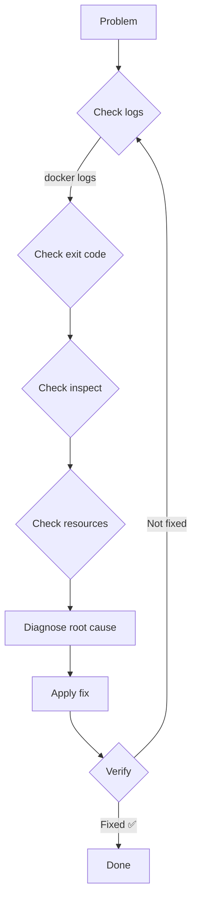

# 11 — Docker Practical Problems & Solutions

> Real-world Docker problems and how to solve them step-by-step

---

## Table of Contents

1. [Problem 1: Container Won't Start — "port is already allocated"](#problem-1-container-wont-start--port-is-already-allocated)
2. [Problem 2: Container Exits Immediately After Starting](#problem-2-container-exits-immediately-after-starting)
3. [Problem 3: Docker Build Is Too Slow](#problem-3-docker-build-is-too-slow)
4. [Problem 4: Docker Image Is Too Large](#problem-4-docker-image-is-too-large)
5. [Problem 5: Container Can't Connect to Database](#problem-5-container-cant-connect-to-database)
6. [Problem 6: Volume Data Lost After Container Restart](#problem-6-volume-data-lost-after-container-restart)
7. [Problem 7: Permission Denied on Bind Mount](#problem-7-permission-denied-on-bind-mount)
8. [Problem 8: Container Running Out of Memory](#problem-8-container-running-out-of-memory)
9. [Problem 9: Secrets Accidentally Committed to Image](#problem-9-secrets-accidentally-committed-to-image)
10. [Problem 10: Docker Daemon Not Responding](#problem-10-docker-daemon-not-responding)
11. [Problem 11: Multi-Architecture Build Fails](#problem-11-multi-architecture-build-fails)
12. [Problem 12: DNS Resolution Fails Inside Container](#problem-12-dns-resolution-fails-inside-container)

---

## Problem 1: Container Won't Start — "port is already allocated"

### Scenario

```bash
docker run -d -p 8080:80 nginx
# docker: Error response from daemon: driver failed programming
# external connectivity on endpoint nginx:
# Bind for 0.0.0.0:8080 failed: port is already allocated.
```

### Diagnosis

```bash
# Find what's using the port
netstat -tlnp | grep 8080

# Check other Docker containers
docker ps --format "table {{.Names}}\t{{.Ports}}" | grep 8080

# Check all processes using the port
lsof -i :8080
```

### Solution

**Option A: Stop the process using the port**

```bash
# If it's another Docker container
docker stop <container-name>
docker rm <container-name>

# If it's a system process
kill $(lsof -t -i :8080)
```

**Option B: Use a different host port**

```bash
docker run -d -p 8081:80 nginx  # Use 8081 instead
```

**Option C: Let Docker pick a random port**

```bash
docker run -d -p 80 nginx
docker port <container>
# Output: 80/tcp -> 0.0.0.0:32768
```

**Option D: Check if it's the same container already running**

```bash
docker ps | grep nginx
# If nginx is already running, just use it
```

### Prevention

- Use port ranges in compose files
- Document port assignments in README
- Use `docker compose down` before starting new instances
- Check for running containers before deploying

---

## Problem 2: Container Exits Immediately After Starting

### Scenario

```bash
docker run -d myapp
docker ps -a
# CONTAINER ID   STATUS                     NAMES
# abc123         Exited (1) 3 seconds ago   myapp
```

### Diagnosis

```bash
# 1. Check exit code
docker inspect --format '{{.State.ExitCode}}' myapp

# 2. Check logs
docker logs myapp

# 3. Try running interactively
docker run -it --rm myapp sh

# 4. Override entrypoint
docker run -it --rm --entrypoint sh myapp
# Then manually start the app to see errors
```

### Exit Code Reference

| Code | Meaning | Common Fix |
|------|---------|------------|
| 0 | Normal exit | App is a one-shot task; use `-d` or `--rm` |
| 1 | General error | Check app logs |
| 125 | Docker error | Check docker run flags |
| 126 | Command not executable | Check permissions on entrypoint |
| 127 | Command not found | Check entrypoint/CMD path |
| 137 | SIGKILL (OOM) | Increase memory limit |
| 139 | SIGSEGV (segfault) | Check binary compatibility (musl vs glibc) |
| 143 | SIGTERM | Graceful shutdown (normal) |

### Solution Examples

**Case A: App needs a foreground process**

```dockerfile
# ❌ BAD — process runs in background, container exits immediately
CMD node app.js &

# ✅ GOOD — process in foreground
CMD ["node", "app.js"]
```

**Case B: Dependency not ready (DB)**

```yaml
services:
  app:
    depends_on:
      db:
        condition: service_healthy

  db:
    image: postgres
    healthcheck:
      test: ["CMD-SHELL", "pg_isready -U postgres"]
      interval: 5s
      retries: 10
```

**Case C: Entrypoint not found**

```dockerfile
# ❌ BAD — entrypoint script path wrong
COPY entrypoint.sh .
ENTRYPOINT ["/app/entrypoint.sh"]

# ✅ GOOD — verify the path
COPY entrypoint.sh /app/entrypoint.sh
RUN chmod +x /app/entrypoint.sh
ENTRYPOINT ["/app/entrypoint.sh"]
```

### Prevention

- Always test with `docker run -it --rm myimage sh` before deploying
- Add debug logging to application startup
- Use health checks to validate readiness
- Test locally with the same image before deploying

---

## Problem 3: Docker Build Is Too Slow

### Scenario

Your CI pipeline takes 15 minutes just for `docker build`. Developers are waiting.

### Diagnosis

```bash
# See which layers are taking time
docker build --no-cache -t myapp . 2>&1 | grep "Step"
# Or time each step manually

# Check if cache is being used
docker build -t myapp . 2>&1 | grep "CACHED"
# If nothing is cached, layers are changing too often
```

### Solutions

**Solution 1: Optimize layer order**

```dockerfile
# ❌ BAD: Source code copied before deps
COPY . .
RUN npm ci
# Every file change makes npm ci re-run (slow!)

# ✅ GOOD: Deps first
COPY package.json package-lock.json ./
RUN npm ci
COPY . .
```

**Solution 2: Use BuildKit cache mounts**

```dockerfile
# Dockerfile
FROM node:20-alpine
RUN --mount=type=cache,target=/root/.npm \
    --mount=type=cache,target=/app/node_modules \
    npm ci
```

**Solution 3: CI caching with Docker Buildx**

```yaml
# .github/workflows/build.yml
- name: Set up Docker Buildx
  uses: docker/setup-buildx-action@v3

- name: Build and push
  uses: docker/build-push-action@v5
  with:
    cache-from: type=gha
    cache-to: type=gha,mode=max
```

**Solution 4: Reduce build context**

```
# .dockerignore
node_modules/
.git/
.env
*.log
dist/
.next/
coverage/
```

**Solution 5: Use a smaller base image**

```dockerfile
# BEFORE: ~800MB base
FROM node:20

# AFTER: ~130MB base
FROM node:20-alpine
```

### Before/After

```
Before: 15 minutes build
  - Copy everything: 30s
  - npm ci (no cache): 5min
  - npm run build: 8min
  - docker push: 1.5min

After: 3 minutes build
  - npm ci (cached): 30s
  - npm run build (incremental): 2min
  - docker push: 30s

Savings: 80% faster
```

---

## Problem 4: Docker Image Is Too Large

### Scenario

```bash
docker images
# REPOSITORY   TAG       IMAGE ID       SIZE
# myapp        latest    abc123def456    1.5GB
```

### Diagnosis

```bash
# 1. Check layer sizes
docker history myapp

# 2. Check what's inside
docker run --rm myapp du -sh /app/* | sort -rh | head -20

# 3. Check base image size
docker images node:20
docker images node:20-alpine
```

### Solutions

**Solution 1: Multi-stage build (biggest win)**

```dockerfile
# BEFORE: Single stage — 1.5GB
FROM node:20
WORKDIR /app
COPY . .
RUN npm ci && npm run build
CMD ["node", "dist/server.js"]

# AFTER: Multi-stage — 150MB
FROM node:20-alpine AS builder
WORKDIR /app
COPY . .
RUN npm ci && npm run build

FROM node:20-alpine
WORKDIR /app
COPY --from=builder /app/dist ./dist
COPY --from=builder /app/node_modules ./node_modules
CMD ["node", "dist/server.js"]
```

**Solution 2: Only production dependencies**

```dockerfile
# ❌ BAD: includes devDependencies
RUN npm install

# ✅ GOOD: only production deps
RUN npm ci --only=production
```

**Solution 3: Clean up package manager caches**

```dockerfile
# ❌ BAD: apt cache stays in image
RUN apt-get update && apt-get install -y curl

# ✅ GOOD: clean up in the same layer
RUN apt-get update && \
    apt-get install -y --no-install-recommends curl && \
    apt-get clean && \
    rm -rf /var/lib/apt/lists/*
```

**Solution 4: Use distroless / scratch**

```dockerfile
# Go app: 1.2GB → 12MB
FROM golang:1.22 AS builder
WORKDIR /app
COPY . .
RUN CGO_ENABLED=0 go build -o server .

FROM scratch
COPY --from=builder /app/server /server
COPY --from=builder /etc/ssl/certs/ca-certificates.crt /etc/ssl/certs/
ENTRYPOINT ["/server"]
```

### Before/After

```
Technique                    Before    After    Reduction
──────────                   ──────    ─────    ────────
Alpine base                  350MB     130MB    63%
Multi-stage (Node)           1.5GB     150MB    90%
Multi-stage (Go)             1.2GB     12MB     99%
--only=production            350MB     150MB    57%
apt-get clean                 80MB     60MB     25%
.dockerignore                 var       var      10-50%
```

---

## Problem 5: Container Can't Connect to Database

### Scenario

```bash
docker logs myapp
# Error: connect ECONNREFUSED 127.0.0.1:5432
```

### Diagnosis

```bash
# 1. Check if DB container is running
docker ps | grep db

# 2. Check network connectivity
docker exec myapp ping db
# If ping: bad address → DNS issue
# If no route to host → network issue

# 3. Check if they're on the same network
docker inspect myapp --format '{{json .NetworkSettings.Networks}}'
docker inspect mydb --format '{{json .NetworkSettings.Networks}}'

# 4. Check DB port
docker exec db ss -tlnp | grep 5432
```

### Solutions

**Solution 1: Use the same network**

```bash
# Create a network
docker network create app-network

# Run both containers on it
docker run -d --name db --network app-network -e POSTGRES_PASSWORD=secret postgres
docker run -d --name app --network app-network -e DB_URL=postgres://postgres:secret@db:5432/mydb myapp
```

**Solution 2: Use container name (not localhost)**

```yaml
# docker-compose.yml
services:
  app:
    environment:
      - DB_URL=postgres://postgres:secret@db:5432/mydb  # NOT localhost!
  db:
    image: postgres
```

**Solution 3: Wait for DB to be ready**

```yaml
services:
  app:
    depends_on:
      db:
        condition: service_healthy
  db:
    healthcheck:
      test: ["CMD-SHELL", "pg_isready -U postgres"]
      interval: 5s
      retries: 10
```

**Solution 4: Check DB is listening on 0.0.0.0**

```bash
# Inside the DB container, verify it's listening on all interfaces
docker exec db netstat -tlnp
# Should show: 0.0.0.0:5432

# If it shows 127.0.0.1:5432, it won't accept connections from other containers
# Fix: Set listen_addresses = '*' in postgresql.conf
```

### Prevention

- Always use container names/services names, not `localhost`
- Always create a dedicated network for related containers
- Use health checks with `depends_on`
- Test connectivity as part of CI

---

## Problem 6: Volume Data Lost After Container Restart

### Scenario

```bash
docker run --name postgres -e POSTGRES_PASSWORD=secret postgres:16
# ... create tables, insert data ...
docker stop postgres
docker rm postgres
docker run --name postgres -e POSTGRES_PASSWORD=secret postgres:16
# ❌ All data is gone!
```

### Diagnosis

```bash
# Check if the container has volumes
docker inspect postgres --format '{{json .Mounts}}'

# Check if volumes are persisted
docker volume ls
```

### Solution: Use Named Volumes

```bash
# ✅ Create a named volume
docker volume create pgdata

# ✅ Mount the volume
docker run -d \
  --name postgres \
  -v pgdata:/var/lib/postgresql/data \
  -e POSTGRES_PASSWORD=secret \
  postgres:16

# Now data survives container removal:
docker stop postgres && docker rm postgres
docker run -d \
  --name postgres \
  -v pgdata:/var/lib/postgresql/data \
  -e POSTGRES_PASSWORD=secret \
  postgres:16

# ✅ Data is still there!
```

### With Docker Compose

```yaml
# ✅ Always define volumes at the top level
services:
  db:
    image: postgres
    volumes:
      - pgdata:/var/lib/postgresql/data

volumes:
  pgdata:                    # Named volume
```

### Prevention

- Always use named volumes for persistent data
- Never use anonymous volumes for things you care about
- Use `docker compose down` (without `-v`) for maintenance
- Back up volumes regularly

---

## Problem 7: Permission Denied on Bind Mount

### Scenario

```bash
docker run -v $(pwd)/data:/data --user node myapp
touch /data/test.txt
# touch: cannot touch '/data/test.txt': Permission denied
```

### Diagnosis

```bash
# Check host directory permissions
ls -la ./data
# drwxr-xr-x 2 root root 4096 ...   ← Owned by root!

# Check container user
docker run --rm myapp id
# uid=1000(node) gid=1000(node)

# The node user (UID 1000) can't write to a directory owned by root
```

### Solutions

**Solution 1: Match user UID**

```bash
# Run with the same UID as the host user
docker run --user $(id -u):$(id -g) -v $(pwd)/data:/data myapp
```

**Solution 2: Fix host directory permissions**

```bash
# On host:
mkdir -p ./data
chown -R 1000:1000 ./data   # Same UID as container user

# Or make it world-writable (less secure)
chmod 777 ./data
```

**Solution 3: Create user with matching UID in Dockerfile**

```dockerfile
FROM node:20-alpine
ARG UID=1000
ARG GID=1000
RUN addgroup -g $GID appgroup && adduser -u $UID -G appgroup -D appuser
USER appuser
```

**Solution 4: Fix permissions at startup**

```bash
# Use an entrypoint script
#!/bin/sh
chown -R appuser:appgroup /data
exec "$@"
```

### Prevention

- Document required UID/GID in README
- Use entrypoint scripts to handle permissions
- For dev environments, use `--user $(id -u):$(id -g)`

---

## Problem 8: Container Running Out of Memory

### Scenario

```bash
docker logs myapp
# ... process runs for a while then ...
# Killed

docker inspect --format '{{.State.OOMKilled}}' myapp
# true
```

### Diagnosis

```bash
# 1. Check memory usage
docker stats myapp --no-stream

# 2. Check current limits
docker inspect myapp --format '{{.HostConfig.Memory}}'
# 838860800 (800MB)

# 3. Check peak usage
docker stats --no-stream myapp | awk '{print $4}'

# 4. Check if swap is disabled
docker inspect myapp --format '{{.HostConfig.MemorySwap}}'
# -1 (unlimited swap)? 838860800 (same as memory = no swap)
```

### Solutions

**Solution 1: Increase memory limit**

```bash
# Increase to 1GB
docker update --memory=1g myapp

# Or at run time:
docker run -d --memory=1g myapp
```

**Solution 2: Remove memory limit**

```bash
docker run -d --memory=0 myapp  # No limit
# ⚠️ Be careful — can starve other containers
```

**Solution 3: Add memory reservation (soft limit)**

```bash
# Hard limit: 1GB, soft limit: 512MB
docker run -d --memory=1g --memory-reservation=512m myapp
```

**Solution 4: Enable swap**

```bash
# Total memory (RAM + swap): 2GB
docker run -d --memory=1g --memory-swap=2g myapp
```

**Solution 5: Fix the memory leak**

```dockerfile
# Add NODE_OPTIONS to limit Node.js memory
ENV NODE_OPTIONS="--max-old-space-size=512"
```

### Prevention

- Profile your application's memory usage
- Set appropriate limits based on profiling
- Add alerting when memory usage exceeds 80% of limit
- Use `--memory-reservation` for soft limits
- Monitor with `docker stats`

---

## Problem 9: Secrets Accidentally Committed to Image

### Scenario

```bash
docker history myapp
# IMAGE          CREATED          CREATED BY
# abc123         2 min ago        ENV DB_PASSWORD=supersecret ← ❌ EXPOSED!
```

### Diagnosis

```bash
# Check all environment variables in the image
docker inspect myapp --format '{{.Config.Env}}'

# Check for hardcoded secrets in layers
docker history --no-trunc myapp | grep -i "password\|secret\|key\|token"

# Check image layers
docker save myapp > myapp.tar && tar -xzf myapp.tar
# Search the layers for secrets
```

### Solutions

**Solution 1: Remove secret from Dockerfile**

```dockerfile
# ❌ NEVER do this:
FROM node:20-alpine
ENV DB_PASSWORD=supersecret
ENV API_KEY=abc123
```

**Solution 2: Use runtime environment variables**

```bash
# ✅ Set at runtime only:
docker run -e DB_PASSWORD=supersecret -e API_KEY=abc123 myapp
```

**Solution 3: Use Docker secrets**

```yaml
# docker-compose.yml
services:
  app:
    secrets:
      - db_password
      - api_key

secrets:
  db_password:
    file: ./secrets/db_password.txt
  api_key:
    file: ./secrets/api_key.txt
```

**Solution 4: Use BuildKit secrets for build-time**

```dockerfile
# Dockerfile
RUN --mount=type=secret,id=npm_token \
    NPM_TOKEN=$(cat /run/secrets/npm_token) npm ci
```

```bash
docker build --secret id=npm_token,src=./.npm_token -t myapp .
```

**Solution 5: If a secret was pushed, rotate it immediately**

```bash
# 1. ROTATE THE SECRET FIRST (revoke the compromised key)
# 2. Rebuild without the secret
# 3. Force all users to pull the new image
# 4. Audit who might have pulled the old image
```

### Prevention

- Never hardcode secrets in Dockerfiles
- Use `--secret` for build-time secrets
- Use environment variables or Docker secrets for runtime
- Scan images for secrets (Trivy, GitLeaks)
- Use `.dockerignore` to exclude .env files

---

## Problem 10: Docker Daemon Not Responding

### Scenario

```bash
docker ps
# Cannot connect to the Docker daemon at unix:///var/run/docker.sock.
# Is the docker daemon running?
```

### Diagnosis

```bash
# 1. Check if daemon is running
sudo systemctl status docker

# 2. Check logs
sudo journalctl -u docker.service --since "10 min ago"

# 3. Check if socket exists
ls -la /var/run/docker.sock

# 4. Check disk space (common cause)
df -h
```

### Solutions

**Solution 1: Start the daemon**

```bash
sudo systemctl start docker
```

**Solution 2: Restart the daemon**

```bash
sudo systemctl restart docker
```

**Solution 3: Check for disk space**

```bash
# Docker needs disk space for images, containers, volumes
df -h /var/lib/docker

# Clean up if full
docker system prune -af
```

**Solution 4: Check daemon configuration**

```bash
# /etc/docker/daemon.json
sudo cat /etc/docker/daemon.json

# Check for invalid configuration
dockerd --validate
```

**Solution 5: Check user permissions**

```bash
# Is user in docker group?
groups $USER
# Should include 'docker'

# If not:
sudo usermod -aG docker $USER
newgrp docker
```

### Prevention

- Set up Docker daemon monitoring
- Configure log rotation
- Regular cleanup with `docker system prune`
- Monitor disk space on Docker partition
- Set resource limits on containers

---

## Problem 11: Multi-Architecture Build Fails

### Scenario

```bash
docker build --platform linux/amd64,linux/arm64 -t myapp:latest .
# Error: multiple platforms feature is not supported
```

### Diagnosis

```bash
# Check current builder
docker buildx ls

# Check if buildx is available
docker buildx version
```

### Solutions

**Solution 1: Create and use a multi-architecture builder**

```bash
# Create a new builder that supports multi-arch
docker buildx create --name multiarch --use

# Bootstrap the builder (downloads QEMU emulators)
docker buildx inspect --bootstrap

# Now build for multiple platforms
docker buildx build \
  --platform linux/amd64,linux/arm64,linux/arm/v7 \
  -t myuser/myapp:latest \
  --push .
```

**Solution 2: Use QEMU for cross-platform builds (macOS)**

```bash
# Install QEMU (if not already installed)
docker run --privileged --rm tonistiigi/binfmt --install all

# Then build
docker buildx build \
  --platform linux/amd64,linux/arm64 \
  -t myuser/myapp:latest \
  --push .
```

**Solution 3: Handle platform-specific dependencies**

```dockerfile
# Dockerfile with platform-specific logic
FROM --platform=$BUILDPLATFORM node:20-alpine AS builder
ARG TARGETPLATFORM
ARG BUILDPLATFORM
RUN echo "Building on $BUILDPLATFORM for $TARGETPLATFORM"

# Install platform-specific dependencies
RUN if [ "$TARGETPLATFORM" = "linux/arm64" ]; then \
      apk add --no-cache some-arm-package; \
    fi
```

**Solution 4: Use --load for local testing**

```bash
# --load loads the image for the current architecture only
docker buildx build --platform linux/amd64 -t myapp:test --load .
```

### Prevention

- Test builds on each target architecture during CI
- Use buildx for all production builds
- Pin base image architectures explicitly
- Document platform requirements

---

## Problem 12: DNS Resolution Fails Inside Container

### Scenario

```bash
docker run alpine ping google.com
# ping: bad address 'google.com'

docker run alpine ping 8.8.8.8
# PING 8.8.8.8 (8.8.8.8): 56 data bytes
# 64 bytes from 8.8.8.8: seq=0 ttl=118 time=12.4 ms
# ✅ IP works but DNS doesn't
```

### Diagnosis

```bash
# 1. Check DNS configuration
docker run alpine cat /etc/resolv.conf

# 2. Check if DNS server is reachable
docker run alpine sh -c "ping -c 2 $(cat /etc/resolv.conf | grep nameserver | awk '{print $2}')"

# 3. Test with explicit DNS
docker run --dns 8.8.8.8 alpine ping google.com
```

### Solutions

**Solution 1: Set explicit DNS servers**

```bash
docker run --dns 8.8.8.8 --dns 8.8.4.4 alpine ping google.com
```

**Solution 2: Use host's DNS**

```bash
docker run --dns $(hostname -I | awk '{print $1}') alpine ping google.com
```

**Solution 3: Use host networking (temporary debug)**

```bash
docker run --network host alpine ping google.com
# If this works, it's a Docker DNS configuration issue
```

**Solution 4: Fix daemon DNS configuration**

```json
{
  "dns": ["8.8.8.8", "8.8.4.4"]
}
```

```bash
sudo systemctl restart docker
```

**Solution 5: For custom bridge networks, check DNS settings**

```bash
# Docker's embedded DNS runs at 127.0.0.11
docker run alpine cat /etc/resolv.conf
# Should show: nameserver 127.0.0.11

# If it shows something else, Docker DNS isn't working
```

### Prevention

- Use user-defined bridge networks (not the default `docker0`)
- Set explicit `dns` in docker-compose.yml for production
- Monitor DNS resolution as part of health checks
- Test with both hostname and IP during troubleshooting

---

## Summary: Troubleshooting Framework



| Step | Command | What to look for |
|------|---------|------------------|
| 1. Logs | `docker logs -f --tail=100` | Error messages, stack traces |
| 2. Exit code | `docker inspect --format '{{.State.ExitCode}}'` | 0=ok, 137=OOM, 139=crash |
| 3. Inspect | `docker inspect` | Config, networking, volumes |
| 4. Stats | `docker stats --no-stream` | CPU, memory, disk, network |
| 5. Events | `docker events --since 5m` | OOM kills, health failures |
| 6. Network | `docker exec ping` | Connectivity |
| 7. System | `docker system df` | Disk space |

---

## Next Steps

→ [12 — Docker in Production](./12-docker-in-production.md)
