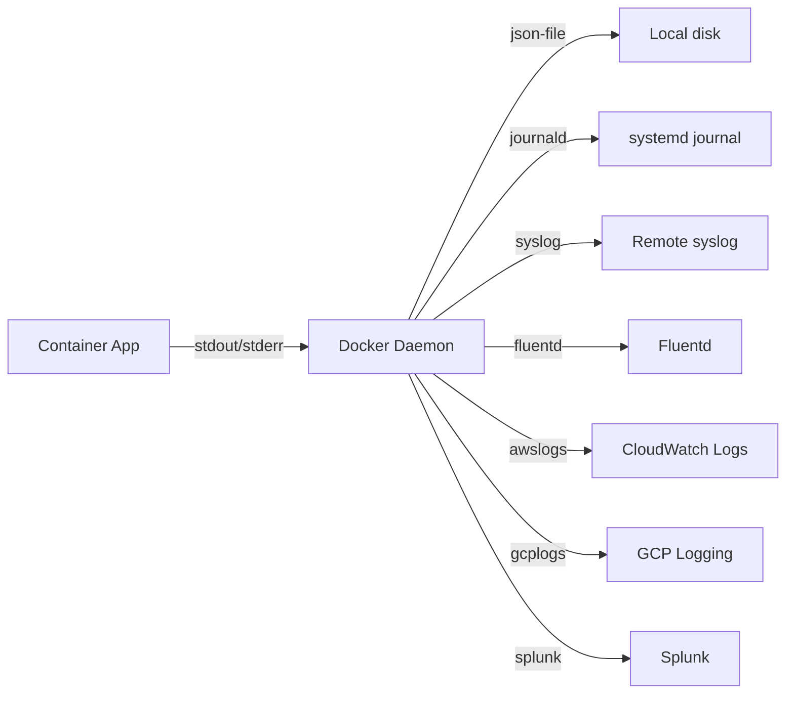
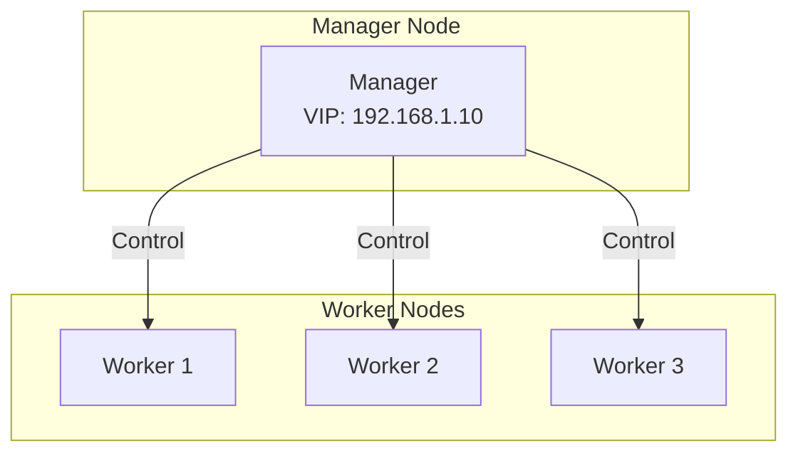
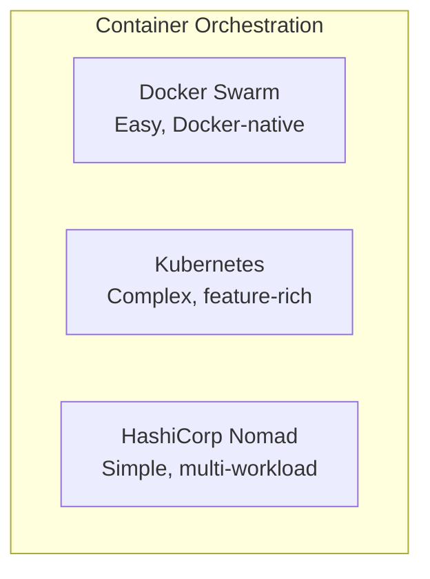
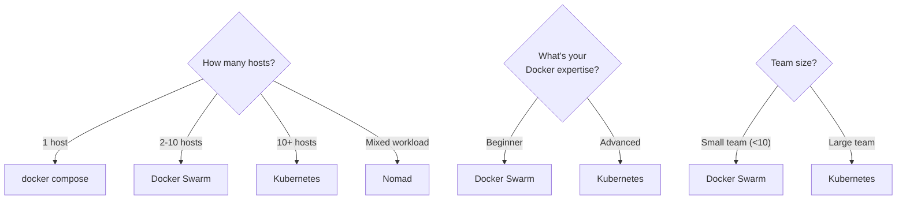
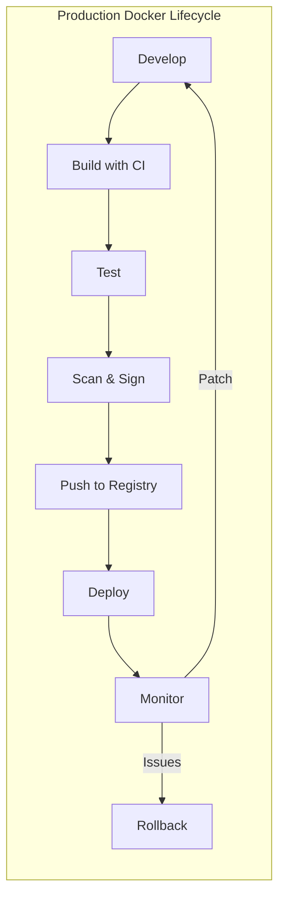

# 12 — Docker in Production

> Taking Docker from development to production-ready

---

## Table of Contents

1. [Production Considerations](#production-considerations)
2. [Docker in CI/CD](#docker-in-cicd)
3. [Container Registries](#container-registries)
4. [Logging in Production](#logging-in-production)
5. [Monitoring Containers](#monitoring-containers)
6. [Docker Swarm](#docker-swarm)
7. [Orchestration Overview](#orchestration-overview)
8. [Docker in the Cloud](#docker-in-the-cloud)
9. [Resource Planning](#resource-planning)
10. [Production Checklist](#production-checklist)

---

## Production Considerations

### Development vs Production

| Aspect | Development | Production |
|--------|-------------|------------|
| **Base image** | Full (node, ubuntu) | Alpine, distroless, scratch |
| **Build** | Single stage | Multi-stage |
| **Restart** | No restart | `always` or `unless-stopped` |
| **Health checks** | Optional | Mandatory |
| **Resource limits** | None | Set CPU/memory limits |
| **Security** | Minimal | Drop caps, read-only FS, non-root |
| **Logging** | `docker logs` | Centralized log aggregation |
| **Monitoring** | `docker stats` | Prometheus + Grafana |
| **Ports** | Publish all | Only expose via reverse proxy |
| **Volumes** | Bind mounts | Named volumes with backups |
| **Orchestration** | docker compose | Swarm / K8s / Nomad |

### Production Dockerfile Template

```dockerfile
FROM node:20-alpine AS builder
WORKDIR /app
COPY package*.json ./
RUN npm ci
COPY . .
RUN npm run build

FROM node:20-alpine
RUN addgroup -S appgroup && adduser -S appuser -G appgroup
WORKDIR /app
COPY --from=builder --chown=appuser:appgroup /app/dist ./dist
COPY --from=builder --chown=appuser:appgroup /app/node_modules ./node_modules
COPY --chown=appuser:appgroup package.json ./
USER appuser
EXPOSE 3000
HEALTHCHECK --interval=30s --timeout=3s --start-period=15s --retries=3 \
  CMD wget --no-verbose --tries=1 --spider http://localhost:3000/health || exit 1
ENV NODE_ENV=production
CMD ["node", "dist/main.js"]
```

### Production Compose Template

```yaml
name: myapp-prod

services:
  app:
    build:
      context: .
      dockerfile: Dockerfile.prod
    image: registry.example.com/myapp:${VERSION}
    restart: unless-stopped
    ports:
      - "127.0.0.1:3000:3000"       # Only accessible via reverse proxy
    environment:
      - NODE_ENV=production
      - DB_URL=postgres://user:${DB_PASSWORD}@db:5432/myapp
    env_file:
      - .env.production
    depends_on:
      db:
        condition: service_healthy
    healthcheck:
      test: ["CMD", "curl", "-f", "http://localhost:3000/health"]
      interval: 30s
      timeout: 5s
      retries: 3
    logging:
      driver: "json-file"
      options:
        max-size: "10m"
        max-file: "3"
    security_opt:
      - no-new-privileges:true
    cap_drop:
      - ALL
    cap_add:
      - NET_BIND_SERVICE
    read_only: true
    tmpfs:
      - /tmp
    user: "1000:1000"
    deploy:
      resources:
        limits:
          cpus: "2"
          memory: 512M

  db:
    image: postgres:16-alpine
    restart: always
    environment:
      POSTGRES_USER: user
      POSTGRES_PASSWORD: ${DB_PASSWORD}
      POSTGRES_DB: myapp
    volumes:
      - pgdata:/var/lib/postgresql/data
      - ./init:/docker-entrypoint-initdb.d:ro
    healthcheck:
      test: ["CMD-SHELL", "pg_isready -U user"]
      interval: 10s
      timeout: 5s
      retries: 5
    logging:
      driver: "json-file"
      options:
        max-size: "10m"
        max-file: "3"
    deploy:
      resources:
        limits:
          memory: 1G

  nginx:
    image: nginx:alpine
    restart: always
    ports:
      - "80:80"
      - "443:443"
    volumes:
      - ./nginx/nginx.conf:/etc/nginx/nginx.conf:ro
      - ./nginx/ssl:/etc/nginx/ssl:ro
      - certbot-data:/var/www/certbot:ro
    depends_on:
      - app
    logging:
      driver: "json-file"
      options:
        max-size: "10m"
        max-file: "3"
    deploy:
      resources:
        limits:
          memory: 128M

volumes:
  pgdata:
    driver: local
  certbot-data:
    driver: local
```

---

## Docker in CI/CD

### GitHub Actions — Full Pipeline

```yaml
name: Build, Test, and Deploy

on:
  push:
    branches: [main]
  pull_request:
    branches: [main]

env:
  REGISTRY: ghcr.io
  IMAGE_NAME: ${{ github.repository }}

jobs:
  test:
    runs-on: ubuntu-latest
    steps:
      - uses: actions/checkout@v4
      - name: Run tests
        run: |
          docker compose -f docker-compose.test.yml up -d
          docker compose -f docker-compose.test.yml run --rm app npm test
          docker compose -f docker-compose.test.yml down

  build-and-push:
    needs: test
    runs-on: ubuntu-latest
    permissions:
      contents: read
      packages: write
    steps:
      - uses: actions/checkout@v4

      - name: Set up Docker Buildx
        uses: docker/setup-buildx-action@v3

      - name: Log in to registry
        uses: docker/login-action@v3
        with:
          registry: ${{ env.REGISTRY }}
          username: ${{ github.actor }}
          password: ${{ secrets.GITHUB_TOKEN }}

      - name: Extract metadata
        id: meta
        uses: docker/metadata-action@v5
        with:
          images: ${{ env.REGISTRY }}/${{ env.IMAGE_NAME }}
          tags: |
            type=semver,pattern={{version}}
            type=sha,format=short
            type=ref,event=branch

      - name: Build and push
        uses: docker/build-push-action@v5
        with:
          context: .
          push: true
          tags: ${{ steps.meta.outputs.tags }}
          labels: ${{ steps.meta.outputs.labels }}
          cache-from: type=gha
          cache-to: type=gha,mode=max

  deploy:
    needs: build-and-push
    runs-on: ubuntu-latest
    steps:
      - name: Deploy to production
        run: |
          # SSH and deploy
          ssh ${{ secrets.DEPLOY_HOST }} "
            cd /opt/myapp
            docker compose pull
            docker compose up -d --remove-orphans
            docker system prune -af
          "
```

### GitLab CI

```yaml
# .gitlab-ci.yml
stages:
  - test
  - build
  - deploy

variables:
  DOCKER_TLS_CERTDIR: ""
  DOCKER_HOST: tcp://docker:2375

services:
  - docker:dind

test:
  stage: test
  script:
    - docker compose -f docker-compose.test.yml up -d
    - docker compose -f docker-compose.test.yml run app npm test
    - docker compose -f docker-compose.test.yml down

build:
  stage: build
  script:
    - docker build -t $CI_REGISTRY_IMAGE:$CI_COMMIT_SHORT_SHA .
    - docker tag $CI_REGISTRY_IMAGE:$CI_COMMIT_SHORT_SHA $CI_REGISTRY_IMAGE:latest
    - docker login -u $CI_REGISTRY_USER -p $CI_REGISTRY_PASSWORD $CI_REGISTRY
    - docker push $CI_REGISTRY_IMAGE:$CI_COMMIT_SHORT_SHA
    - docker push $CI_REGISTRY_IMAGE:latest

deploy:
  stage: deploy
  script:
    - docker compose pull
    - docker compose up -d --remove-orphans
    - docker system prune -af
  only:
    - main
```

### Docker Layer Caching in CI

```yaml
# Use GitHub Actions cache
- name: Build with cache
  uses: docker/build-push-action@v5
  with:
    cache-from: type=gha
    cache-to: type=gha,mode=max

# Use registry cache
- name: Build with registry cache
  uses: docker/build-push-action@v5
  with:
    cache-from: type=registry,ref=myapp:cache
    cache-to: type=registry,ref=myapp:cache,mode=max

# Use local cache (self-hosted runners)
- name: Build with local cache
  uses: docker/build-push-action@v5
  with:
    cache-from: type=local,src=/tmp/.buildx-cache
    cache-to: type=local,dest=/tmp/.buildx-cache,mode=max
```

---

## Container Registries

### Registry Comparison

| Registry | Best For | Features |
|----------|----------|----------|
| **Docker Hub** | Public images, personal projects | Official images, automated builds |
| **GHCR (GitHub Container Registry)** | GitHub-native | Free for public, integrates with Actions |
| **Amazon ECR** | AWS users | IAM integration, VPC endpoints |
| **Google Artifact Registry** | GCP users | Cloud Build integration, vulnerability scanning |
| **Azure Container Registry** | Azure users | AAD auth, geo-replication |
| **Harbor** | Self-hosted enterprise | Vulnerability scanning, replication, RBAC |
| **GitLab Container Registry** | GitLab users | Built into GitLab, CI integration |

### Pushing to Production Registry

```bash
# Build and push to GHCR
docker build -t ghcr.io/username/myapp:1.0.0 .
docker push ghcr.io/username/myapp:1.0.0

# Build and push to ECR
aws ecr get-login-password --region us-east-1 | \
  docker login --username AWS --password-stdin <account>.dkr.ecr.us-east-1.amazonaws.com
docker build -t <account>.dkr.ecr.us-east-1.amazonaws.com/myapp:1.0.0 .
docker push <account>.dkr.ecr.us-east-1.amazonaws.com/myapp:1.0.0
```

### Tagging Strategy

```bash
# Production tagging strategy
# CI/CD pipeline creates these tags:
docker build \
  -t myapp:1.2.3 \
  -t myapp:1.2 \
  -t myapp:abc1234 \
  -t myapp:latest .
docker push myapp:1.2.3
docker push myapp:1.2
docker push myapp:abc1234

# Deploy with specific tag:
docker pull myapp:abc1234
docker compose up -d

# Promote to production:
docker pull myapp:1.2.3
docker compose up -d

# Rollback:
docker pull myapp:1.2.2
docker compose up -d
```

---

## Logging in Production

### Log Drivers



### Production Log Configuration

```bash
# daemon.json — global config
{
  "log-driver": "json-file",
  "log-opts": {
    "max-size": "10m",
    "max-file": "3"
  }
}

# Per-container
docker run -d \
  --log-driver json-file \
  --log-opt max-size=10m \
  --log-opt max-file=3 \
  --log-opt tag="{{.Name}}/{{.ImageName}}" \
  myapp
```

### Structured Logging

```javascript
// Application should output structured JSON logs
// Example: Node.js with Pino logger
const pino = require('pino');
const logger = pino({
  level: process.env.LOG_LEVEL || 'info',
  formatters: {
    level(label) {
      return { level: label };
    }
  }
});

logger.info({ userId: 123, action: 'login' }, 'User logged in');
// Output: {"level":"info","time":1700000000000,"pid":1,"userId":123,"action":"login","msg":"User logged in"}
```

### Log Aggregation with ELK Stack

```yaml
services:
  app:
    logging:
      driver: fluentd
      options:
        fluentd-address: "localhost:24224"
        tag: "app"

  fluentd:
    image: fluent/fluentd:v1.16
    ports:
      - "24224:24224"
    volumes:
      - ./fluentd.conf:/fluentd/etc/fluent.conf:ro

  elasticsearch:
    image: docker.elastic.co/elasticsearch/elasticsearch:8.12
    environment:
      - discovery.type=single-node
      - xpack.security.enabled=false
    volumes:
      - esdata:/usr/share/elasticsearch/data

  kibana:
    image: docker.elastic.co/kibana/kibana:8.12
    ports:
      - "5601:5601"
    environment:
      - ELASTICSEARCH_HOSTS=http://elasticsearch:9200

volumes:
  esdata:
```

---

## Monitoring Containers

### Key Metrics

| Metric | How to Check | Alert Threshold |
|--------|-------------|-----------------|
| **CPU usage** | `docker stats` | >80% for 5min |
| **Memory usage** | `docker stats` | >85% of limit |
| **Disk usage** | `docker system df` | >80% of partition |
| **Restart count** | `docker inspect .State.RestartCount` | >5 in 10min |
| **Health status** | `docker inspect .State.Health.Status` | unhealthy |
| **Container down** | `docker ps` | Missing container |
| **Log size** | `du -sh /var/lib/docker/containers/*/` | >1GB per container |

### Prometheus + Grafana Stack

```yaml
services:
  cadvisor:
    image: gcr.io/cadvisor/cadvisor:latest
    ports:
      - "8080:8080"
    volumes:
      - /:/rootfs:ro
      - /var/run:/var/run:ro
      - /sys:/sys:ro
      - /var/lib/docker/:/var/lib/docker:ro
    devices:
      - /dev/kmsg
    privileged: true

  prometheus:
    image: prom/prometheus
    ports:
      - "9090:9090"
    volumes:
      - ./prometheus.yml:/etc/prometheus/prometheus.yml
      - prometheus-data:/prometheus
    command:
      - '--config.file=/etc/prometheus/prometheus.yml'
      - '--storage.tsdb.path=/prometheus'
      - '--storage.tsdb.retention.time=30d'

  grafana:
    image: grafana/grafana
    ports:
      - "3000:3000"
    environment:
      - GF_SECURITY_ADMIN_PASSWORD=${GRAFANA_PASSWORD}
    volumes:
      - grafana-data:/var/lib/grafana

volumes:
  prometheus-data:
  grafana-data:
```

```yaml
# prometheus.yml
scrape_configs:
  - job_name: 'docker'
    static_configs:
      - targets: ['cadvisor:8080']

  - job_name: 'containers'
    static_configs:
      - targets: ['app:3000']
```

### Prometheus Rules

```yaml
# rules.yml
groups:
  - name: docker
    rules:
      - alert: ContainerDown
        expr: |
          time() - container_last_seen{
            container_label_com_docker_compose_service="app"
          } > 60
        for: 1m
        annotations:
          summary: "Container {{ $labels.name }} is down"

      - alert: ContainerHighMemory
        expr: |
          container_memory_working_set_bytes{
            container_label_com_docker_compose_service!=""
          } / container_spec_memory_limit_bytes{
            container_label_com_docker_compose_service!=""
          } > 0.85
        for: 5m
        annotations:
          summary: "Memory usage >85% for {{ $labels.name }}"

      - alert: ContainerRestarting
        expr: |
          rate(container_restarts_total[5m]) > 0.5
        for: 2m
        annotations:
          summary: "Container {{ $labels.name }} restarting frequently"
```

---

## Docker Swarm

### What is Docker Swarm?

Docker Swarm is Docker's **native clustering and orchestration** solution. It turns a group of Docker hosts into a single virtual host.



### Initialize Swarm

```bash
# On manager node
docker swarm init --advertise-addr 192.168.1.10

# Output:
# docker swarm join --token SWMTKN-1-<hash> 192.168.1.10:2377

# On worker nodes
docker swarm join --token SWMTKN-1-<hash> 192.168.1.10:2377

# List nodes
docker node ls
```

### Deploy a Stack

```yaml
# docker-stack.yml (uses deploy section)
version: '3.8'

services:
  app:
    image: registry.example.com/myapp:${VERSION:-latest}
    deploy:
      replicas: 3
      update_config:
        parallelism: 1
        delay: 10s
        order: start-first        # Start new before stopping old (rolling update)
      rollback_config:
        parallelism: 1
        delay: 10s
        order: stop-first
      restart_policy:
        condition: any
        delay: 5s
        max_attempts: 3
      resources:
        limits:
          cpus: "1"
          memory: 256M
        reservations:
          cpus: "0.5"
          memory: 128M
    healthcheck:
      test: ["CMD", "curl", "-f", "http://localhost:3000/health"]
      interval: 30s
      timeout: 5s
      retries: 3
    ports:
      - target: 3000
        published: 80
        protocol: tcp
        mode: ingress            # Load balance across all nodes
    networks:
      - app-network

  db:
    image: postgres:16-alpine
    deploy:
      placement:
        constraints:
          - node.role == manager    # DB only on manager node
    environment:
      POSTGRES_PASSWORD: ${DB_PASSWORD}
    volumes:
      - pgdata:/var/lib/postgresql/data
    networks:
      - app-network

networks:
  app-network:
    driver: overlay

volumes:
  pgdata:
    driver: local
```

```bash
# Deploy (not up — Swarm uses stack deploy)
docker stack deploy -c docker-stack.yml myapp

# List services
docker service ls

# List service tasks
docker service ps myapp_app

# Scale
docker service scale myapp_app=5

# Update image (rolling update)
docker service update --image registry.example.com/myapp:2.0 --update-parallelism 2 myapp_app

# Rollback
docker service rollback myapp_app

# Logs
docker service logs myapp_app

# Remove stack
docker stack rm myapp
```

### Swarm vs Compose

| Feature | docker compose | docker stack |
|---------|---------------|--------------|
| **Hosts** | Single host | Multi-host |
| **Scaling** | `--scale` flag | `deploy.replicas` |
| **Updates** | Manual restart | Rolling updates |
| **Networking** | Bridge | Overlay (multi-host) |
| **Service discovery** | Compose DNS | Swarm DNS + VIP |
| **Load balancing** | None | Built-in (routing mesh) |
| **Secrets** | File-based | Docker secrets |
| **Configs** | File-based | Docker configs |
| **Use case** | Dev, small prod | Production clusters |

---

## Orchestration Overview

### Docker Swarm vs Kubernetes vs Nomad



| Feature | Docker Swarm | Kubernetes | Nomad |
|---------|-------------|------------|-------|
| **Setup complexity** | Very simple | Complex | Simple |
| **Learning curve** | Low | High | Medium |
| **Features** | Basic | Comprehensive | Moderate |
| **Scaling** | Manual + basic auto | HPA, VPA, Cluster | Built-in |
| **Service mesh** | None (use 3rd party) | Istio, Linkerd | Consul Connect |
| **Storage** | Volumes | PV, PVC, CSI | CSI plugins |
| **Rolling updates** | Yes | Yes (advanced) | Yes |
| **Self-healing** | Reschedules failed tasks | Reschedules, health checks, auto-remediation | Reschedules |
| **Community** | Small | Large | Medium |
| **Best for** | Simple deployments, Docker-native workflows | Complex microservices, enterprise | Multi-workload (containers + non-containers) |

### When to Use What



---

## Docker in the Cloud

### AWS ECS (Elastic Container Service)

```yaml
# task-definition.json
{
  "family": "myapp",
  "taskRoleArn": "arn:aws:iam::account:role/ecsTaskRole",
  "executionRoleArn": "arn:aws:iam::account:role/ecsTaskExecutionRole",
  "networkMode": "awsvpc",
  "containerDefinitions": [
    {
      "name": "app",
      "image": "account.dkr.ecr.us-east-1.amazonaws.com/myapp:latest",
      "memory": 512,
      "cpu": 256,
      "essential": true,
      "portMappings": [
        {
          "containerPort": 3000,
          "protocol": "tcp"
        }
      ],
      "environment": [
        {"name": "NODE_ENV", "value": "production"}
      ],
      "logConfiguration": {
        "logDriver": "awslogs",
        "options": {
          "awslogs-group": "/ecs/myapp",
          "awslogs-region": "us-east-1",
          "awslogs-stream-prefix": "ecs"
        }
      }
    }
  ]
}
```

### Google Cloud Run

```yaml
# cloudbuild.yaml
steps:
  - name: 'gcr.io/cloud-builders/docker'
    args:
      - 'build'
      - '--platform=linux/amd64'
      - '-t'
      - 'us-central1-docker.pkg.dev/$PROJECT_ID/myapp/myapp:$SHORT_SHA'
      - '.'

  - name: 'gcr.io/cloud-builders/docker'
    args:
      - 'push'
      - 'us-central1-docker.pkg.dev/$PROJECT_ID/myapp/myapp:$SHORT_SHA'

  - name: 'gcr.io/google.com/cloudsdktool/cloud-sdk'
    entrypoint: 'gcloud'
    args:
      - 'run'
      - 'deploy'
      - 'myapp'
      - '--image=us-central1-docker.pkg.dev/$PROJECT_ID/myapp/myapp:$SHORT_SHA'
      - '--region=us-central1'
      - '--platform=managed'
      - '--allow-unauthenticated'
```

### Azure Container Apps

```bash
# Deploy to Azure Container Apps
az containerapp up \
  --name myapp \
  --resource-group myapp-rg \
  --environment myapp-env \
  --source . \
  --target-port 3000 \
  --ingress external
```

---

## Resource Planning

### Sizing Guide

| Application Type | CPU | Memory | Storage | Base Image |
|-----------------|-----|--------|---------|------------|
| **Node.js API** | 1-2 cores | 256-512MB | 100MB | node:20-alpine |
| **Python API** | 1-2 cores | 256-512MB | 200MB | python:3.12-slim |
| **Go API** | 0.5-1 core | 64-256MB | 20MB | scratch |
| **PostgreSQL** | 2-4 cores | 1-4GB | 10GB+ | postgres:16-alpine |
| **Redis** | 1-2 cores | 256MB-1GB | 1GB+ | redis:7-alpine |
| **Nginx** | 0.5-1 core | 64-128MB | 10MB | nginx:alpine |
| **Java/Spring** | 2-4 cores | 512MB-2GB | 200MB | eclipse-temurin:21-jre-alpine |

### Node Sizing

```bash
# Small app (1 service)
# 1 GB RAM, 2 CPU cores → ~5-10 containers
# Recommended: t3.medium or equivalent

# Medium app (3-5 services)
# 4 GB RAM, 4 CPU cores → ~15-25 containers
# Recommended: t3.large or equivalent

# Large app (10+ services)
# 16 GB RAM, 8 CPU cores → 50+ containers
# Recommended: t3.xlarge or equivalent
```

### Docker System Requirements

| Component | Minimum | Recommended |
|-----------|---------|-------------|
| **Docker Engine** | 2GB RAM, 2 cores | 4GB RAM, 4 cores |
| **Swarm manager** | 4GB RAM, 2 cores | 8GB RAM, 4 cores |
| **Swarm worker** | 2GB RAM, 2 cores | 4GB RAM, 4 cores |
| **Build server** | 4GB RAM, 4 cores | 8GB RAM, 8 cores |
| **Registry** | 2GB RAM, 2 cores + 50GB storage | 4GB RAM, 4 cores + 200GB SSD |

---

## Production Checklist

### Pre-Deployment

```markdown
- [ ] Dockerfile uses multi-stage build
- [ ] Uses minimal base image (alpine/distroless/scratch)
- [ ] Runs as non-root user
- [ ] Has HEALTHCHECK instruction
- [ ] No secrets baked in (check docker history)
- [ ] .dockerignore excludes unused files
- [ ] Image scanned for vulnerabilities (Trivy, Docker Scout)
- [ ] Resource limits defined (CPU, memory)
- [ ] Log rotation configured
- [ ] Restart policy set

### Docker Compose

- [ ] Healthchecks on all services
- [ ] depends_on with condition: service_healthy
- [ ] Named volumes (not anonymous)
- [ ] Secure network configuration
- [ ] Read-only filesystem where possible
- [ ] Capabilities dropped
- [ ] External secrets management

### Infrastructure

- [ ] Container registry configured
- [ ] CI/CD pipeline builds and pushes images
- [ ] Registry authentication automated
- [ ] Backup strategy for volumes
- [ ] Monitoring (Prometheus + Grafana or equivalent)
- [ ] Log aggregation (ELK, Datadog, or equivalent)
- [ ] Alerting configured
- [ ] Disaster recovery plan
- [ ] Regular image updates (security patches)

### Deployment

- [ ] Blue/green or rolling update strategy
- [ ] Rollback plan tested
- [ ] Health checks passing before traffic routed
- [ ] Database migrations tested
- [ ] Secrets available in production environment
- [ ] DNS configured
- [ ] SSL/TLS certificates in place
- [ ] Backup verified
```

### One-Button Deploy Script

```bash
#!/bin/bash
# deploy.sh — Production deployment script
set -euo pipefail

echo "=== Deploying $APP_NAME v$VERSION ==="

# 1. Pull latest
docker compose -f docker-compose.yml -f docker-compose.prod.yml pull

# 2. Run database migrations
echo "Running migrations..."
docker compose -f docker-compose.yml -f docker-compose.prod.yml run --rm app npm run migrate

# 3. Deploy with zero-downtime
echo "Deploying..."
docker compose -f docker-compose.yml -f docker-compose.prod.yml up -d --remove-orphans

# 4. Health check
echo "Waiting for health check..."
for i in $(seq 1 12); do
  if curl -sf http://localhost:3000/health > /dev/null; then
    echo "✅ App is healthy!"
    break
  fi
  if [ $i -eq 12 ]; then
    echo "❌ Health check failed. Rolling back..."
    docker compose -f docker-compose.yml -f docker-compose.prod.yml down
    exit 1
  fi
  sleep 5
done

# 5. Clean up
echo "Cleaning up..."
docker system prune -af --filter until=24h

echo "✅ Deployment complete!"
```

---

## Summary



| Stage | Key Actions |
|-------|-------------|
| **Build** | Multi-stage, no-cache for CI, BuildKit |
| **Scan** | Trivy, Docker Scout, SBOM generation |
| **Sign** | Cosign, Docker Content Trust |
| **Push** | Registry with immutable tags |
| **Deploy** | Rolling update, blue/green, canary |
| **Monitor** | Prometheus, Grafana, centralized logs |
| **Rollback** | Previous image tag, compose down--up |

---

## End of Docker Curriculum

You've completed the Docker learning path from **zero to production-ready**. 

### What You've Learned

| Module | Topics |
|--------|--------|
| **01** | Docker fundamentals, Containers vs VMs, Architecture |
| **02** | Images, Dockerfile, Layers, Multi-stage builds |
| **03** | Container lifecycle, Resource limits, Health checks |
| **04** | Volumes, Bind mounts, tmpfs, Backup/Restore |
| **05** | Networking, Bridge/Host/Overlay, DNS, Port mapping |
| **06** | Docker Compose, Multi-file, Profiles, Production patterns |
| **07** | Security, Capabilities, Seccomp, Rootless, Scanning |
| **08** | Language-specific Dockerfiles, Anti-patterns, BuildKit |
| **09** | Complete Docker commands reference |
| **10** | Interview questions with real-world answers |
| **11** | Practical problems with step-by-step solutions |
| **12** | Production deployment, Monitoring, Orchestration |

### Next Steps

- [Kubernetes Documentation](../05-kubernetes.md)
- [Interview Questions](../interview-questions.md)
