# Docker — Complete Learning Path

> From zero to production-ready — 12 documents covering everything Docker

---

## Quick Navigation

| # | Module | Description |
|---|--------|-------------|
| 01 | [Docker Fundamentals](./01-docker-fundamentals.md) | Containers vs VMs, architecture, installation, hello world |
| 02 | [Images & Dockerfile](./02-docker-images-and-dockerfile.md) | All Dockerfile instructions, layers, caching, multi-stage builds |
| 03 | [Containers Deep Dive](./03-docker-containers.md) | Container lifecycle, resource limits, health checks, restart policies |
| 04 | [Volumes & Data](./04-docker-volumes-and-data.md) | Volumes, bind mounts, tmpfs, backup/restore, storage drivers |
| 05 | [Networking](./05-docker-networking.md) | Bridge, host, overlay, macvlan, DNS, port publishing |
| 06 | [Docker Compose](./06-docker-compose.md) | Multi-container apps, compose file reference, profiles, production |
| 07 | [Security](./07-docker-security.md) | Capabilities, seccomp, rootless, image scanning, supply chain |
| 08 | [Dockerfile Recipes](./08-dockerfile-recipes-and-patterns.md) | Language-specific patterns, anti-patterns, BuildKit features |
| 09 | [Commands Reference](./09-docker-commands-reference.md) | Every Docker command with examples and explanations |
| 10 | [Interview Questions](./10-docker-interview-questions.md) | 35+ Q&A from basic to staff engineer with real-world scenarios |
| 11 | [Practical Problems](./11-docker-practical-problems.md) | 12 real-world problems with step-by-step solutions |
| 12 | [Production Patterns](./12-docker-in-production.md) | CI/CD, monitoring, Swarm, orchestration, cloud deployment |

---

## Learning Path

```mermaid
flowchart LR
    subgraph Beginner
        A[01 Fundamentals] --> B[02 Images & Dockerfile]
        B --> C[03 Containers]
    end
    subgraph Intermediate
        C --> D[04 Volumes]
        D --> E[05 Networking]
        E --> F[06 Compose]
    end
    subgraph Advanced
        F --> G[07 Security]
        G --> H[08 Dockerfile Recipes]
        H --> I[09 Commands]
    end
    subgraph Mastery
        I --> J[10 Interview Q&A]
        J --> K[11 Practical Problems]
        K --> L[12 Production]
    end
```

---

## Stats

| Metric | Value |
|--------|-------|
| Documents | 12 |
| Total Lines | ~11,200 |
| Interview Questions | 35+ |
| Practical Problems | 12 |
| Commands Documented | 150+ |
| Mermaid Diagrams | 40+ |

---

## How to Use

1. **New to Docker?** Start at 01 and go sequentially
2. **Need a refresher?** Jump to any topic directly
3. **Interview prep?** Hit 10 and 11
4. **Production deployment?** Start with 12 and reference back
